# Week 10

## 클래스

### 절차적 언어의 아쉬운 점

1. 데이터의 비인간화


2. 데이터가 많아지면 관리하기 어려움 → 실수할 여지 증가


### 절차적 언어의 보완책 : 구조체

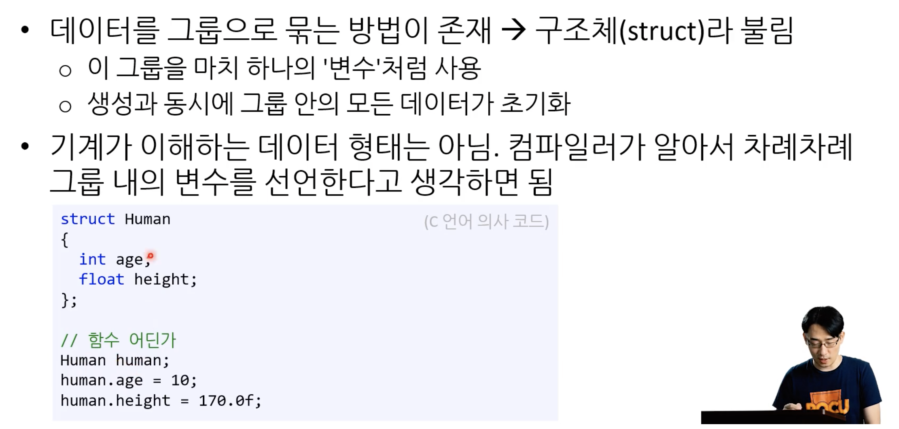

구조체를 하나의 변수처럼 사용

컴파일러가 구조체 안의 변수를 하나하나 선언

하드웨어는 구조체 안의 변수를 하나하나 이해하고, 프로그램 언어(컴파일러에서 처리)에서 개념상 하나의 그룹으로 묶는다

### 구조체의 한계 : 데이터와 동작의 분리

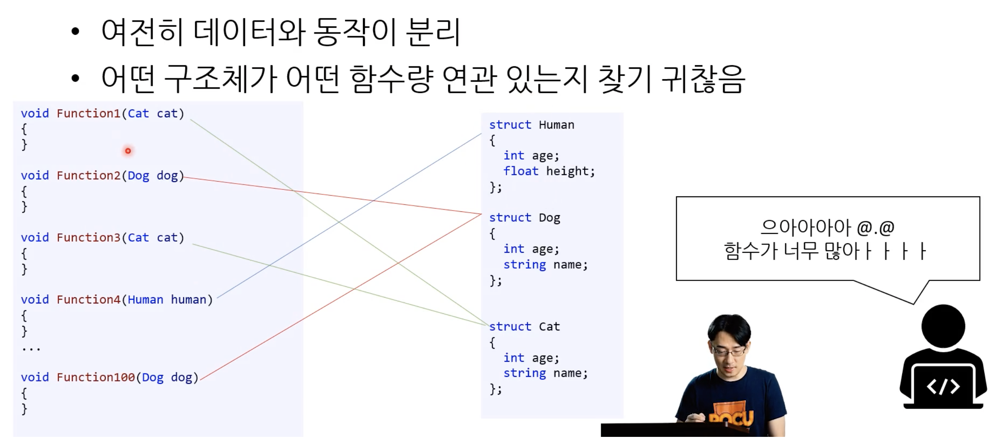

### 데이터와 동작(함수)를 하나로 묶어야 하는 이유

사람들은 세상을 물체(object)로 인지 → 직관적

세상의 물체는 상태와 동작이 한 곳에 있음

### 값이 변하는 것 vs 값이 여러 개

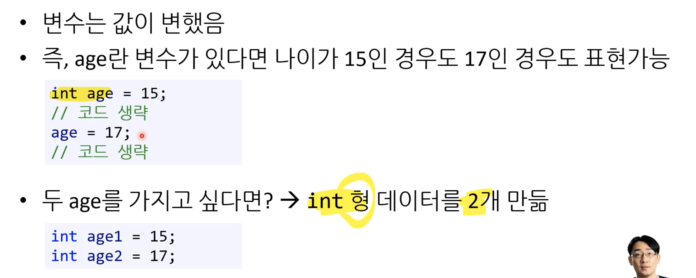

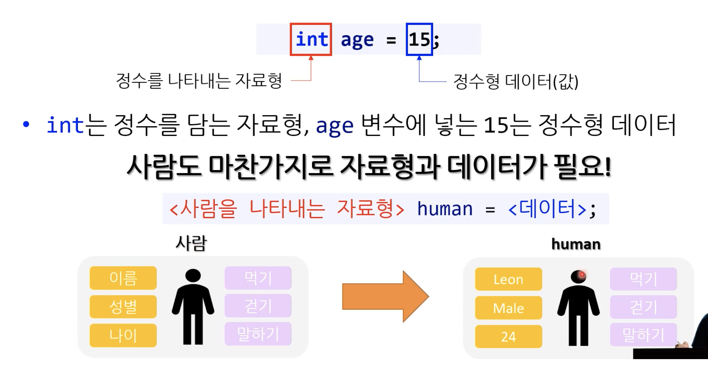

형을 클래스(template, blueprint)라고 부름

실제 데이터는 개체

### 클래스란


커스텀하게 만드는 `자료형`


### 클래스 만들기

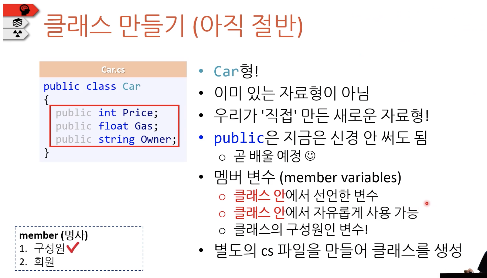

```C#
public class car
{
	public int Price;
	public float Gas;
	public string Owner;
}
```

\* 별도의 cs파일을 만들어 클래스를 생성. 이 때 파일 이름이 클래스 이름과 같게 함

### 개체 만들기


new 키워드 사용

### 개체의 멤버에 접근하기

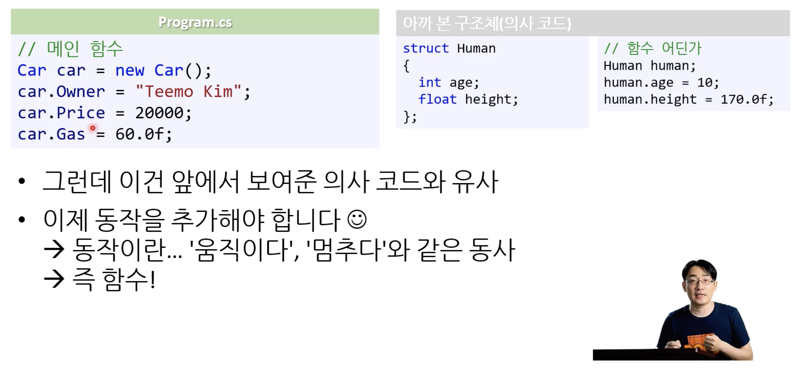

멤버는 2가지로 분류할 수 있음. 상태(변수)와 동작(함수)

멤버에 접근은 `.` 을 통해서

### 메서드 만들기

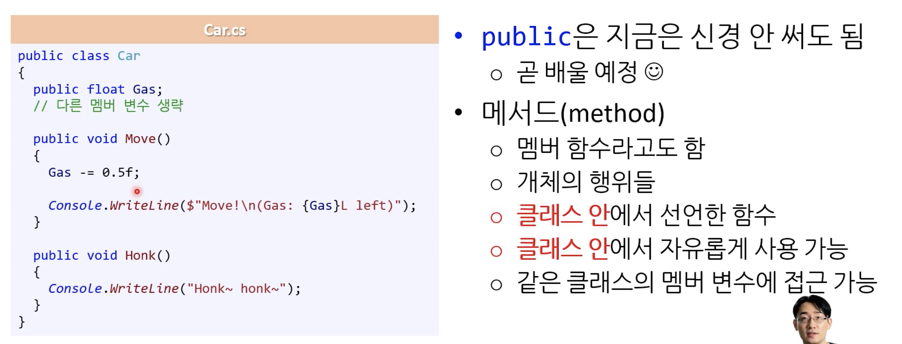

클래스 안의 함수는 메서드

`멤버 함수`라고 부르기도 함

## 생성자

### 뭐가 문제일까?

```C#
Car car = new Car();
car.Gas = 50.0f;
```

개체 생성 후 깜박하고 데이터를 대입 안 할 경우 문제가 발생함

지금 car의 가격은 0임

모든 car 개체의 가격을 생성 시 500000으로 하려면?

### 생성자 예제

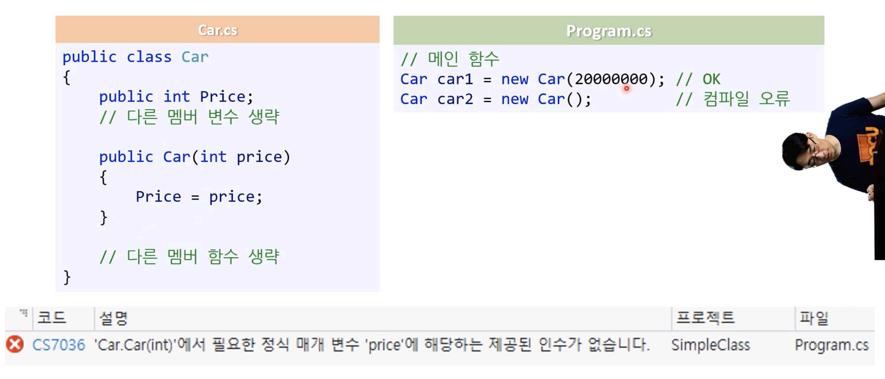

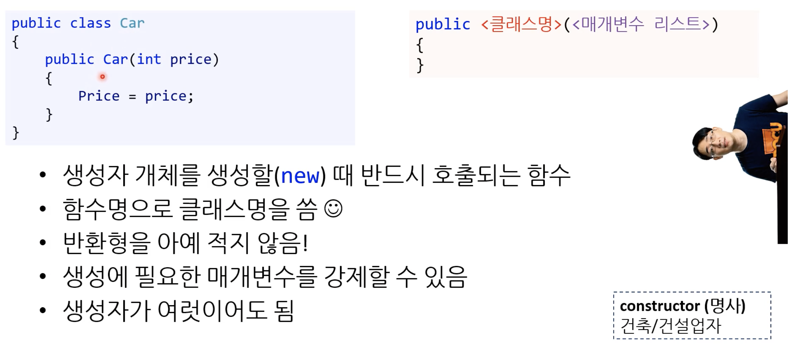

생성자의 특징은 아래와 같음

- 생성자는 함수의 이름이 클래스의 이름과 같은 함수
- 생성자는 반환형이 없다!(아예 적지 않음)
- 개체를 생성할 때 반드시 자동으로 호출됨
  - 따라서 개체를 생성하기 위해서 생성자를 반드시 선언해야함
- 개체 생성에 필요한 매개변수를 강제할 수 있음
- 생성자를 `오버로딩`해서 여럿을 사용할 수 있음
  - 함수 오버로딩과 똑같은 개념.
  - 생성자도 함수의 특수한 경우

### 생성자 안에서 바로 상수를 대입하는 예제


- 매개변수가 없는 생성자를 선언하고, 멤버 변수에 상수를 대입하게 함

- 아무런 생성자도 만들지 않으면 `기본 생성자`를 컴파일러가 생성해줌
  - 기본 생성자는 매개변수가 없고, 멤버 변수에 기본값을 대입함

- 프로그래머가 어떤 다른 생성자를 만들면 `기본 생성자`는 없어짐
  - 위 예시의 경우 매개변수가 없는 생성자를 프로그래머가 만들었기 때문에 기본 생성자는 없어짐

### 더 나은 방법 : 멤버 변수 생성시 변수 대입

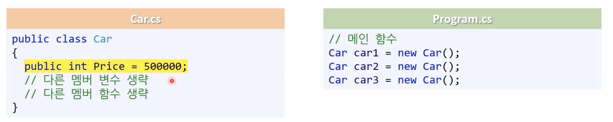

기본 생성자에서 Price 변수에 500000을 대입후 개체 생성

### 멤버 변수 기본값

멤버 변수에 값을 대입하지 않으면(기본 생성자) 멤버 변수에 기본값이 대입됨

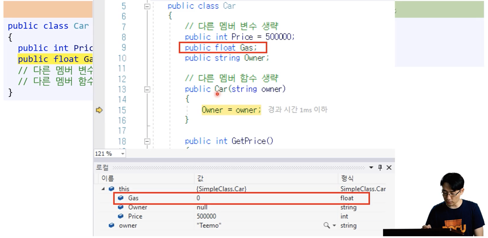


- 참조형의 기본값은 null

- 사실 string도 클래스임
  - Owner 변수는 개체

- 멤버 변수는 초기화를 생략해도 개체 생성시 컴파일러에서 알아서 기본값을 대입해 초기화됨. 초기화를 생략하고 사용해도 됨
- 지역 변수의 경우 초기화를 생략하고 사용하면 컴파일 에러가 발생

### 생성자 요약

- 생성자는 모든 개체가 '동일한 값'을 가져야 하는 경우 사용할 수 있다.

- 생성자는 OOP를 더 안전하게 사용하기 위한 방법이다.

- 생성자는 필수적으로 입력해야 되는 데이터를 입력 안 하는 실수를 막아준다.

## 접근 제어자

### 접근 제어자란?

어디에서 클래스의 멤버에 접근할 수 있는지 정하는 키워드

종류는 다음과 같음

- public
- private
- protected
- internal

### public

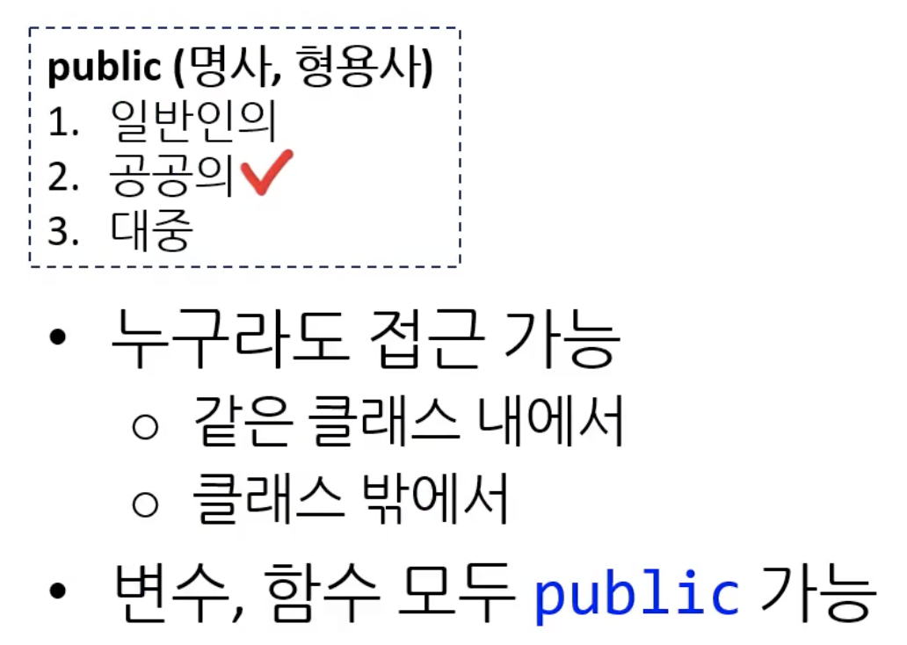

### private


\* 컴파일 오류

## 프로퍼티(Property)

### 멤버 변수 mGas의 접근제어자가 private라서 생기는 문제


1. 멤버 변수의 값을 클래스 외부에서 알 수 없음

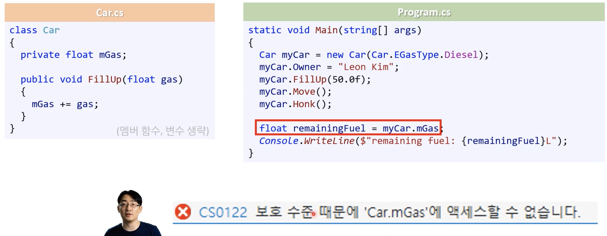

2. 판매가 변경 로직을 알기 어려움

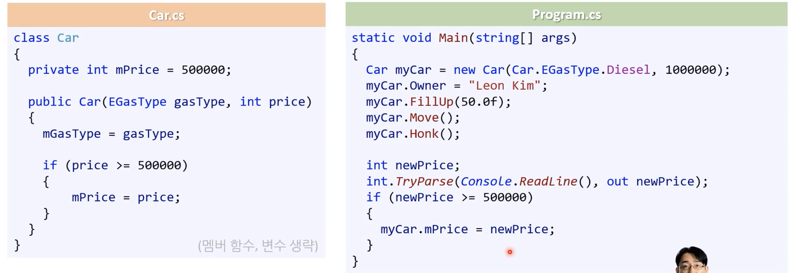

생성자에 멤버 변수인 판매가 변경 로직이 존재함

price 값이 500000을 넘을 때 멤버 변수 mPrice의 값이 price의 값으로 대입됨

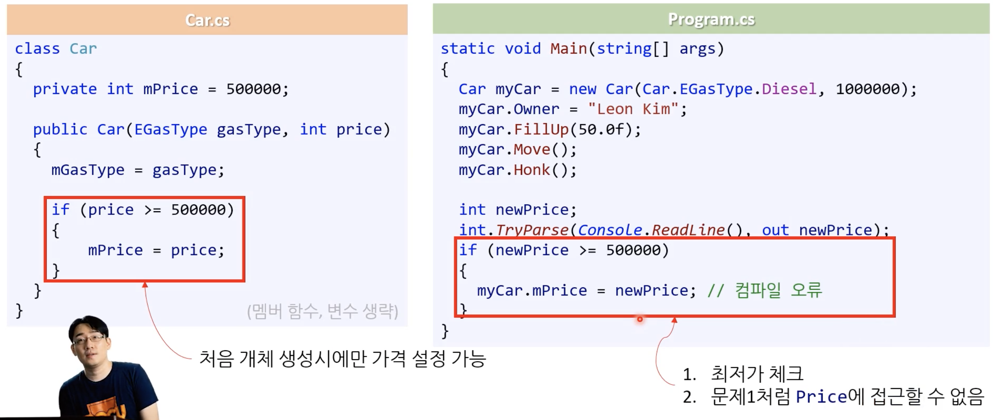

2가지 문제점이 존재한다

1. private 멤버 변수에 접근하기 때문에 컴파일 오류가 발생함

2. 사용하는 곳(클래스 외부)에서 가격을 체크하는 로직이 중복되고, 결과는 생성자 호출 시(개체 생성)만 가격을 변경할 수 있음

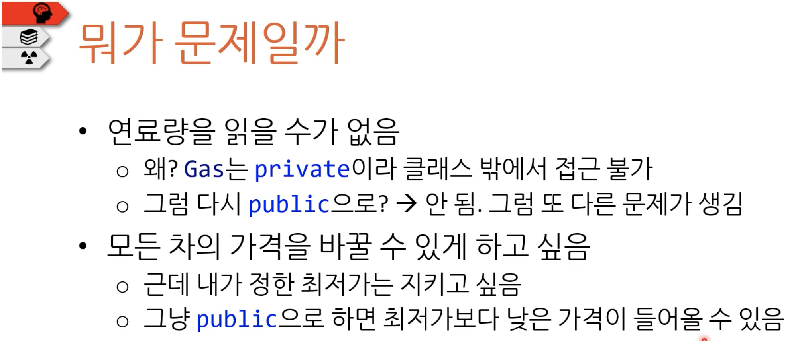

이런 고민이 들 수 있다. 다시 멤버 변수를 public으로 바꿔야하나..?

하지만 일반적인 해결 방법이 있음!

### getter, setter 함수


- getter의 역할은 내부의 private 멤버 변수의 값을 읽어서 반환함

- getter은 public이라 어디서든 접근할 수 있음

- setter의 역할은 내부의 private 멤버 변수를 변경함. 마찬가지로 publicd이라 어디서든 접근할 수 있다. 

- setter에 가격을 체크하는 로직을 넣을 수 있음

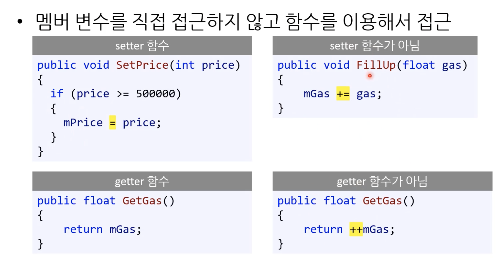

핵심은 private 멤버 변수에 바로 접근하는 것이 아니라, 멤버 함수를 통해서 접근!

### 프로퍼티는 왜 필요한가?

어차피 변수에 접근하는 건데 함수로 다 만들어야해?

setter, getter을 모두 함수로 만들어야하는 번거로움을 극복

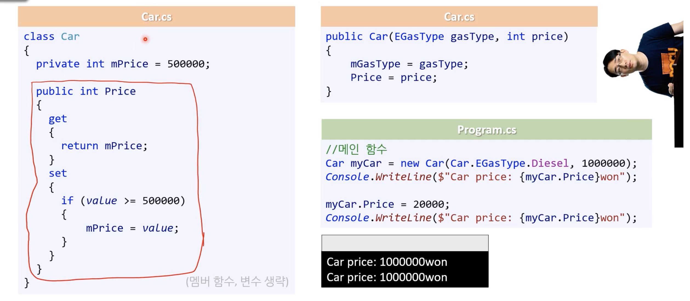

### 프로퍼티 문법

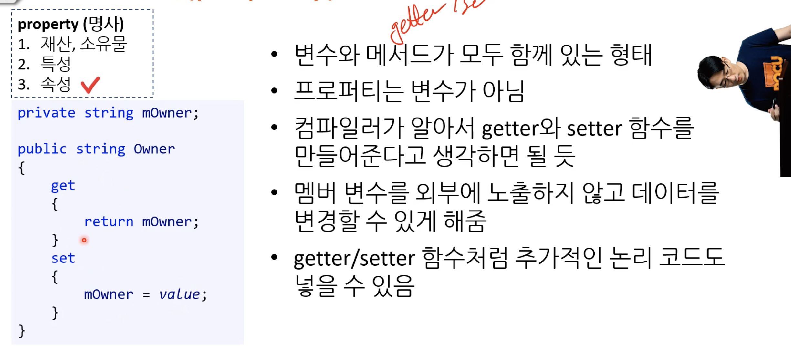

- 프로퍼티는 변수가 아니다
- 컴파일러가 getter, setter을 알아서 만들어 줌
- get, set, value(우항) 라는 정해진 문법이 있음

### getter, setter와 비교

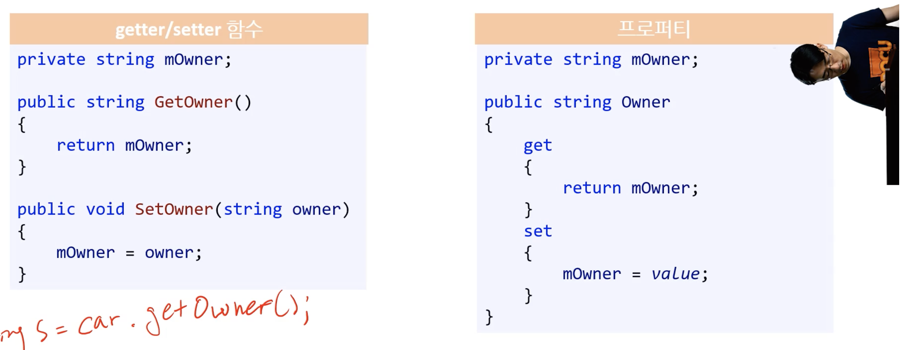

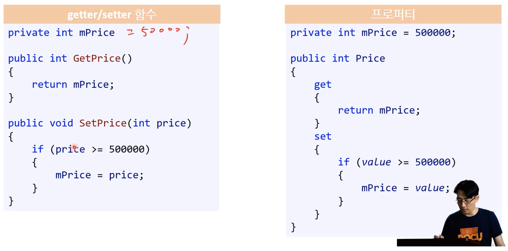

### 여전히 귀찮다

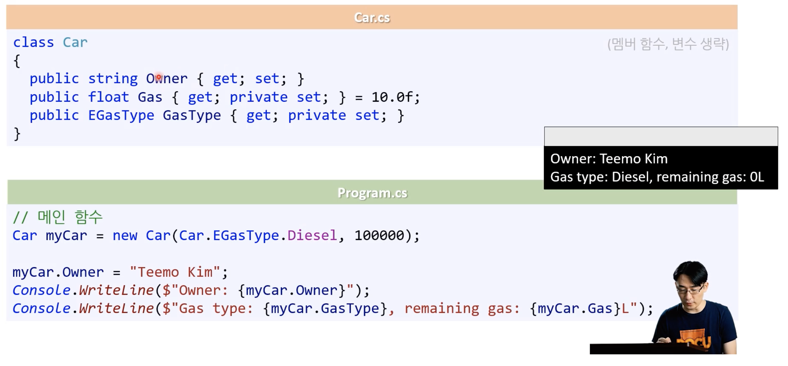

- 내부적으로 어떤 이름의 float 타입 gas변수를 만듬

- getter은 gas 값을 반환함

- 프로퍼티의 초기값을 지정할 수 있음

- setter을 private로 만들 수 있음

→ `멤버 변수, 멤버 함수(getter, setter)`을 생략해도 되는 아주 편리한 방법

### auto-implemented 프로퍼티

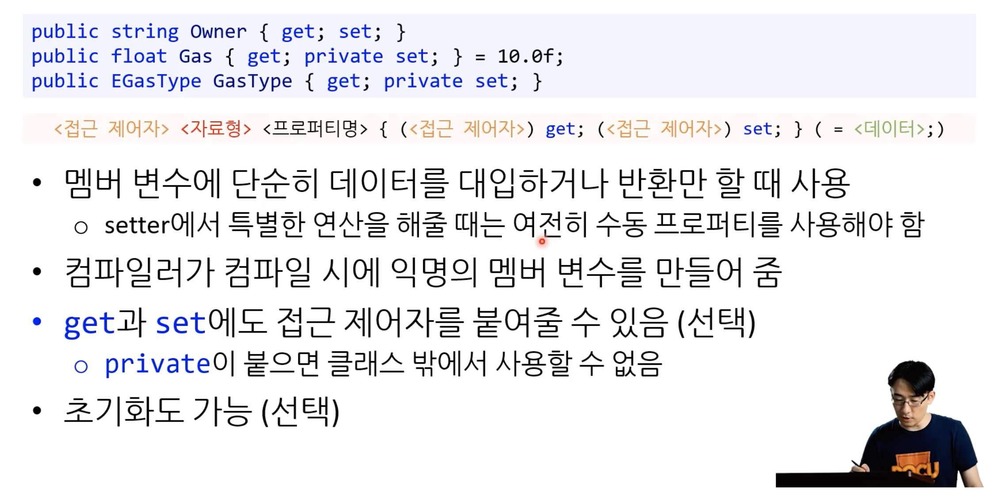

세터에서 특별한 유효성 검사를 해줄 때는 여전히 `수동 프로퍼티`를 사용해야함

익명의 멤버 변수는 컴파일러가 자동으로 만들어주는 멤버 변수로 이름을 알 수 없음. 다만 값만 getter로 알 수 있다.