# Week9

## 문자열 빌더

### 왜 문자열 빌더가 필요할까?

문자열은 굉장히 많이 사용된다. 하지만 문자열은 컴퓨터가 바로 이해할 수 있는 자료형이 아니기 때문에 문자열을 조작하다 보면 `성능`에서 문제가 생길 수 있다.

### 문자열 합치기는 느리다


연산자의 우선순위를 생각해보자. 더하기라는 동일한 연산자가 있을 때 연산자의 우선 순위는 왼쪽의 연산자가 높다.
문자열을 더할 때도 왼쪽에서 오른쪽으로 우선적으로 평가된다.

왼쪽에서 오른쪽으로 문자열을 더할 때 한 번 연산자가 평가될 때 마다 임시 문자열이 생성되고 이를 다음 더하기 연산에 사용하게 된다. 임시 문자열은 다음 더하기 연산에만 사용되고 버려진다.

```C#
string message = "hi";
int result = 1;
for (int i = 1; i <= 100; ++i) {
	message = message + result + " ";
}
```

위 코드는 공백을 구분자로 result의 값을 문자열에 합치는 코드다. [String.join](https://learn.microsoft.com/ko-kr/dotnet/api/system.string.join?view=net-8.0)과 유사하게 동작한다.

여기서 생각해볼 점은 join도 성능 면에서 효율적이지 않다는 것이다. join은 내부에서 위의 코드와 마찬가지로 반복문을 통해 문자를 더하기 때문에 버려지는 임시 문자열을 많이 생성하게 된다.

### 임시 문자열은 컴퓨터에서 어떻게 버릴까? GC(garbage collector)

C#은 가비지 수집기라는 시스템이 자동으로 임시 문자열을 지워준다. 문자열을 치울 때 문자열을 일일히 확인하면서 이 문자열이 진짜 사용되는지, 임시로 사용됬는지 여부를 확인하고 지운다.
문자열을 일일히 확인하는 과정에서 성능 저하가 오게된다.

### 다시 문자열 빌더가 필요한 이유

문자열 합치기 과정에서 임시 문자열의 수가 늘어나면 가비지 컬렉터의 성능 저하를 불러올 수 있다는 것을 확인했다. 따라서 `임시 문자열의 수를 줄이는 해결책`이 문자열 빌더(StrinigBuilder)다.

문자열 빌더는 문자열 합치기라는 매우 매우 자주하는 연산을 최적화한 라이브러리다.

### 문자열 빌더의 동작 방법

1. 문자열은 char 배열이라서 할당되고 크기 변경이 불가능하다. 따라서 긴 문자열을 담을 수 있는 충분한 공간(배열의 크기)을 미리 확보한다.  
2. 추가되는 문자열들로 그 공간을 차례대로 채워나간다.  
3. 필요한 문자열로 공간을 채우면 최종적으로 문자열을 만들어서 반환한다.

### 문자열 빌더 사용 예제

#### 라이브러리 추가와 선언 방법

```C#
// 파일 제일 위에서 라이브러리 추가
using System.Text;

// 사용하는 함수 안에서
StringBuilder builder = new StringBuilder(4096);
```


미리 충분한 공간(배열)의 크기가 maxCharCount의 값이다.

#### append 함수

```C#
StringBuilder builder = new StringBuilder(4096);
builder.Append("hi!");
builder.AppendLine("Kim");
```

Append는 문자열을 미리 확보한 공간에 추가하는 함수, AppendLine은 문자열과 줄바꿈을 함께 미리 확보한 공간에 추가하는 함수다.

이 함수들은 [여려 가지 오버로드 함수들이](https://learn.microsoft.com/ko-kr/dotnet/standard/base-types/stringbuilder) 다양하다.


문자열이 아닌 다양한 자료형도 문자열에 합칠 수 있다!

#### StrinbBuilder의 용량과 길이


```C#
builder.Capacity // 총 용량
builder.Length // 현재 사용중인 길이
```

StringBuilder의 프로퍼티로 내부 배열의 총 용량과 길이 값을 가지고 있다.
길이를 size라고 표현하는 프로그래밍 언어도 있다.

#### 추가 공간 확보


```C#
builder.EnsureCapacity(1024);
```

주목할 점은 ensure이라는 동사다. 1024의 공간을 확보한 상태에서 512로 공간을 줄일 수 있을까? 불가능하다. EnsureCapacity함수는 공간을 늘리는 기능만 제공한다. 공간의 용량을 마음대로 변화시키는 것은 아니다.  
ensure의 확보라는 뜻은 최소 그 공간은 확보한다는 말이고, 그 이후 확보된 공간을 줄이면 말의 뜻에 맞지 않다.

#### 최종 문자열 반환


#### StringBuilder가 과연 얼마나 임시 문자열을 줄였는지 확인해보자!


#### 처음 확보해 둔 공간을 다 쓰면?


```C#
StringBuilder builder = new StringBuilder(10);
builder.Append("asdfadfa");
builder.AppendLine("gggg");
```

처음 10개를 확보했는데 Append로 추가할 때 10개를 넘을 것으로 보인다. 실행해도 아무런 문제 없이 잘 실행된다.  
StringBuilder은 클래스라서 내부에서 알아서 공간을 늘려서 확보하도록 작동한다. 따라서 자동으로 내부 공간을 2배로 늘린 뒤 기존 공간의 모든 데이터를 복사하게된다.
→ 최대한 처음부터 넉넉하게 잡자. 보통(512, 1024...)

### 문자열 빌더의 기타 함수

#### Insert


어디에 삽입 해야하는지 정하기 위해 index가 필요하다. 
Insert의 특징은 덮어쓰는 것이 아니라 기존의 문자열들이 뒤로 밀린다.

#### Replace


start 번째임을 주의하자.
count는 개수를 세는 의미를 가진다. start부터 몇 개를 지운다고 생각하자

#### Remove


length는 길이다. 지워지는 문자열의 길이라고 생각하자.

#### Clear


## 코드 보기

```C#
using System;
using System.Text;

namespace StringBuilderExample
{
    class Program
    {
        static void Main(string[] args)
        {
            const int CAPACITY = 1000;
            StringBuilder builder = new StringBuilder(CAPACITY);
            builder.Append("Hello World!");
            builder.AppendLine(" Welcome to COMP1500!");
            builder.AppendLine("Are you having fun yet?");

            Console.WriteLine(builder.ToString());

            builder.Insert(12, " Going to insert this here.");

            Console.WriteLine(builder.ToString());

            builder.Replace(" Going to insert this here.", " And replace this.");

            Console.WriteLine(builder.ToString());

            builder.Remove(12, 19);

            Console.WriteLine(builder.ToString());

            builder.Clear();

            Console.WriteLine(builder.ToString());
        }
    }
}
```

주목할 점은 Replace에서 string을 string으로 대체할 수 있다!

```C#
using System;
using System.Diagnostics;
using System.Text;

namespace StringConcatVsStringBuilder
{
    class Program
    {
        static void Main(string[] args)
        {
            const int LOOP_COUNT = 1000;

            Stopwatch stopWatch = new Stopwatch();

            #region USING_CONCATENATION
            stopWatch.Start();

            string concatenated = string.Empty;
            for (int i = 0; i < LOOP_COUNT; i++)
            {
                concatenated += "test";
            }

            stopWatch.Stop();
            Console.WriteLine($"Time elapsed in ms (Concatenated): {stopWatch.Elapsed.TotalMilliseconds}");
            #endregion

            stopWatch.Reset();

            #region USING_STRING_BUILDER
            stopWatch.Start();

            StringBuilder stringBuilder = new StringBuilder(4096);
            for (int i = 0; i < LOOP_COUNT; i++)
            {
                stringBuilder.Append("test");
            }

            string s = stringBuilder.ToString();

            stopWatch.Stop();
            Console.WriteLine($"Time elapsed in ms (StringBuilder): {stopWatch.Elapsed.TotalMilliseconds}");
            #endregion
        }
    }
}

```

## decimal 형

decimal은 소수점을 나타낸다. 부동소수점과 차이점에 유의하자

### 부동소수점형의 정밀도 문제

```C#
static void Main(string[] args)
{
    float num1 = 0.0999999999999f;
    float num2 = 0.1f;

    if (num1 == num2)
    {
        Console.WriteLine("The numbers are equal");
    }
}
```

num1 과 num2의 값이 같음
부동소수점형의 정밀도(precision) 문제
이를 해결하기 위해서 앱실론(Machine Epsilon)이라고 아주 작은 수를 이용하는 방법이 있음

### 부동소수점 정밀도 문제 해결 1

- 모든 달러를 센트 단위로 곱해서 사용하기
  - EX) $10.10 + $0.01 = $10.11 => 1010 + 1 = 1011
- 화면에 보여줄 때는 다시 100으로 나누고 소수점 3번째 자리에서 반올림해서 보여줌

한계 1. 더하기, 빼기에만 올바른 방법(근데 돈 계산할 때 곱하는 경우가 거의 없긴함)

한계 2. 정수가 표현할 수 있는 범위까지 표현함

### 부동소수점 정밀도 문제 해결 2

- 문자열은 무한의 길이를 가지니 문자열로 저장
  - EX) "10.10" 더하기 "0.01"
- 계산할 때 각 자리의 수를 정수형으로 바꿔서 계산 후 문자열에 저장
  - 받아 올림, 내림할 때 쉽지 않음

### 부동소수점 정밀도 문제를 해결한 decimal

- CPU 자체에서 지원하는 자료형 X
- 금융권에서 돈 계산에 쓰기에 적합
- Java의 경우 BigDecimal

```C#
decimal num1 = 10.12345678987654321234567899m;
decimal num2 = 10.12345678987654321234567899; // 컴파일 오류
decimal num3 = 10m;
decimal num4 = 10;
long num5 = 123m; // 컴파일 오류
decimal num6 = 1.2345f;  // 컴파일 오류
double num7 = 1.2345m;  // 컴파일 오류
double num8 = (double)1.2345m;  // 명시적 변환 허용
decimal num9 = (decimal)1.2345f;  // 명시적 변환 허용
```

- 접미사 m사용
- 값이 정수일 때 decimal 형으로 묵시적 변환 허용
- 값이 decimal형일 때 정수형으로 묵시적 변환 불가능
  - 부동소수점 형을 정수형으로 묵시적 변환할 때 소수점이 잘리니까 허용 안 해주는 것과 원리가 동일
- 값이 부동소수점 형일 때 decimal 형으로 묵시적 변환 불가능
- 값이 decimal형일 때 부동소수점 형으로 묵시적 변환 불가능
  - decimal과 다른 부동소수점형의 정밀도가 다르기 때문

> 암기
>> 정수 일 때는 정수형에서 decimal로 묵시적 허용  
>> 부동소수점일 때는 반드시 명시적 형변환 해줘야함

## 코드보기 : decimal

- 함수 오버로딩
- 정밀도 순서 : float < double < decimal

## 컬렉션(Collection)

### 컬렌션이란?

- collection은 무리, 더미라는 뜻을 가짐
- 다른 언어에서는 container(컨테이너)라고 부름
- `동일한 형`의 여러 자료를 저장하는 공간
- 자료 구조의 일부

동일한 형의 여러 자료를 저장하는 가장 기본적인 자료 구조가 배열이다. 따라서 배열과의 비교를 해보자.

### 배열과 비교


컬렉션은 배열과 비교해서 사용하기 편리하다. 요소의 수를 바꿀 수 있고, 유용한 함수를 기본적으로 제공한다.

반면 배열은 사람이 사용하기 불편하지만 컴퓨터가 처리하기 쉬운 자료 구조다. 배열의 형태가 그대로 메모리에 일직선으로 저장되는 구조와 오프셋의 개념인 인덱스 모두 컴퓨터 친화적이다.

### 컬렉션의 또 다른 장점

배열로 표현하기 힘든 자료 구조를 표현할 수 있다.

그래서 다양한 컬렉션 종류가 있음

### 다양한 컬렉션 중 결정 시 고려 사항

- 색인(index)의 종류
  - 정형화된 색인(배열과 같은 방식이라고 생각하면 됨 0,1,2... 순서대로 증가)
  - 임의의 key 값(어떤 자료형이든 가능하나 배열의 색인처럼 순서가 존재할 수도 아닐 수도 있음 즉 정형화된 색인이 아님)

- 데이터 접근 패턴
  - 처음부터 끝까지 데이터를 순회할 것인가?
  - 컬렉션 중간에 데이터를 자주 넣고 빼는가?
  (자세한 내용은 자료구조/알고리즘)

### 리스트

- 사용하기 편한 배열
- 색인(0부터 n)을 통해 데이터에 접근할 수 있음
- 배열의 길이(담을 수 있는 최대 요소 수)를 언제든 바꿀 수 있음

#### 리스트 생성

```C#
List<int> scores = new List<int>();
List<string> names = new List<string>();
List<T> <변수명> = new List<T>();
```

<T>는 어떤 자료형을 담을지 표현하는 제너릭(generic) 프로그래밍의 일부

- 생성 시 리스트의 현재 길이(Count)는 0이다. 아무 요소도 안에 들어있지 않기 때문이다. 즉 길이는 요소의 개수와 같다.

#### 리스트 생성 총 용량(capacity)과 함께

```C#
List<int> scores = new List<int>(3);
List<string> names = new List<string>(6);
List<T> <변수명> = new List<T>(int capacity);
```

count와 capacity는 다르다는 것을 염두하자

#### 리스트에 데이터를 삽입하기

```C#
Add(T data);
```


리스트의 `가장 마지막 원소 다음` 데이터를 삽입함

#### 리스트에 데이터를 여러 개 삽입하기


```C#
int [] dummy = new int[3] {1, 2, 3};

List<int> list = new List<int>(5);
list.AddRange(dummy);
```

```C#
List<string> dummy = new List<string>(5);
dummy.Add("hi");
dummy.Add("boo");

List<string> list = new List<string>(5);
list.AddRange(dummy);
```

주의할 점은 List<T>를 AddRange의 함수 인자로 넣을 수 있다는 것!

\* 리스트를 생성할 때 용량을 정해주지 않으면 용량의 기본값으로 정해짐

#### 데이터가 리스트에 있는지 확인


\* 내부적으로 for문 돌아서 확인하게 됨!

#### 이 데이터가 리스트의 "어디에" 있나요?


\* 왜 반환값이 int일까? 유효하지 않은 색인값 -1을 반환하기 위해!

#### 이 데이터가 리스트의 "어디에" 있나요(2)?


\* 가장 마지막 인덱스 부터 찾아서 해당 데이터가 마지막으로 나타난 위치의 색인을 반환하게 됨

#### 리스트 중간에 데이터 넣기


\* 넣을 곳 뒤의 원소들을 모두 뒤로 한 칸 밀어버림

배열에서 이 동작을 하려면 for문 돌면서 요소 하나씩 밀어줘야함

#### 총 용량과 길이


#### 잘 못된 색인을 넣으면?


총 용량이 3이라서 최대 인덱스는 2인데 10의 인덱스에 값을 삽입하려고 해서 예외가 발생함

#### 리스트에서 요소 삭제하기


#### 리스트의 요소에 접근하기


인덱스 2에 아무런 요소가 없기 때문에 접근해도 값이 없다. 따라서 예외가 발생함!

#### 리스트에 순차적으로 접근하기(순회)


#### 리스트에서 배열로 변경하기


\* 내부적으로는 for문으로 일일히 원소를 배열에 대입함

#### 리스트의 모든 요소 지우기


\* 용량을 바꾸진 않음!

## 코드보기 : List

```C#
List<int> list = new List<int>();

for (int i = 0; i < ELEMENTS_COUNT; i++)
{
    list.Add(i);
}

Console.WriteLine($"[ {string.Join(", ", list)} ]");
```

\* string.Join()의 인자로 List<int>를 받았다는 것을 주목해야함!

정수형을 문자열로 표현할 수 있음

## 딕셔너리

### 딕셔너리란?


- 색인(0~n)이 아니라 임의의 자료형 key를 사용함

- 키가 동일하면 언제나 같은 값을 가리킴
- 다른 언어에서는 Map이라고 부름
- 내부 데이터 저장은 배열처럼 연속된 메모리에 할 수 없음

### 딕셔너리 생성

```C#
Dictionary<int, string> students = new Dictionary<int, string>();
```


### 딕셔너리에 데이터 추가


내부에서는 Key, Value가 메모리에 순서대로 저장되는 것을 보장하지 않음

이미 들어있는 키로 새로운 데이터를 추가하면? Add 함수의 함수명을 생각하자. 함수명이 Add or Replace가 아니라 오직 Add임
리스트의 경우 리스트의 마지막 원소 뒤에 계속 추가가 되는 것을 Add라고 명명할 수 있음 하지만 딕셔너리의 경우 키가 있는데 같은 키를 Add할 수 없기 때문에 예외가 발생함!


### 딕셔너리에 중복된 키를 확인하고 추가

\* Try라는 표현을 추가 Try가 붙은 함수는 보통 boolean값을 반환함


### 딕셔너리의 모든 요소 삭제


### 딕셔너리 키 존재하는지 확인

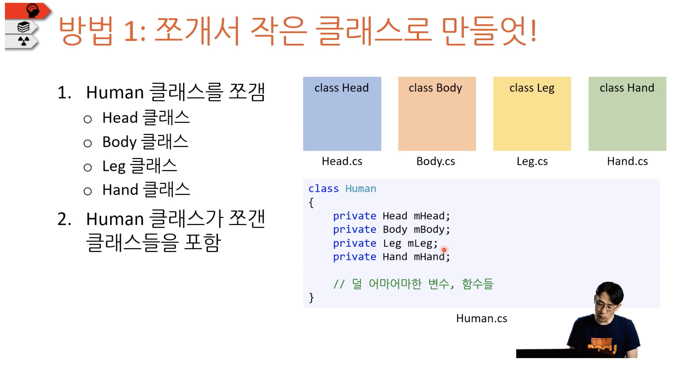

### 딕셔너리 안에 값이 있는지 확인

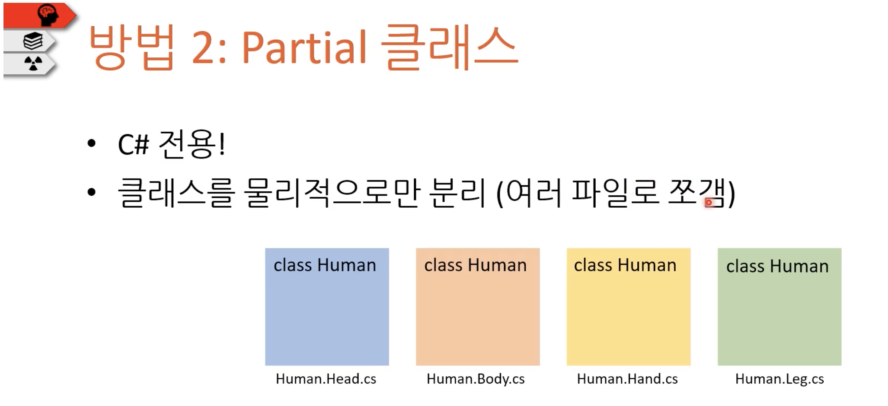

### 딕셔너리 안의 요소 삭제

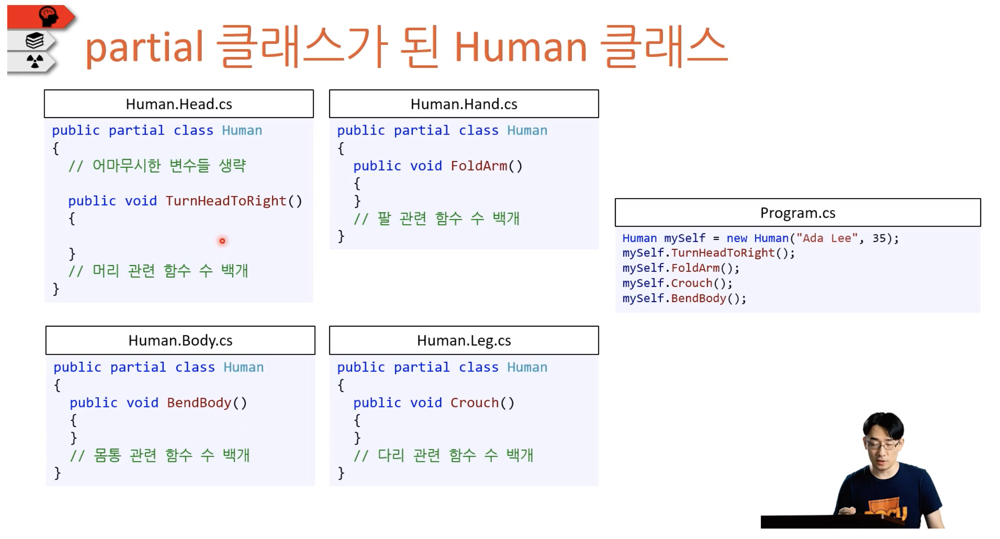

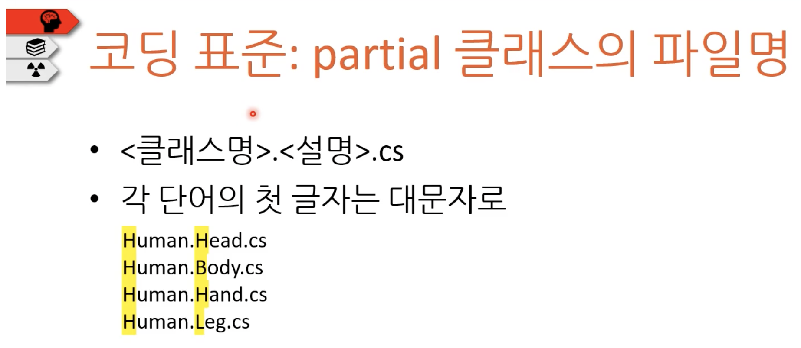

\* 의문점

왜 어떤 함수는 예외를 던지고, 어떤 함수는 예외를 안 던질까?  Remove도 못찾았으면 못찾았다고 예외를 던지는게 좋은게 아닌가?  
삭제를 한다는 목적에서 생각해봤을 때 만약에 Key가 없어서 지우는 것을 실패해도 원래 Key가 없기 때문에 없다. Key가 있다면 결국 삭제되고 없어진다. 즉 어떻게 되든 결과는 원소가 없다는 것임. 이것이 프로그래머가 의도한 결과이기 때문에 예외를 던지지 않는다.

다른 경우를 생각해보자. List의 insert에서 길이가 3인데 5번째 색인에 삽입하려고 하면 예외가 발생한다. 프로그래머의 의도가 5번째 색인에 넣는 것인데 만약 Add를 해서 마지막 원소 뒤에 삽입한다고 해도 4번째 색인에 넣는 것과 결과가 동일하다. 따라서 프로그래머의 의도대로 결과가 나오지 않는다는 것을 알리기 위해 예외를 던진다.

### 딕셔너리에서 키와 매핑된 값 가져오기

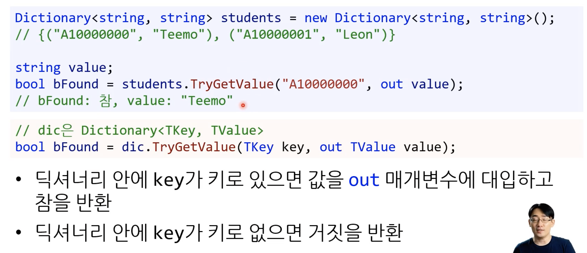

보통 if문으로 TryGetValue의 반환값에 따라 out 매개변수를 사용할지 말지를 결정함

### 또 다른 요소 추가/접근법 []

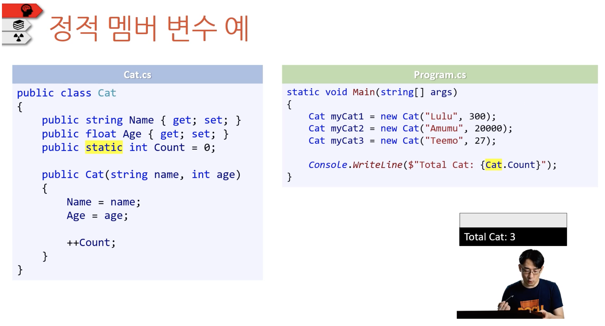

\* Add와 다른점에 주의하자 Add는 없는 키에 대응하는 요소를 추가하려 하면 예외가 발생한다. 하지만 `[]`는 다르다. 키가 없다면 키와 값을 새로운 원소로 추가한다.

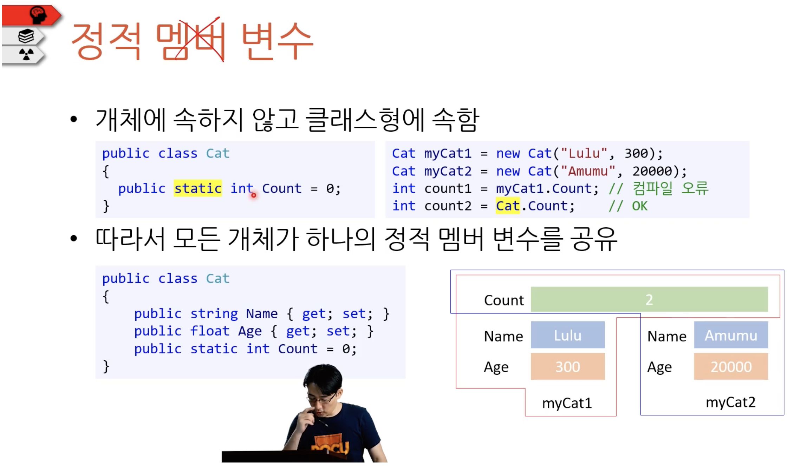

물론 키가 없을 때 접근하면 예외가 발생한다.

[] 는 접근 기능 + 추가 기능을 모두 가짐

### 딕셔너리를 사용하면 좋은 경우

- 배열처럼 순서대로 저장하기 힘든 경우 즉 Key가 순서가 없는 개념을 가질 수 있음

- 배열 중간에 데이터 삽입 및 삭제를 자주해야할 경우

## 코드보기 : 딕셔너리

```C#
using System;
using System.Collections.Generic;

namespace DictionaryExample
{
    class Program
    {
        static void Main(string[] args)
        {
            List<int> list = new List<int>();

            Random random = new Random();

            for (int i = 0; i < 20; i++)
            {
                int number = random.Next(0, 10);
                list.Add(number);
            }

            Console.WriteLine($"[ {string.Join(", ", list)} ]");

            Dictionary<int, bool> dictionary = new Dictionary<int, bool>();

            for (int i = 0; i < list.Count; i++)
            {
                if (dictionary.ContainsKey(list[i]))
                {
                    list.Remove(list[i]);
                }
                else
                {
                    dictionary.Add(list[i], true);
                }
            }

            Console.WriteLine($"[ {string.Join(", ", list)} ]");
        }
    }
}
```

- list의 capacity는 20이다. count도 20이다. 각 원소는 0~9중 무작위의 수가 들어가있음

```C#
Dictionary<int, bool> dictionary = new Dictionary<int, bool>();

for (int i = 0; i < list.Count; i++)
{
    if (dictionary.ContainsKey(list[i]))
    {
        list.Remove(list[i]);
    }
    else
    {
        dictionary.Add(list[i], true);
    }
}
```

- dictionary의 value의 자료형은 무엇을 하던 상관없다. 어차피 key만 사용하기 때문이다.

- 위 코드에서 list에서 처음 등장한 수는 dicionary에 추가되고, 여러 번 등장한 수는 list에서 삭제된다.

- 결과적으로 dicionary의 키들은 list에서 중복되는 원소를 제거한 결과임

- 이 코드는 정상적으로 작동하지 않을 수 있음. 이는 Remove와 for문에서 문제가 있다. `list.count를 for문을 돌 때마다 호출하게 되는데 Remove를 호출하면 count가 변한다.`
따라서 정상적으로 작동하지 않고 인덱스를 벗어나 예외가 발생할 수 있음.
`Remove는 값을 찾아서 앞에서(0 색인)부터 찾아서 지운다. 즉 같은 값을 가진 원소를 지우는 것이지 중복된 원소를 지우는 것이 아니다.` 따라서 원소가 지워지면서 원소들이 밀리기 때문에 어떤 원소는 건너뛸 수 도 있음!

- 그렇다면 정상적으로 고치기 위해서는 어떻게 해야할까?

```C#
for (int i = list.Count - 1; i >= 0; i--)
{
    if (dictionary.ContainsKey(list[i]))
    {
        list.RemoveAt(i);
    }
    else
    {
        dictionary.Add(list[i], true);
    }
}
```

- 뒤에서 부터 찾으면서 지우면 된다. 두가지 원인을 모두 해결했다.

1. 우선 list.Count는 변하지만 한 번만 호출해서 모든 원소에 접근할 수 있다.

2. 지울 때 중복된 원소를 바로 제거한다.

## HashSet

딕셔너리와 차이점은 해시셋은 키만 있음! (중복이 안됨!)

### HashSet 생성

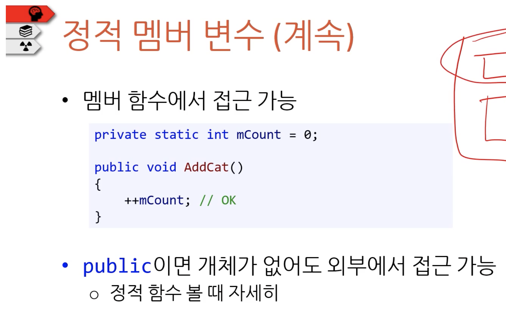

### HashSet 요소 추가

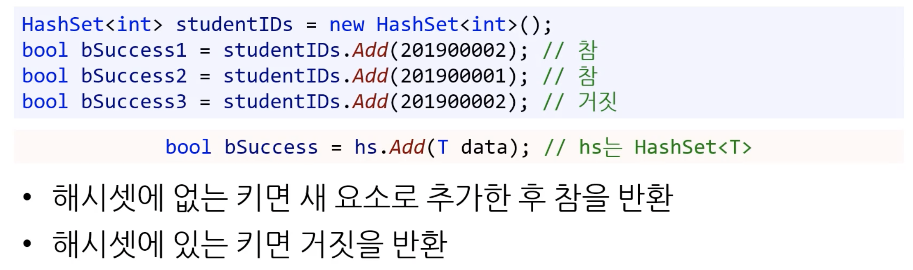

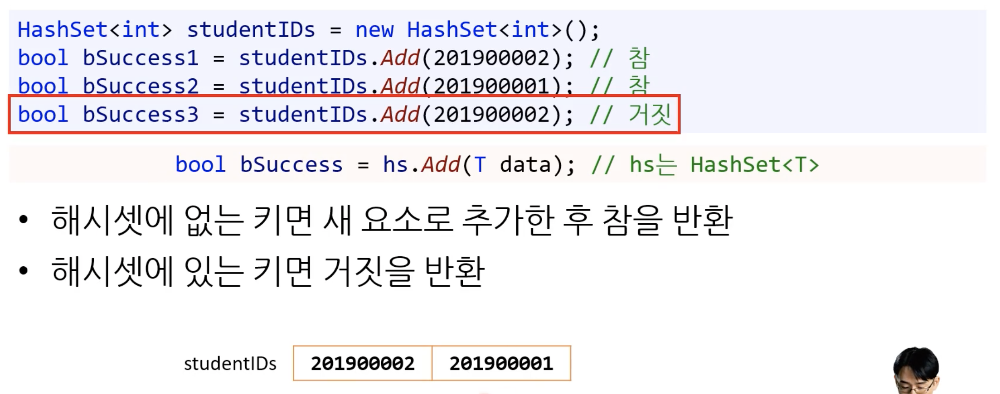

예외를 던지지 않는다. 요소를 추가하는데 실패하더라도 이미 해시셋에 그 원소가 있으니까 프로그래머가 의도한 결과는 결국 동일하다.

### 이 요소가 해시셋에 있나요?

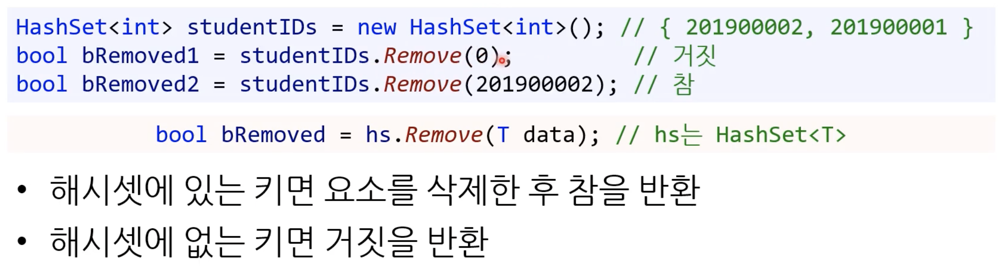

### 해시셋의 요소 삭제하기

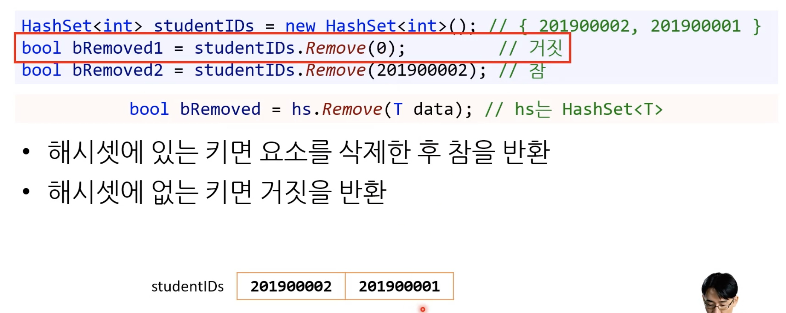

예외를 던지지 않는다는 것에 주목하자. 프로그래머의 의도한 결과와 같다!

### 해시셋의 모든 요소 삭제

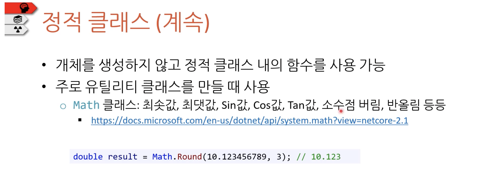

### 해시셋의 요소 가져오기

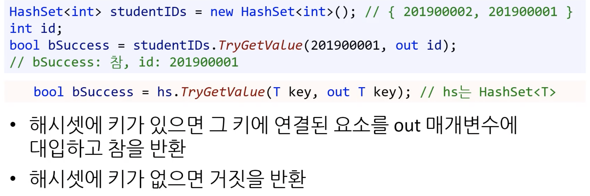

### 해시셋은 언제 사용할까?

중복을 제거할 때!

## 컬렉션과 같이 쓰면 유용한 것들 : foreach

i라는 인덱스가 왜 필요한가? 실수를 줄여준다.

읽기도 편함!

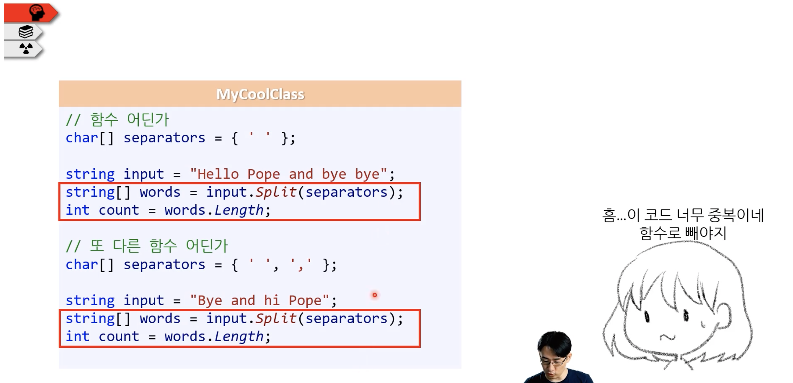

break만 없으면 끝까지 순회하면서 모든 원소에 접근한다!

### 딕셔너리와 foreach문

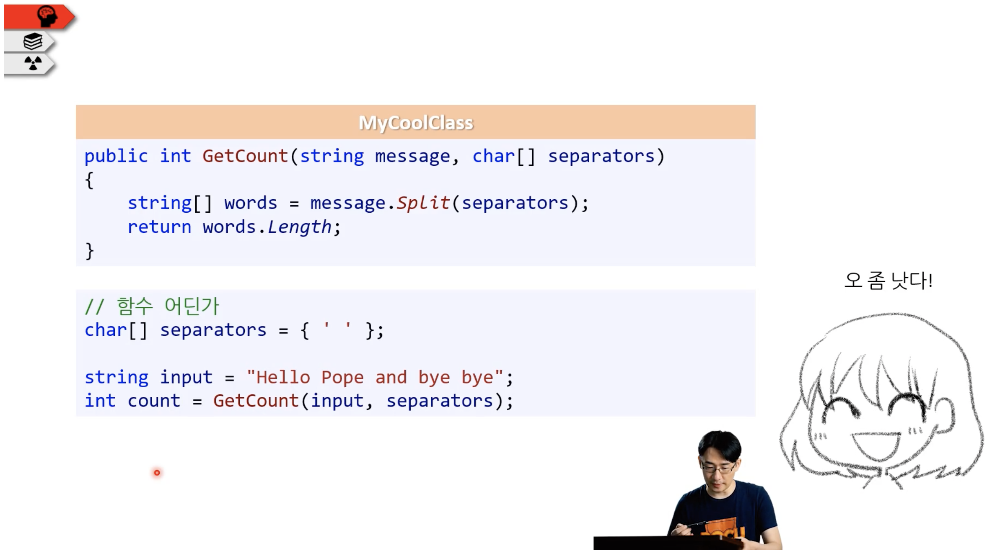

KeyValuePair이 특이하다!

### 해시셋과 foreach문

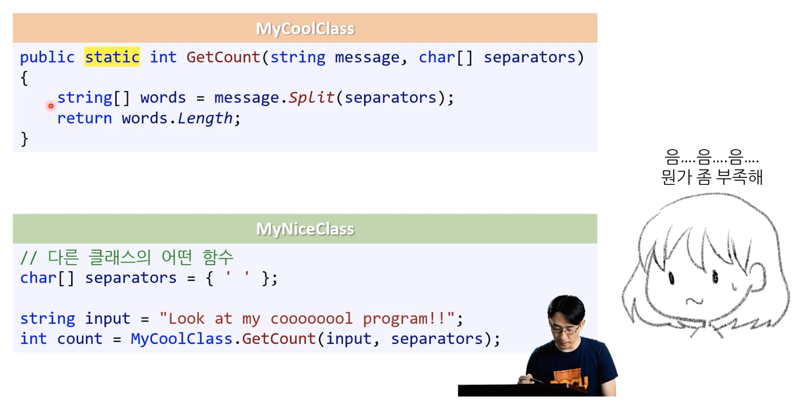

### 배열과 foreach문

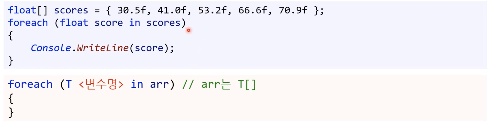

### foreach문의 한계

1. 방문하는 요소의 값을 바꿀 수 없다.

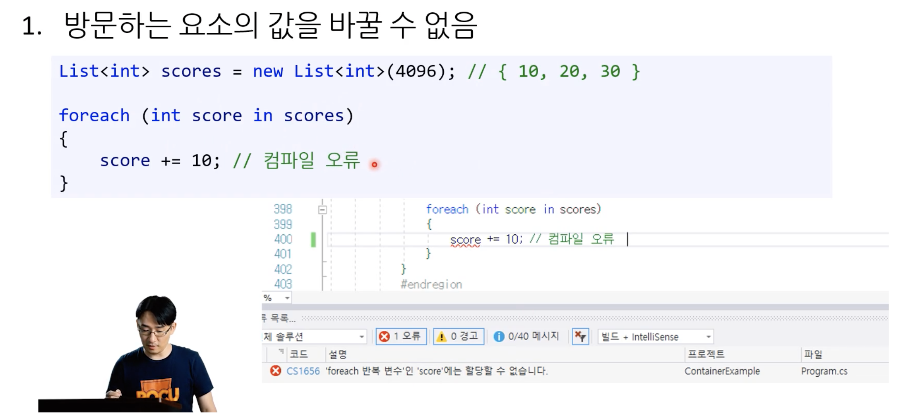

\* 컴파일 오류가 발생하는 것에 주목하자

2. 현재 방문 중인 요소의 색인을 알 방법이 없다.

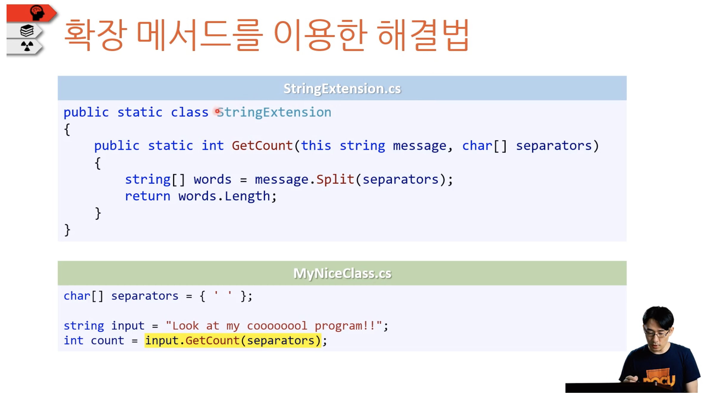

\* 별도의 변수 int index를 활용했음

3. 컬렉션이나 배열을 거꾸로 탐색할 수 없음

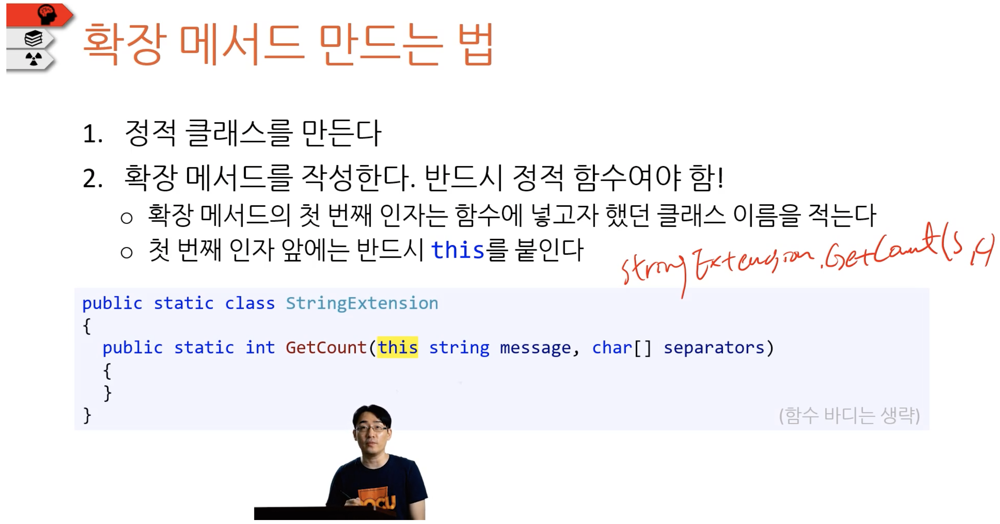

## 코드보기 : foreach문

```C#
List<int> list = new List<int>();

Random random = new Random();

for (int i = 0; i < 20; i++)
{
    int number = random.Next(0, 10);
    list.Add(number);
}
```

- 이 부분은 배열에 원소를 추가하는 코드다. 배열을 순회하는 것이 아니라서 foreach문을 사용할 수 없다!

```C#
Dictionary<string, int> dictionary = new Dictionary<string, int>
            {
                { "key1",  1 },
                { "key2",  2 },
                { "key3",  3 },
                { "key4",  4 },
                { "key5",  5 },
                { "key6",  6 },
            };
```

- 딕셔너리에 원소를 추가하면서 초기화하는 코드(이렇게도 할 수 있다!)

## 컬렉션과 같이 쓰면 유용한 것들 : var

var은 variable 변수에서 따왔음

### 딕셔너리 foreach문의 문제점

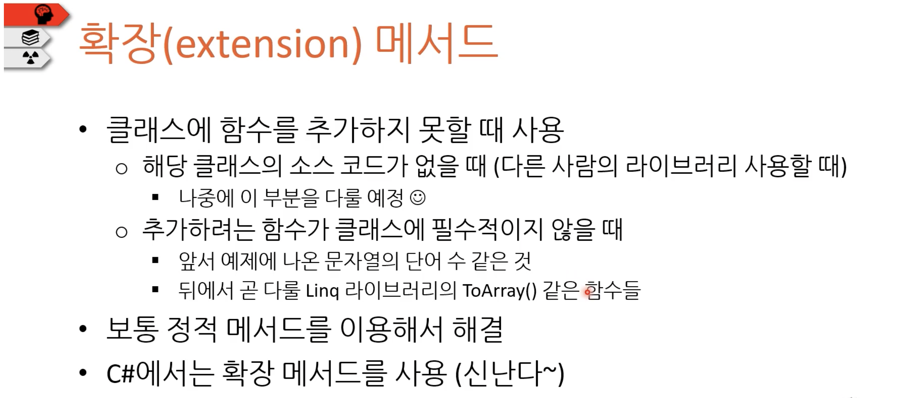

길고 보기 싫다.

### var로 수정하자

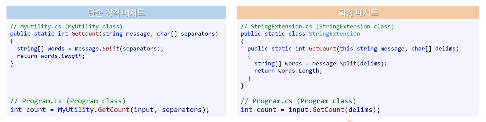

### var 키워드의 정체

- 묵시적 자료형
  - 컴파일러가 알아서 자료형을 추론해줌

- 지역 변수에서만 사용가능
  - 클래스를 배우면 당연한 것을 알게 될 것임

- 반드시 선언과 동시에 대입을 해야함
  - 그래야지 컴파일러가 추론할 수 있음
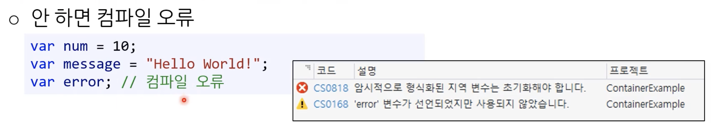
\* 컴파일 에러에 주목하자

### 코딩 표준 : 자료형이 명백할 때만!

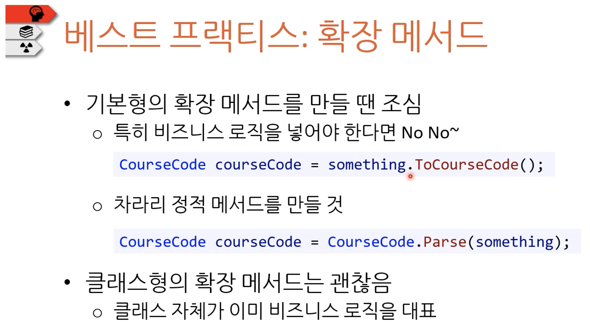