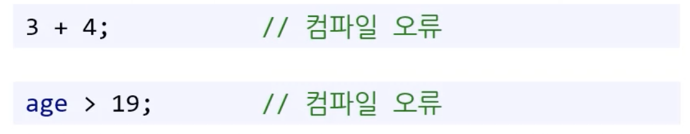
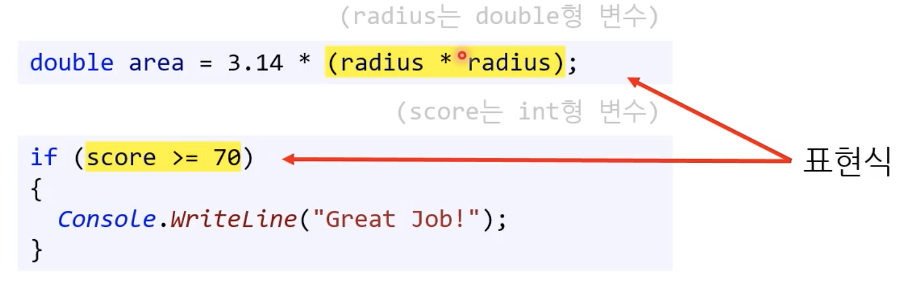
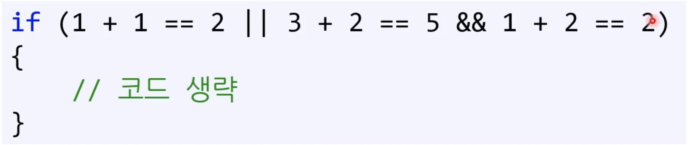

# Week4

## 조건문의 필요성

프로그램이 매번 같은 결과만 보여준다고 상상해보자. 지루하겠죠? 유용성도 매우 떨어집니다. 그렇다면 특정 상황에 맞게 프로그램이 작동하게 만들고 싶으면 뭐가 필요할까요?

여기서 나온 개념이 조건문입니다. 명제라고 생각하면 됩니다.

> 만약 방이 어두우면, 불을 켜  
> IF the room is dark, turn on the light

## if문

### 조건문 if의 사용법

- 조건이 만족하면 if 문 아래의 중괄호 안의 코드(block)를 실행한다.

```<C#>
if (조건식)
{
	조건을 만족할 때 실행되는 코드
}
```

### 조건

조건이 무엇일까? 조건의 정의는 다음과 같다.

> x와 같은 변수의 값에 따라 참이나 거짓임을 판별할 수 있는 식이나 문장

그런데 참과 거짓을 표현할 수 있는 `자료형`이 있다는 것을 잊지말자.

### 불리언형

1비트만 사용해서 0과 1로 참과 거짓을 표현하는 자료형이죠?

### 조건식

조건문의 괄호 안에 들어가는 조건식은 참이나 거짓을 반환해야한다. 따라서 이를 `Boolean Expression` 이라고 부릅니다. 여기서 Expression 이라는 용어가 나오는데요? 한국어로 표현식 입니다.

### 표현식

표현식이란 무엇일까요?

아래와 같은 것들이 있습니다.

```<C#>
3 + 4
num1 - num2
num1 < 10
```

#### 표현식의 정의

표현식의 정의는 다음과 같습니다.

> 하나 이상의 피연산자와 0개 이상의 연산자의 조합  
> 어떤 특정 값이나 개체, 메서드, 혹은 네임스페이스로 평가할 수 있다.

굉장히 추상적이죠?

### 구문(Statement)과 표현식(Expression)

구문과 표현식을 비교하면 직관적으로 이해가 쉽습니다.

우선 구문의 정의를 다시 생각해봅시다.

#### 구문의 정의

;로 끝나는 코드 한줄 또는 {}의 block을 말합니다. 이는 `실행의 최소단위`죠?

#### 표현식과 구문의 관계

표현식은 `평가(evalutate)되며 값을 반환`합니다. 참고로 void 반환도 반환의 개념에 포함됩니다. 일부 표현식은 단독으로 사용할 수 없습니다.

이렇게 ` 표현식만 사용하면 단독으로 사용할 수 없죠?``  `컴파일 오류`가 발생합니다.


구문에 표현식이 포함될 수 있습니다. 아래처럼 말입니다.



### 불리언 표현식(Boolean Expression)

불리언 표현식의 정의는 다음과 같습니다.

> 평가되어 불리언 값을 반환하는 표현식

이 표현식을 실행하면 참이나 거짓이 반환되죠?

## 관계연산자(Relational Operator)

불리언 표현식을 만들기 위해서 [관계연산자](https://learn.microsoft.com/en-us/dotnet/csharp/language-reference/operators/comparison-operators)가 필요합니다.

내용은 링크를 참조하자.

## if/else 문

### else : 만약 그렇지 않다면

if문의 조건식(불리언 표현식)이 참이 아닐 경우 실행된다. 당연히 if없이 else를 쓰면 `컴파일 에러`가 발생한다.

```<C#>
if (조건식)
{
	조건을 만족할 때 실행되는 코드
}
else
{
	조건을 만족하지 않을 때 실행되는 코드
}
```

조건이 여러 개라면 어떤 문제점이 발생할까요? 계산기 예제에서 살펴봅시다.


들여쓰기가 정말 지옥입니다. ㅋㅋ 문법상 block에 이어갈 수 밖에 없습니다...

### else-if

else-if를 쓰면 들여쓰기를 할 필요가 없습니다!


else 있고 block 내부의 if문을 합쳐주는 기능입니다.


else-if 동작의 흐름을 이해하는 것이 중요합니다. 주의점을 살펴보겠습니다. 조건문이 내려오면서 당연히 위의 조건문의 값은 거짓이고 이게 and로 누적되죠?

### else-if 주의점

- 조건문의 순서가 올바른지 확인해야한다. 논리적으로 말이 되어야합니다.
- 헷갈리면 그림을 그려보자!
  

논리적 흐름 상 조건문 A, 조건문 B 모두 거짓이어야 else가 실행됩니다.

## 코딩 표준

Block 안에 오직 한 줄의 구문(statement)가 있으면 중괄호를 생략할 수 있습니다.

이거 하지말고 무조건 Block 중괄호 써줍시다!! Block도 `구문`이죠!

## 논리 연산자

### 논리 연산자의 종류


비트 연산자와 흐름이 동일합니다.

### if 문 안의 표현식의 평가

- 논리 연산자 때문에 if문 안의 표현식이 `평가(evaluate)`가 되지 않을 수 있습니다.
- 실행이 되지 않고, 값도 반환하지 않습니다.

#### 예시


|| 조건 연산자를 if 문의 조건식에 사용할 때 첫번째 표현식이 참이면 두번째 표현식은 평가되지 않습니다.

따라서 첫번째 표현식이 거짓일 때만 두번째 표현식을 평가합니다.


&& 조건 연산자를 if 문의 조건식에 사용할 때 첫번째 표현식이 거짓이면 두번째 표현식은 평가되지 않습니다.

따라서 첫번째 표현식이 참일 때만 두번째 표현식을 평가합니다.

#### 연습문제

```<C#>
int num1 = 10;
int num2 = 20;
if (num1 == 10 || ++num2 == 20)
{
    num1++;
}

Console.WriteLine($"{num1}, {num2}");
```

정답은 "11, 20"이다. 두번째 표현식은 실행되지 않는다.

### 논리연산자 드모르간 법칙


집합 생각하면 됩니당.

#### 연습 문제 2

```<C#>
using System;

public class Program
{
    public static void Main()
    {
        int num = 10;

	if (3 * 6 != 18 || ++num == 11)
	{
	    num++;
	}

	if (12 + 2 == 14 && num++ == 11)
	{
    	    num++;
	}

	if (1 * 4 == 4 || num++ > 0)
	{
	    num++;
	}

	Console.WriteLine(num);
    }
}
```

정답은 14다.

#### 연습 문제 3

```<C#>
using System;

namespace LogicalExpressions
{
    class Program
    {
        static void Main(string[] args)
        {
            int num1 = 1;
            int num2 = 1;
            int num3 = 4;

            bool bExpression1 = !(num1 == num2 && num1 != num3);
            bool bExpression2 = num1 != num2 || num1 == num3;

            Console.WriteLine($"expression1: {bExpression1}");
            Console.WriteLine($"expression2: {bExpression2}");

            bool bExpression3 = num1 > num2 || num1 == num3 || ++num1 > num2;
            Console.WriteLine($"expression3: {bExpression3}");
            // num1 = 2, num2 = 1, num3 = 4
            // 따라서 true 출력

            bool bExpression4 = num3 >= num2 || num1-- == num2;
            Console.WriteLine($"expression4: {bExpression4}");
            // num3 >= num2 는 참이라서 두번째 표현식은 실해되지 않는다.
            // 따라서 true 출력

            bool bExpression5 = num3 == num1 && --num2 > num1;
            Console.WriteLine($"expression5: {bExpression5}");
            Console.WriteLine($"num1: {num1}, num2: {num2}, num3: {num3}");
            // num3 == num1 은 거짓이라서 두번째 표현식은 실행되지 않는다.
            // 따라서 false 출력
            // 최종적으로 num1 = 2, num2 = 1, num3 = 4
        }
    }
}
```

#### 논리력 부족 실수


이렇게 짜면 안 된다.

if 문이 조건식을 평가하고 아니면 else-if를 실행하기 때문에 이미 배제된 로직이 포함됩니다. CPU 낭비입니다. 2번 평가하니까... 그리고 가독성도 매우 떨어집니다!!

## 조건 연산자(A.K.A 삼항연산자)


주의할 것은 남용하면 가독성이 떨어진다. 조심합시다.

## 연산자 우선순위

### 우선순위와 결합법칙

- 연산자 우선순위가 동일한 연산자가 여러 개일 때 결합법칙에 따라 연산 순서를 결정한다.

  - 대부분 연산자의 결합 순서는 왼쪽에서 오른쪽
  - 소수의 연산자만 오른쪽에서 왼쪽

- 우선순위에서 곱하기(&, &&)가 더하기(| ||)보다 우선한다는 것은 꼭 기억하자.

### 우선순위와 결합법칙 연습문제

x = a++ \* d;

x = (a++) \* d;

위 두개는 동일하다. 후위 연산자 ++가 \*보다 우선 순위가 높다.

```<C#>
int a = 1;
int b = 2;

int x = a++ * b;
Console.WriteLine(x);
Console.WriteLine(a);

>> 2
>> 2
```

```<C#>
int a = 1;
int b = 2;

int x = (a++) * b;
Console.WriteLine(x);
Console.WriteLine(a);

>> 2
>> 2
```

```<C#>
int a = 1;
int b = 2;

int x = ++a * b;
Console.WriteLine(x);
Console.WriteLine(a);

>> 4
>> 2
```

```<C#>
int a = 1;
int b = 2;

int x = (++a) * b;
Console.WriteLine(x);
Console.WriteLine(a);

>> 4
>> 2
```

`C#에서 후위 증감연산자는 해당 구문(statement)의 연산이 모두 끝나고 적용된다.`

## Short-Circuit Evaluation



- 연산자 우선 순위는 &&가 ||보다 높다.
- 하지만 두번째 표현식, 세번째 표현식은 실행조차 되지 않는다. || , && 연산자는 평가 순서를 강제하기 때문이다.
- 모두 평가 되고나서 우선 순위에 따라 계산된다.

```<C#>
int num1 = 5;
int num2 = 15;
int num3 = 2;

int result3 = num1 / (num2 + num1) + num1++;
Console.WriteLine($"result3: {result3}");
Console.WriteLine($"num1: {num1}, num2: {num2}, num3: {num3}");
```

1. num1 / (num2 + num1) + num1++
2. 5 / (15 + 5) + 5++ (num1의 현재 값은 5이므로)
3. 5 / 20 + 5++
4. 0 + 5++ (5 / 20은 정수 나눗셈이므로 0)
5. 5 (num1++은 현재 값을 반환하고 나서 1 증가)

`C#에서 후위 증감연산자는 해당 구문(statement)의 연산이 모두 끝나고 적용된다.`

```<C#>
int num1 = 5;
int num2 = 15;
int num3 = 2;

int result3 = num1 / (num2 + num1) + ++num1;
Console.WriteLine($"result3: {result3}");
Console.WriteLine($"num1: {num1}, num2: {num2}, num3: {num3}");
```

1. num1 / (num2 + num1) + ++num1
2. 6 / (15 + 6) + ++num1 (num1의 현재 값은 6이므로)
3. 6 / 21 + ++num1
4. 0 + ++num1 (6 / 21은 정수 나눗셈이므로 0)
5. 7 (++num1은 현재 값에 1을 더한 후 반환)

`전위 증감연산자가 가장 우선순위가 높아서 먼저 실행되어 num1이 증가한 상태로 다른 표현식들이 평가되었다.`
