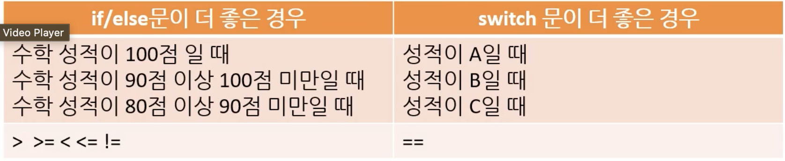
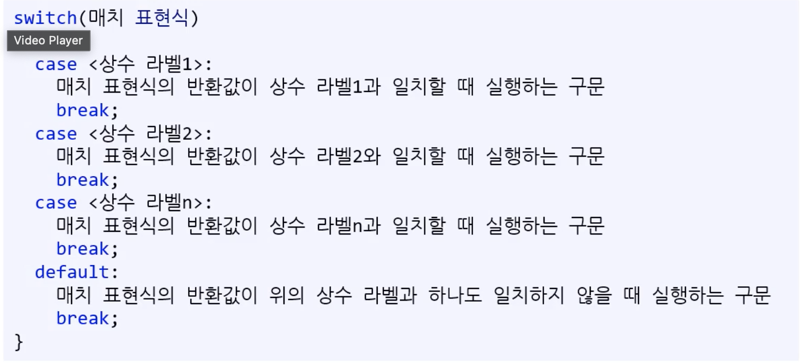
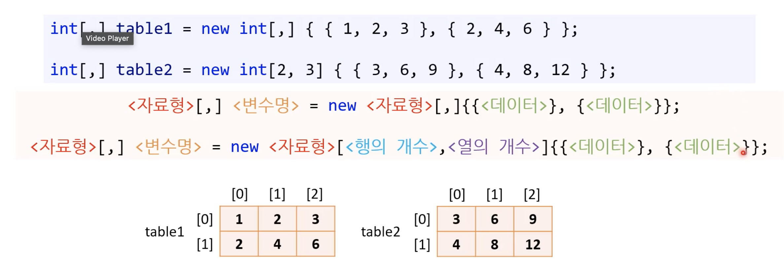

# Week5

## switch 문

if/else 문에 비해서 가독성이 좋은 상황에 사용한다. 어떤 상황에 switch문이 더 적합할까?  
=> 패턴 일치 조건



### switch 문에서 문법 용어

- switch : 전환, 바꾸다의 의미
- case : 경우(Ex: case by case)

### switch 문 문법



매치 표현식의 결과 값에 따라 실행할 구문을 선택한다.

if-else 문과 어떻게 1대1로 대응하는지 이해해야한다.

### switch 문을 탈출 : break

모든 case 구문 다음에는 break 구문을 넣어야한다. C#에서 없으면 `컴파일 오류`가 발생한다.

다른 언어에서는 fallthrough라고 break 없으면 아래로 쭉 실행하는 방식을 채택하기도 한다. 결론은 case 마다 꼭 break를 써주자! 실수를 막는 방법입니다!

### default 구문

- 매치 포현식의 반환 값과 일치하는 case 구문이 없을 경우
  실행된다.
- default 문에서 잘못된/예상하지 못한 매치 표현식의 반환값을 잡아야하는 경우 assert를 사용한다.
- default 구문 끝에도 반드시 break를 넣어야한다.

### case 구문에 사용할 수 있는 상수

- int
- long
- char
- bool
- `string(C# 전용)`

부동소수점형들은 사용하지 못한다.
char은 아스키로 결국 정수형과 호환된다.

### case 여러 개 묶기

```
int answer = int.Parse(Console.ReadLine());
switch (answer)
{
    case 1:
		Console.WriteLine("1");
		break;
    case 2:
    case 3:
    case 4:
		Console.WriteLine("1");
		break;
    case 5:
		Console.WriteLine("1");
		break;
    default:
		Console.WriteLine("1");
		break;
}
```

case2, case3, case4를 묶었다. fall through를 활용한 방식이다. case2, case3에 break가 없어서 break를 만날 때 까지 아래 case 문을 확인하고 실행하면서 내려온다.

## 배열

왜 배열을 사용할까?

- 코드 중복을 줄인다.
- 변수만 사용한다면 변수의 개수를 동적으로 사용하지 못한다.
  - 배열을 선언해서 변수를 몇 개 담을지 입력을 받을 수 있다!!

### 배열의 정의

- `동일한 자료형`을 여러 개 담을 수 있는 자료구조
- 배열 안의 데이터를 원소(element)라고 부름
- 몇 개의 데이터를 담을지 결정한 뒤에는 그 개수를 바꿀 수 없음
- 배열의 길이는 바꿀 수 없지만 원소의 값은 변경 가능

### 배열 선언하기

int[] ages = new int[3];
<자료형>[] 변수명 = new <자료형>[개수];

### 배열의 선언과 동시에 대입

int[] ages = new int[]{ 30, 27, 11 };
<자료형>[] 변수명 = new <자료형>[]{값...};

int[] ages = int[]{ 30, 55, 14 };
<자료형>[] 변수명 = {값...};

### 요소에 접근하기

[]을 첨자(subscript) 연산자라고 부른다. []안에 접근(access)하고자 하는 데이터의 색인(index)를 넣는다.

요소에 접근한 뒤 `변수와 똑같이` 사용할 수 있다.

### 데이터의 순서

제일 앞(왼쪽) 부터 센다.

### 배열의 색인(index)

대부분 프로그래밍 언어에서 색인은 0부터 시작한다.

배열에서 요소들은 메모리에 연속적으로 위치한다. 이 때 첫번째 요소(가장 왼쪽)부터 몇 칸(offset) 떨어진지를 나타내는 값이 색인이다.

## Char 배열과 문자열

char 배열에서 기능을 추가한 것이 문자열이다.

char 배열은 선언 후 길이를 바꿀 수 없지만, 문자열은 이를 보완해서 길이를 변경할 수 있다.

## for 반복문

```<C#>
for (초기화 코드; 반복 조건식; 증감문)
{
	반복할 코드
}
```

- 초기화 코드는 딱 한번만 실행한다.
- 반복 조건식을 평가한다.

  - 참이면 중괄호(block) 사이의 코드를 실행한다.
  - 거짓이면 건너뛴다.

- 증감문을 실행한다.
- 다시 반복 조건식을 평가한다.

## while 반복문

```<C#>
while (조건식)
{
	조건을 만족할 때 반복할 코드
}
```

반복할 횟수를 안 정하고 무한 반복도 가능하다.

### 무한 반복

```<C#>
while(ture)
{
	무한 반복
	조건 문으로 break
}
```

## do-while

```<C#>
do
	{
		최소 한 번은 실행하는 코드
		한 번 실행 후에는 조건식이 참일 때만 실행
	} while(조건식)
```

## for vs while

for 문이 더 좋을 때

- 반복문이 시작하는 시점에 범위가 정해져 있을 때
- 배열의 모든 요소를 훑을 때

while 문이 더 좋을 때

- 반복문을 종료하는 시점이 반복문 실행 도중에 결정될 때

## while vs do-while

```<C#>

while (true)
{
	if (조건식)
	{
		break
	}
}

```

do-while 보다 위 처럼 쓰는 경우가 많다.

## 2차원 배열

int[ , ] table = new int[2, 4];
<자료형>[,] <변수명> = new <자료형>[<행의 개수>,<열의 개수>]

### 2차원 배열 선언과 동시에 대입하기



### for문 속 for문

2차원 배열은 순차적으로 access 하기 위해서는 2중의 for문이 필요하다.
행을 위한 for문 + 열을 위한 for문

```<C#>
int[,] table = new int[2, 3];

for (int i = 0; i < 2; i++)
{
	for (int j = 0; j < 3; j++)
	{
		table[i, j] = (i + 1) * (j + 1);
	}
}
```

(y , x) 로 이해하면 덜 헷갈린다. 앞의 숫자가 행 다음 숫자가 열

## 3차원 4차원 배열

### 반복문이 많아질 수록 성능이 떨어짐

기하급수적으로 떨어진다.

데이터 수에 비례해서 for문 내포하면 점점 기하급수록 증가합니다. O(N^n)
