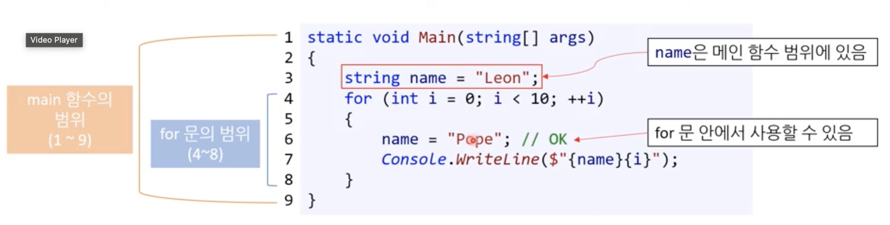
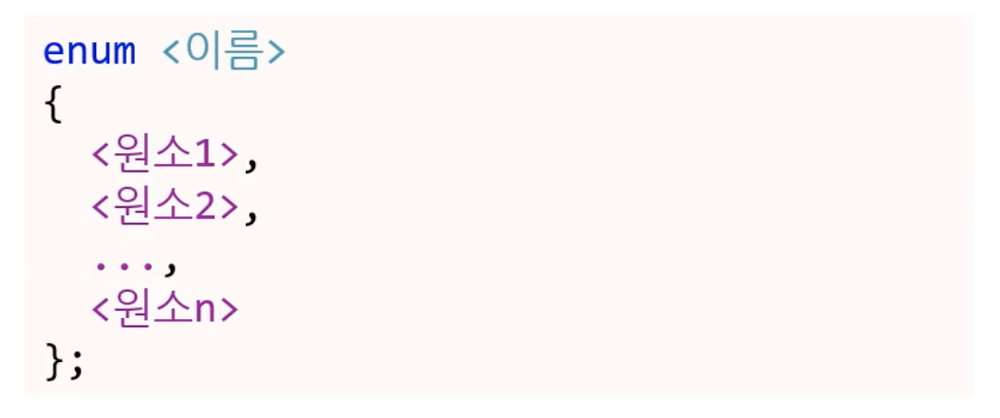

# Week6

## 함수

- 함수는 중복 코드를 줄이고, 실수를 줄이기 위해 사용한다. 따라서 수정할 때 굉장히 유리하다.
- 코드의 재활용성을 높인다! 함수를 호출하기만 하면 되기 때문이다.
- 입력에 대응되는 출력이 일정하다. (블랙 박스)

### 예제 : 소수점 n 자리에서 올림, 내림, 반올림하기

```C#
double average = 123.456
// 소수점 세번째 자리 올림
average = (int) (average * 100 + 1) / 100.0
// 소수점 세번째 자리 내림
average = (int) (average * 100) / 100.0
// 소수점 세번째 자리 반 올림
average = (int) (average * 100 + 0.5) / 100.0
```

10 ^ n - 1 을 곱해서 형변환을 이용해서 소수점을 자르고 10 ^ n - 1을 나눠서 다시 원래 자리 수로 복구하면 된다.

### 배열의 길이 구하는 법

배열 변수명이 array라고 하면 array.Length를 하면 구할 수 있다!
시간 복잡도 O(1)이다. 배열을 선언할 때 길이 정보가 배열 객체 내에 저장되어있다.

이런 정보를 `프로퍼티`라고 부른다.
(C# 전용)

### 함수의 정의

```
static <반환형> <함수명> (<매개변수 목록>)
{
	함수 body
}
```

함수를 정의할 때는 다음의 것들이 필요하다.

- 함수 시그니처
- 반환형(필수, 언어에 따라 시그니처에 포함 될 수 있음)
- 함수 바디(필수)

### 함수 시그니처

함수 시그니처는 아래와 같이 구성된다. 시그니처는 고유한 함수를 식별할 수 있게 해준다. 함수의 identity, 서명!

- static 같은 키워드(필수)
- 함수명(필수)
- 매개변수 목록(선택)
  - 매개변수 목록은 반드시 있어야 하는 것은 아니다.

### 함수의 반환형

- 함수의 출력
- 반환형은 필수다. 반환형을 선언하지 않으면 `컴파일 오류`가 발생한다.
- void 형은 반환값이 없다.
- void가 아닌 경우 함수 바디에 return 키워드를 이용해 데이터를 반환해야 한다. 그렇지 않으면 `컴파일 오류`가 발생한다.

### 함수의 매개변수 목록

- 콤마를 통해서 입력값을 여러 개 받을 수 있다.
- int,byte 같은 자료형 뿐만 아니라, int[], byte[]와 같이 배열도 매개변수로 받을 수 있다.
- 매개변수는 필수가 아니다! (수학과 달라지는 개념)
  - `함수는 0개 이상의 매개변수를 가진다.`

- 엄밀히 말하면 인자와 매개변수를 구분해야한다.
  - 매개변수는 함수를 정의할 때 함수의 입력값을 선언하는 것
  - 인자는 함수를 호출할 때 전달되는 값을 말한다.

### 메인 함수의 매개변수

❗️ 메인 함수의 매개변수를 출력해보자

```<C#>
static void Main(string[] args)
{
	for (int i = 0; i < args.Length; i++)
	{
		Console.WriteLine($"args[{i}] = {args[i]}");
	}
}
```

메인 함수를 실행하면 아무것도 출력이 안 된다. 왜냐하면 프로그램을 실행할 때 메인 함수에 아무런 인자도 넘겨주지 않았기 때문이다.

메인 함수는 언제 실행될까? 프로그램이 시작되면 바로 실행된다. 따라서 프로그램을 실행할 때 어떤 인자를 입력해야지 메인 함수는 인자를 받아서 출력을 하던가 함수 바디의 내용을 실행할 수 있다.

함수의 매개변수의 이름(변수명)은 만드는 사람 마음이다.

#### args

- 띄어쓰기를 만날 때 마다 string 하나로 구분된다. 즉 단어가 string 하나로 args에 들어가는 거죠.

- 문장을 통채로 다 넣고 싶으면 ""로 감싸서 넣으면 됩니다!

### 함수의 바디

- 함수의 기능을 구현한 코드 블록이다.
- 반환형이 void가 아닌 함수는 반드시 return 키워드를 포함해 값을 반환해야한다!

### 함수의 이름

- 함수가 어떤 기능을 하는지 명확하게 알려주도록 이름을 지어야한다.
- `함수의 블랙박스` : 어떤 입력을 넣으면 함수 내부 구조(작동 원리)를 알지 못한다. (사용자는 알 필요가 없다.)
- 함수의 이름은 블랙 박스의 Label이다. 함수 이름만 봐도 입력값을 넣으면 어떤 출력이 나오는지 알 수 있도록 함수 이름을 명확하게 지어라!

### 함수의 호출

- 호출해서 얻을 반환값을 바로 변수에 대입할 수 있다.
- 함수 호출 시 인자에 변수를 넣어도 된다!

```C#
double result = Square(num);
```

### 코딩 표준 : 함수 이름 짓기

- 동사로 시작할 것
- 파스칼 표기법
  - PrintFullName

### 코딩 표준 : 매개 변수와 지역변수 이름 짓기

- 정확하게 알려주는 명사를 쓸 것
- 카멜 표기법
  - mathScore

### 선조건과 후조건

- 선조건

  - 함수 실행 전에 참으로 가정한 조건
  - 함수 이름이나 매개변수로 유추 가능하나, 부족하면 주석으로 설명 해야한다.
  - 함수를 만드는 프로그래머의 문제인지, 사용하는 사람의 문제인지? 누구의 잘못인가를 따져봐야한다. Divide 함수의 분모에 0을 넣으면 사용하는 사람 문제겠죠?

- 후조건

  - 함수 실행 후 보장되는 조건
  - 보통 함수의 이름과 반환형으로 유추할 수 있다.

- 선조건을 만족하지 못하면 후조건을 보장할 수 없다!

- 문서 주석(Document Comment)이라는 주석 기능을 사용할 수 있다.
  - 비쥬얼 스튜디오에서 슬래시(/) 세번 입력 시 XML format으로 문서 주석 생성

#### 함수 시그니처가 약속하는 것

```<C#>
static float Divide(float numerator, float denominator)
{
	return numerator / denominator
}

```

- 함수명 : 두 수를 나눈 결과를 얻을 수 있는 함수구나
- 매개변수 : 첫 번째 매개변수가 분자고 두 번째 매개변수는 분모구나
- 반환형 : 부동소수점형이 반환되는 구나

### 범위

- 범위(scope)를 나타내는 block은 구문(statement)에 포함된다.
- if , 반복문도 범위가 있다.
- 기본적으로 어떤 범위 안에 선언된 것(지역 변수)은 범위 밖에서 쓰지 못한다!
  - `컴파일 오류`

### 내포된 범위



- 상위 범위에서 선언한 변수/상수는 하위 범위(내포된 범위)에서 사용할 수 있다.
- 상위 범위의 변수와 같은 이름을 가진 변수를 하위 범위에 선언할 수 없다.

### 함수의 범위

- 기본적으로 함수 안에서 선언한 모든 것은 그 함수에서만 사용 가능하다.
- 이를 지역 변수(local variable)라고 부른다.
- 함수 매개변수, 반환 값 모두 복사된다.(pass by vlaue)

```<C#>
static double Square(double number)
{
	number *= number;
	return number;
}
static void Main(string[] args)
{
	double number = 5;
	double result = Square(number);
}
```

Main의 number와 Square의 number은 이름만 같을 뿐 소속된 곳이 다르다. 동명이인이라고 생각하죠!

#### 예제

```<C#>
class Program
    {
        static void Main(string[] args)
        {
            int[] numbers = new int[] { 1, -3, 4, -10, 4, 2, 9, 15 };
            double average = GetAverage(numbers);

            Console.WriteLine($"average: {average}");

            {
                //int average = 0; // Compile error!(상위 scope에서 이미 선언되었기 때문에)
                string message = "Message in the first child scope!";
                Console.WriteLine(message);
            }

            {
                //int average = 0; // Compile error!
                string message = "Message in the second child scope!";
                // scope1, scope2는 형제라서 컴파일 오류 발생X
                Console.WriteLine(message);
            }
        }

        static double GetAverage(int[] inputs)
        {
            int sum = 0;

            // Compile error! (numbers는 Main()의 지역변수이기 때문에)
            //for (int i = 0; i < numbers.Length; i++)
            //{
            //    sum += numbers[i];
            //}

            for (int i = 0; i < inputs.Length; i++)
            {
                sum += inputs[i];
            }

            return (double)sum / inputs.Length;
        }
    }
```

## 값에 의한 전달과 참조에 의한 전달

### 값에 의한 전달

함수를 호출할 때 함수의 매개변수(인자)에 변수를 입력할 수 있다.

- 원본 변수와 인자는 다르다!
  - 인자에 원본 변수의 사본값이 대입된다.

- 호출된 함수(receiver)의 인자 값이 변경되도 호출자 함수(caller)에 반영되지 않는다.

- 예시

```<C#>
static void Square(double number)
{
	number *= number;
}
```

receiver의 number(인자)의 변화는 caller에 반영되지 않죠!

```<C#>
static void Main(string[] args)
{
	int input = 5;
	Square(input);
	Console.WriteLine(input); // 그대로 5
}
```

### 주소에 의한 전달

- 원본 변수를 바꿀 수 있다!

```<C#>
static void Square(ref double number)
{
	number *= number;
}
```

```<C#>
static void Main(string[] args)
{
	int input = 5;
	Square(input);
	Console.WriteLine(input); // 25
}
```

- ref 키워드를 사용한다!(C# 전용)
- 원본 변수가 그대로 인자가 된다.
- receiver에서 인자의 값이 변경되면, caller의 원본이 변경된다.

### 복습 퀴즈

```C#
public class Program
{
	public static void Main()
	{
		int originalNumber = 10;
		
		Plus(ref originalNumber);
		
		Console.WriteLine(originalNumber);
		
		Plus(originalNumber);
		
		Console.WriteLine(originalNumber);
	}
	
	public static void Plus(ref int number)
	{
		int plusNumber = 5;
		number += plusNumber;
	}

	public static int Plus(int number)
	{
		int plusNumber = 5;
		return number + plusNumber;
	}
}

>> 15, 15 출력
```

### 코드보기 : pass by value, pass by reference

```C#
using System;

namespace CallByValueAndCallByReference
{
    class Program
    {
        static void Main(string[] args)
        {
            int num1 = 0;

            IncrementByValue(num1, 2, 5);

            Console.WriteLine($"num1 after IncrementByValue(): {num1}");

            IncrementByReference(ref num1, 2, 5);

            Console.WriteLine($"num1 after IncrementByReference(): {num1}");
        }

        static void IncrementByValue(int num, int increment, int incrementCount)
        {
            for (int i = 0; i < incrementCount; i++)
            {
                num += increment;
            }
        }

        static void IncrementByReference(ref int num, int increment, int incrementCount)
        {
            for (int i = 0; i < incrementCount; i++)
            {
                num += increment;
            }
        }
    }
}
>> 0, 10 출력
```

`ref 키워드는 함수를 호출할 때 넣어줘야한다!`

## 언제 함수를 작성하나요?

- 처음부터 함수로 짜지 말자!
  - 다 짜고 분리하자
- 코드 중복이 생기면 함수를 만들어볼까?
- 함수는 약속이다. 다른 누군가 쓰기 때문에 엄청난 책임이 생긴다.

## 열거형(Enum)

- 프로그래머의 실수를 막을 수 있는 좋은 방법이다!

- 정수형(int, long) 상수의 집합
  - 컴퓨터가 이해할 때는 정수와 다르지 않다. 컴파일러는 ENUM 이외의 값이 들어오면 `컴파일 에러`로 잡아줄 수 있다.
- 각 원소마다 고유의 이름을 가진다.
- 집합(ENUM)도 고유의 이름을 가진다.
- 변수로 사용이 가능하다.

### 열거형의 정의

```<C#>
enum EDirection
{
	North,	// 0
	South,	// 1
	East,	// 2
	West	// 3
}
```



- 정의는 함수 밖에서 한다. 사용 할 함수 안에서 정의하는 것이 아니다!
- 첫 번째 원소의 기본값은 0이다.
- 아무 값도 대입해주지 않으면 원소의 값은 알아서 1씩 증가한다.

### 각 원소에 원하는 값을 대입할 수 있음

```<C#>
enum EDirection
{
	North = 5,
	South = 10,
	East = 15,
	West = East + 5
}
```

```<C#>
enum EDirection
{
	North = 5,
	South,	// 6
	East,	// 7
	West	// 8
}
```

- 대입할 때 `상수` 혹은 `표현식`을 넣을 수 있다.
- 당연히 부동소수점은 안 됩니다!

### 열거형 변수 정의

```<C#>
enum EDirection
{
	North = -2,
	South,	// -1
	East,	// 0
	West	// 1
}

// 메인 함수
EDirection direction; // East (기본으로 값이 0인 원소가 들어간다)
```

- 정의할 때 초기화 하지 않으면 기본으로 값이 0인 원소가 들어간다.

### 열거형 변수 선언과 동시 대입

```<C#>
enum EDirection
{
	North = -2,
	South,	// -1
	East,	// 0
	West	// 1
}

// 메인 함수
EDirection direction = EDirection.North
```

- 해당 열거형 변수에 열거형 원소가 아닌 값을 대입하면 `컴파일 에러`가 발생한다.
  - 이를 통해 의도하지 않은 값을 대입하는 실수를 막을 수 있다!

### 함수 블랙박스에서 Enum의 장점

```<C#>
static void Move(int direction, ref int x, ref int y)
```

- 결국 함수 구현부를 봐야한다.
- direction이 도대체 뭔데??? 함수의 사용자가 시그니처만 보고 잘 못 판단할 수 있다.
- 이걸 Enum으로 바꾸면 Enum을 확인하고 `함수의 선조건`을 알 수 있죠?

### ENUM 꼼수 배열 만들기

```<C#>
enum EDirection
{
	North,
	South,
	East,
	West,
	MAX // 4
}

// 어떤 함수
string[] directions = new string[(int)EDirection.MAX];

for (int i = 0; i < directions.Length; i++)
{
	//
}
```

- ENUM의 마지막에 Dummy 원소를 추가해서, 이를 ENUM 원소의 개수를 나타내게 할 수 있다.

- ENUM의 원소가 모두 정수에 0부터 대응되기 때문에 가능하다!

### ❗️C#에서 지원하는 다른 방법

[참고자료](https://learn.microsoft.com/ko-kr/dotnet/api/system.enum.getvalues?view=net-8.0)

```C#
enum EDirection
{
    North,
    South,
    East,
    West
}

int numberOfDirections = Enum.GetValues(typeof(EDirection)).Length;
```

### 코드보기 : 열거형

```C#
using System;

namespace CalculatorUsingEnum
{
    class Program
    {
        static void Main(string[] args)
        {
            Console.Write("num1: ");
            string num1String = Console.ReadLine();
            int num1 = int.Parse(num1String);

            Console.Write("num2: ");
            string num2String = Console.ReadLine();
            int num2 = int.Parse(num2String);

            Console.Write("operation (+, -, *, /, %): ");
            string operationString = Console.ReadLine();
            char operationChar = char.Parse(operationString);
            // 문자열을 char로 바꿀 때 문자열의 원소를 인덱스로 참조해도 된다.

            EOperator operation = (EOperator)operationChar;

            switch (operation)
            {
                case EOperator.Plus:
                    Console.WriteLine($"{num1} + {num2} = {num1 + num2}");
                    break;

                case EOperator.Minus:
                    Console.WriteLine($"{num1} - {num2} = {num1 - num2}");
                    break;

                case EOperator.Multiply:
                    Console.WriteLine($"{num1} * {num2} = {num1 * num2}");
                    break;

                case EOperator.Divide:
                    Console.WriteLine($"{num1} / {num2} = {num1 / num2}");
                    break;

                default:
                    Console.WriteLine($"You entered a wrong operator: {operationChar}");
                    break;

            }
        }
    }
}

```

### char도 아스키 정수라 ENUM의 원소에 대입할 수 있다

```<C#>
namespace CalculatorUsingEnum
{
    enum EOperator
    {
        Plus = '+',
        Minus = '-',
        Multiply = '*',
        Divide = '/',
        Mod = '%'
    }
}

```

---

### (참고)How to parse String into ENUM

```<C#>
enum EDirection
{
    North,
    South,
    East,
    West
}

string directionString = "East";
if (Enum.TryParse(directionString, out EDirection direction))
{
    // Parsing successful, 'direction' has the parsed value
}
else
{
    // Parsing failed, handle accordingly
}

```

#### (참고)out 키워드

C#에서 out 키워드는 메소드 매개변수를 통해 데이터를 메소드 외부로 전달하는 데 사용됩니다. 이 키워드는 메소드에 전달된 변수가 메소드 내에서 할당되거나 변경되어야 할 때 사용되며, 메소드가 종료된 후에도 이러한 변경이 유지됩니다. out 매개변수는 참조에 의한 전달 방식(pass-by-reference)을 사용하여 데이터를 전달합니다.

out 매개변수의 주요 특징은 다음과 같습니다

- 초기화되지 않은 변수 전달: out 매개변수를 사용할 때, 해당 변수는 메소드 호출 전에 초기화되지 않아도 됩니다. 실제로, 메소드 내에서 해당 변수를 초기화하거나 값을 할당해야만 합니다.

- 메소드 내에서 할당 필요: 메소드가 out 매개변수로 받은 변수에 대해 값을 할당하거나 초기화하지 않으면 컴파일러 오류가 발생합니다. 이것은 out 매개변수가 반드시 메소드 내에서 할당되어야 함을 의미합니다.

- 값의 반환: out 매개변수를 통해 메소드는 여러 값을 반환할 수 있습니다. 이는 특히 하나 이상의 결과를 반환해야 하는 상황에서 유용합니다.

### 복습 퀴즈

```C#
public enum ERockPaperScissors
{
    Rock,
    Paper,
    Scissors
}

public class Program
{
	public static void Main()
	{
		while (true)
		{
			Console.WriteLine("Enter some number");
			ERockPaperScissors input = (ERockPaperScissors)(int.Parse(Console.ReadLine()) - 1);
			switch (input)
                        {
                            case ERockPaperScissors.Rock:
				Console.WriteLine("Your so rocky");
                                break;
                            case ERockPaperScissors.Paper:
				Console.WriteLine("Paper exist evereywhere");
                                break;
                            case ERockPaperScissors.Scissors:
				Console.WriteLine("Cut Cut Cut, Campus couple cut");
                                break;
                            default:
				Console.WriteLine("Error");
                                break;
                        }
		}
	}
}
```

- Enum으로 형변환할 때 상수값과 Enum값이 어떻게 맵핑되는지 생각!
- Enum에 아무 값도 넣지 않으면, 첫번째 원소인 Rock은 0으로 초기화 되고, 1씩 증가해서 Paper은 1, Sissor은 2로 초기화된다.
- ERockPaperScissors input = (ERockPaperScissors)(int.Parse(Console.ReadLine()) - 1) 에서 콘솔에서 읽어온 값에서 1을 뺀 평가식의 상수값을 형변환하면 대응되는 상수가 나온다.
- 0을 넣으면 -1에 대응하는 ERockPaperScissors의 원소가 없기에 default문이 실행된다.

---

## Assert

- 단언(강한 개연성)
- 이 단언이 `틀리면` 알려주세요!
- 코드 검증을 위한 코드
- 절대 발생하지 않아야할 상황을 `런타임 중`에 검사한다!
  - 선조건 검사에 적당하다.
- 디버그 모드에서만 사용가능하다.
  - 릴리즈 모드에서는 어서트 모드는 무시된다.

### Debug.Assert()

- using System.Diagnostics 라이브러리를 추가해야한다.
- Assert()안에 들어가는 `조건이 거짓`일 때 프로그램은 종료되고, 어서트 메세지를 출력한다.

```<C#>
Debug.Assert(false, "message");
Debug.Assert(<Boolean Expression>, <어서트 메세지>)
```

### 예시

```<C#>
enum EMenu
{
  Menu1 = 1,
  Menu2,
  Menu3,
  Menu4,
  Menu5
}

static double GetPrice(EMenu menu)
{
  switch (menu)
  {
    case Emenu.Menu1:
      return 1000.0;
    case Emenu.Menu2
      return 1200.0
    case Emenu.Menu3:
      return 1053.0;
    case Emenu.Menu4:
      return 1123.0;
    case Emenu.Menu5:
      return 900.0;
    default:
      Debug.Assert(false, "Wrong menu number!")
      return -1;
  }
}
```

위의 코드에서 잘못된 메뉴 번호가 들어오면 default의 Assert가 실행된다. 조건이 false이기 때문에 프로그램은 종료되고 메시지를 출력하게 된다.

메뉴를 정상적으로 입력했다면 default까지 갈 이유가 없다는 것을 알기에 이렇게 Assert문을 활용할 수 있다.

만약 ENUM에 메뉴 6이 추가된다면 어떨까? Menu6을 추가했는데 실수로 GetPrice에서 Case를 추가하지 않고 실행하면, 6번 메뉴를 골랐을 때 default로 가서 Assert문이 실행되고 프로그램이 종료되어 프로그래머는 자신이 GetPrice 함수에 6번 메뉴를 추가하지 않았다는 실수를 확인할 수 있다.

```C#
using System;
using System.Diagnostics;

namespace InputValidationUsingAssert
{
    class Program
    {
        static void Main(string[] args)
        {
            double quotient1 = Divide(2, 1);
            double quotient2 = Divide(3, 6);

            // double quotient3 = Divide(5, 0);

            int[] numbers = new int[] { 1, 2, 3, 4, 5, 6, 7, 8, 9, 10 };

            PrintRange(0, 10, numbers);
            PrintRange(3, 7, numbers);
            PrintRange(8, 10, numbers);

            //PrintRange(-1, 3, numbers);
            //PrintRange(2, -10, numbers);

        }

        static double Divide(int x, int y)
        {
            Debug.Assert(y != 0, "y cannot be 0");

            double quotient = x / (double)y;
            return quotient;
        }

        static void PrintRange(int start, int end, int[] numbers)
        {
            Debug.Assert(start >= 0, "start cannot be less than 0");
            Debug.Assert(end >= 0, "end cannot be less than 0");

            Console.Write("[");

            for (int i = start; i < end; i++)
            {
                Console.Write($"{numbers[i]}, ");
            }

            if (numbers.Length > 0)
            {
                Console.Write(numbers[numbers.Length - 1]);
            } // 이 코드 딱히 안 중요함!! 

            Console.WriteLine("]");
        }
    }
}
```
