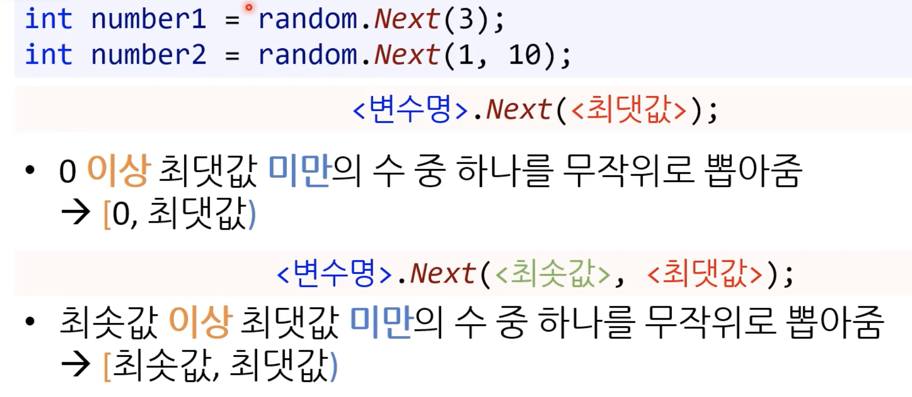
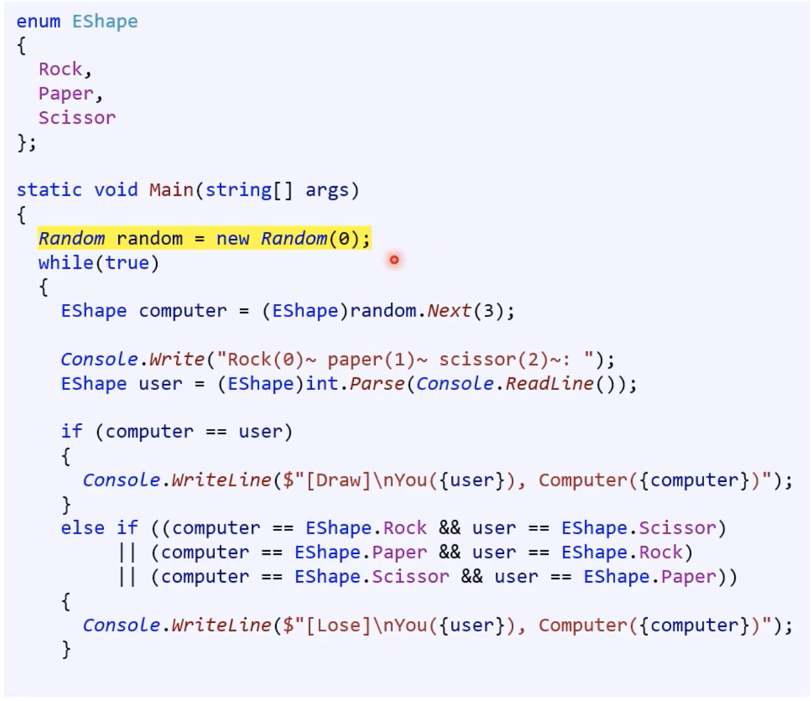
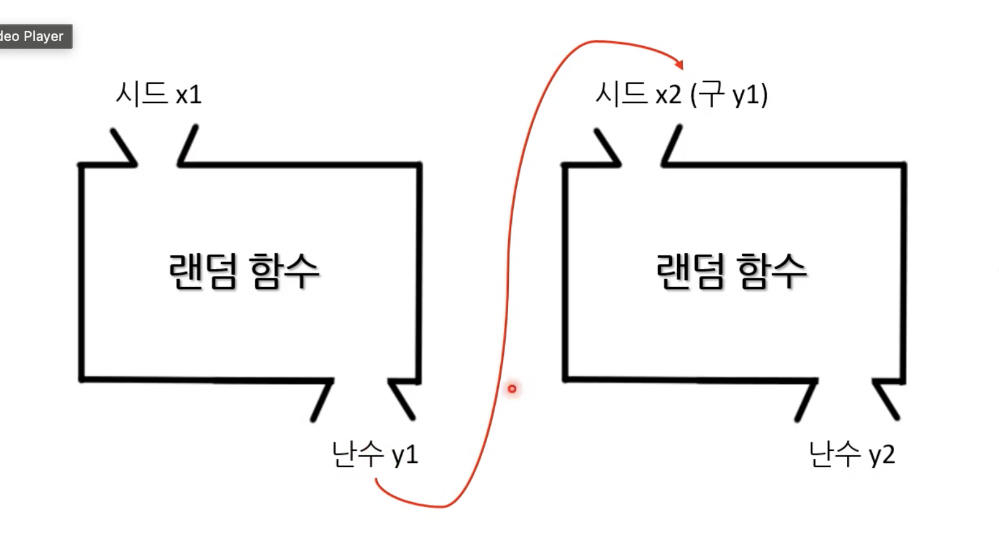
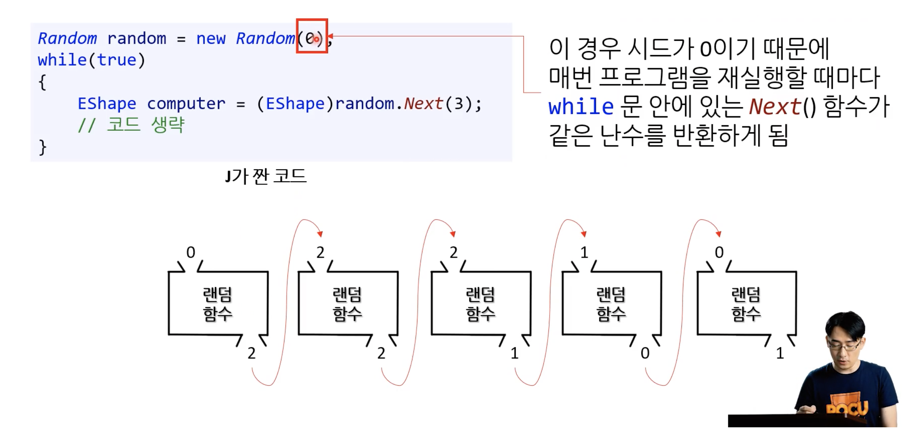
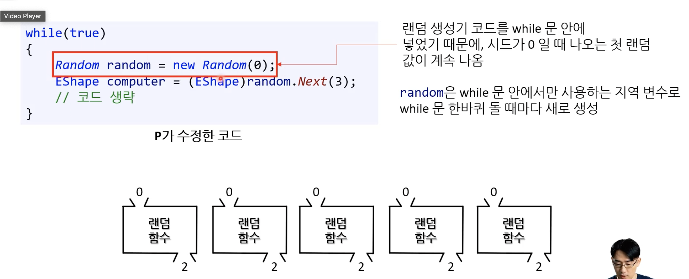
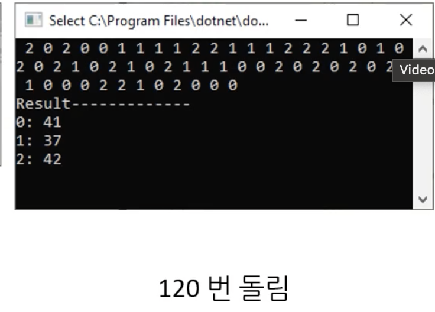

# Week7

## 재귀 함수(Recursive Function)

- 자신이 자신을 호출하는 함수
  - 인자 값만 바꿔서 자신을 호출한다.
- 이미 해결한 작은 문제에서 업어 더 큰 문제를 해결하는 방법
  - Ex) 1에서 5까지 합을 구하고 싶을 때, 1에서 4까지 합을 이미 알고 있으면, 이 결과에 5만 더하면 된다.

### 재귀 함수의 구성요소

#### - 종료 조건(ending condition, base condition)

- 더 이상 재귀 함수를 호출하지 않고 값을 반환하는 조건
- 이 조건이 없으면 무한히 재귀 함수를 호출하게 된다.

#### - 재귀적 함수 호출

- 종료 조건이 아닌 경우
- 함수의 인자를 바꿔 스스로 호출한다.
- 바뀌는 함수의 인자는 더 작은 문제를 대표 해야한다.
- 점진적으로 작아지는 것에 유념하자!

### 반복문과 재귀 함수

- 모든 재귀 함수는 반복문으로 해결할 수 있다.
- 복잡한 문제일 수록 재귀 함수가 편하다. 예를 들어 디렉토리 안의 모든 파일 목록 구하기

### 피보나치 수열 & Early Exit

```<C#>
public static int FibonacciRecursive(uint num)
{
	if (num == 0)
	{
		return 0;
	}

	if (num == 1)
	{
		return 1;
	}

	return FibonacciRecursive(num - 1) + FibonacciRecursive(num - 2);
}
```

종료 조건처럼 특정 조건을 만족하면 함수가 빨리 종료되도록 프로그래밍 하는 것을 Early Exit이라고 부릅니다.

수학적 귀납법을 믿자!

### 장점

- 개념적으로 매우 훌륭하다.

### 단점

- 효율성이 떨어진다
- 중복 호출
- 반복문은 이런 단점이 없다! 아래 처럼 이전 결과를 `캐싱`하기 때문이다.
- 함수 호출 깊이에 제한이 있다. `스택 오버 플로우`

```<C#>
public static uint[] FibonacciLoop(uint n)
{
	uint[] list = new uint[n + 1];
	list[0] = 0;
	list[1] = 1;

	for (int i = 2; i <= n; i++)
	{
		list[i] = list[i - 1] + list[i - 2];
	}
	return list;
}
```

### 재귀 베스트 프렉티스

- 간단한 반복문으로 가능한 문제는 반복문으로
- 성능상의 문제가 있으면 반복문으로
- 함수 호출 깊이의 제한이 있으면 반복문으로

### 하노이의 탑

```<C#>
public static uint HanoiRecursive(uint n)
{
	if (n == 0)
	{
		return 0;
	}

	if (n == 1)
	{
		return 1;
	}

	return HanoiRecursive(n - 1) + 1 + HanoiRecursive(n - 1);
}
```

## 난수 만들기

- 무작위의 수를 뽑는다.

### Random 클래스와 개체 생성

```<C#>
Random random = new Random();
```

- 클래스명 : Random
- 변수명 : random
- 랜덤 개체 생성 : new Random()

- 클래스는 여러 개의 함수가 뭉쳐있는 집합이다.
- 개체는 클래스 안에 함수를 사용하려면 필요하다.

### Random 클래스를 사용해서 난수 생성하기



- 최솟값은 이상, 최댓값은 미만의 반열린 구간

### 의사 랜덤(pseudo random)

```<C#>
Random random = new Random(0);
```

- Random 개체를 생성할 때 0을 인자로 넣으니까 이 개체가 생성하는 난수의 패턴이 일정하다.



반복문에서 random 변수가 생성하는 [0,3) 범위의 난수의 패턴이 일정하다는 말이다. 예를 들어 1,2,0,2,2,1... 이렇게 나왔다면 프로그램을 실행하면 다시 또 1,2,0,2,2,1... 이렇게 반복해서 나온다.

#### 시드값(seed)

- 의사 랜덤은 진정한 난수가 아니다. 시드값에 기초해 언어에서 미리 설계해놓은 알고리즘(함수)을 통해 정해진 순서대로 수를 만들어나간다.
- 따라서 시드값이 같으면 생성된 난수의 숫자와 순서가 동일하다.
- 랜덤 개체를 생성할 때 넣은 인자(0)가 시드 값이다!!

#### 왜 이렇게 의사 랜덤으로 구현?

- 진정한 난수를 만들기 어렵기 때문이다.

#### 랜덤 함수의 결과는 다시 랜덤 함수의 입력이 됨

- 함수의 블랙 박스 개념을 생각해보자.
- 입력 값이 같으면 항상 출력 값은 동일하다! 여기서 입력 값이 시드다.
- 랜덤 함수는 최초의 시드는 프로그래머가 입력하고 이후 출력값이 다시 다른 랜덤함수의 시드(입력)가 되고... 패턴이 반복된다.
- 따라서 시드에 따라서 랜덤 함수를 통과하면서 일정한 패턴의 출력이 나오게 되는 것이죠~





#### 따라서 난수를 상수로



반복문 안에 랜덤 개체 생성 코드를 넣으면 반복문을 반복할 때 마다 새로 랜덤 개체를 생성하게 된다. 이 때 이 랜덤 개체가 생성하는 난수는 (첫번째)랜덤 함수에 따라 0을 넣을 때 출력(여기선 2)이 나온다. 따라서 반복문을 반복할 때 마다 계속 2가 나오게 된다.

#### 의사 랜덤은 난수 분포가 완벽하지도 않음

이렇게 패턴이 정해져있는 것 말고도 한계가 있다. 알고리듬의 효율성은 난수의 분포로 결정된다. 따라서 분포가 동일한 완전한 난수는 생성할 수 없다. 아래와 같이 여러 번 반복해서 난수를 생성했을 때 분포가 동일하지 않다.

수학, 컴퓨터 과학에서 완벽한 난수라는 것은 예측 불가능 + 모든 숫자가 동일 확률을 가짐 이렇게 2가지 조건을 모두 만족해야 함



#### 참고: 완벽한 난수 생성 소프트웨어는 실패했음 -> 하드웨어는 존재

[하드웨어 난수 생성기](https://en.wikipedia.org/wiki/Hardware_random_number_generator)는 물리적 현상(예: 전자기적 노이즈, 방사성 붕괴)을 이용해 난수를 생성한다. 이러한 물리적 과정은 일반적으로 예측할 수 없으므로 생성된 숫자는 매우 무작위적이다.

#### 시드값을 넣지 않고 개체를 생성하면 시드값이 변함!

```<C#>
Random random = new Random();
```

- 시드값이 고정되면 패턴이 반복되는 문제를 해결하기 위해 컴퓨터에 내장된 시계의 시간 값을 시드값으로 넣는다. (C#)
- 시간 값은 정해진 값이 아니라 매 순간 변하기 때문에 매번 변하는 시드값으로 적합하죠?!
- 이걸 알아서 안 넣어주는 언어에서는 직접 시간을 읽어서 시드값으로 넣어줘야 한다. (시간을 읽어오는 방식은 언어에 대부분 내장되어 있음)

```<C#>
using System;

DateTime now = DateTime.Now;
Console.WriteLine(now);
```

### 고정된 시드값이 유용한 경우

- 랜덤 수에 기초한 프로그램을 디버깅할 때 똑같은 시드값을 넣고 재현할 수 있다.
- 네트워크로 연결된 두 사용자가 동일한 게임을 할 때 동일한 시드값을 바탕으로 게임의 로직(스토리)도 동일하게 진행되게 할 수 있다.
	- 예를 들면 게임에서 난수를 사용하여 맵이나 레벨을 생성할 때, 고정된 시드값을 사용하면 플레이어가 동일한 맵이나 레벨을 경험할 수 있습니다. 이는 멀티플레이어 게임이나 사용자가 공유할 수 있는 콘텐츠를 만들 때 유용합니다.

### Fisher-Yates 알고리듬

> Fisher-Yates 알고리즘은 배열이나 리스트의 요소를 무작위로 섞는 데 사용되는 효율적인 방법입니다. 1938년에 Ronald Fisher와 Frank Yates에 의해 처음 소개되었으며, "Knuth Shuffle"로도 알려져 있습니다. 이 알고리즘은 특히 컴퓨터 프로그래밍에서 데이터의 무작위 순서를 생성할 때 자주 사용됩니다.

1. 배열의 마지막 요소를 시작점으로 설정합니다.
2. 마지막 요소와 배열 내의 임의의 요소를 선택하여 두 요소의 위치를 교환합니다.
3. 배열의 크기를 하나 줄여서 마지막 요소를 제외하고 위의 과정을 반복합니다.
4. 배열의 크기가 1이 될 때까지 이 과정을 계속합니다.

```<C#>
static void Main(string[] args)
        {
            const int SEED = 0; // 시드값에 아무거나 넣어도 상관없음
            int[] numbers = new int[] { 1, 2, 3, 4, 5, 6, 7, 8, 9, 10, 11, 12, 13, 14, 15, 16, 17, 18, 19, 20 };

            Console.WriteLine("Before shuffling:");
            Console.WriteLine($"[{string.Join(", ", numbers)}]");

            Random random = new Random(SEED);

            for (int i = numbers.Length - 1; i > 0; i--)
            {
                int j = random.Next(0, i);	// 위치
                int temp = numbers[j];
                numbers[j] = numbers[i];
                numbers[i] = temp;
            }

            Console.WriteLine("After shuffling:");
            Console.WriteLine($"[{string.Join(", ", numbers)}]");
        }
```
