# Week9

## 2D 배열의 문제

```<C#>
static void Main(string[] args)
{
	const int CLASS_COUNT = 3;
	const int STUDENT_COUNT = 5;

	string[,] classrooms = new string[CLASS_COUNT, STUDENT_COUNT]
	{
		{"a", "b", "c", "", ""},
		{"a", "b", "", "", ""},
		{"a", "b", "c", "d", "e"}
	};

	for (int i = 0; i < CLASS_COUNT; ++i)
	{
		for (int j = 0; j < STUDENT_COUNT; ++j)
		{
			// do something
		}
	}
}
```

- 2D 배열은 직사각형 형태의 데이터만 지원 가능
- 하지만 위의 예시처럼 각 행마다 열 수가 달라질 수 있다.
- 1D 배열에서는 없는 새로운 문제가 생겼다!

## 배열의 배열

- 바깥 배열(다른 배열을 포함하는 배열)
	- 1D 배열
	- 각 요소의 형은 1D 배열(안쪽 배열)
- 안쪽 배열
	- 1D 배열
	- 각 요소의 형은 실제 자료형

## 배열의 배열을 만드는 법

```<text>
<자료형>[][] <변수명> = new <자료형>[<바깥 배열 원소 개수>][];
string[][] classrooms = new string[3][];
```

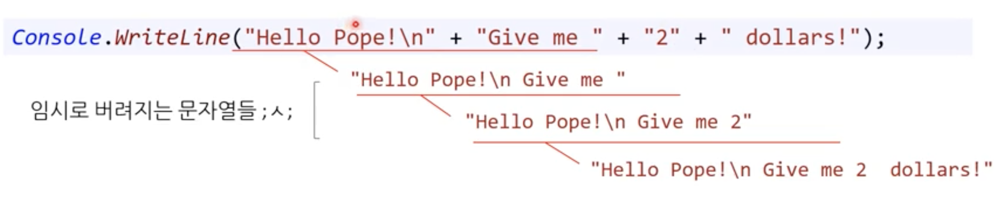

## 바깥 배열의 원소에 접근하기

```<text>
<자료형>[] <변수명> = <배열의 배열 이름>[<바깥 배열 색인>];
int classIndex = 0;
string[] studentNames = classrooms[classIndex];
```

## 안쪽 배열 만들기

안쪽 배열(1반 학생 정보를 담은 배열)의 길이를 출력

```<C#>
static void Main(string[] args)
{
	string[][] classrooms = new string[3][];

	int classIndex = 0;
	string[] studentNames = classrooms[classIndex];

	Console.WriteLine(studentNames.Length);
}
```

출력해보면 예외가 발생한다. 예외의 정체는 뭘까?

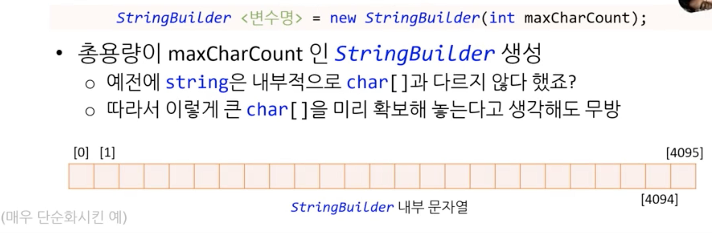

### null

- 아무것도 없다는 개념

```<C#>
int CLASS_COUNT = 3;
string[][] classrooms = new string[CLASS_COUNT][];
```

바깥 배열에서 CLASS_COUNT 수만큼의 문자열 배열을 담을 공간을 만든다. 하지만 이 문자열 배열은 비어있다. 안쪽 배열의 원소가 몇 개인지는 선언할 때 입력하지 않았고 원소도 입력하지 않았다.

안쪽 배열의 원소 개수를 선언해보자

```<C#>
classroom[0] = new string[3];
classroom[1] = new string[2];
classroom[2] = new string[5];
```

```<C#>
<바깥 배열 이름>[<색인>] = new string[<안쪽 배열 원소 개수>]
```

이렇게 안쪽 배열의 원소 개수를 선언하면 안쪽 배열이 null이 아니게 되어, 배열의 길이를 출력할 수 있다.

```<C#>
static void Main(string[] args)
{
	const int CLASS_COUNT = 3;
	int[] STUDENT_COUNT_PER_CLASS = { 3, 2, 5 };
	string[][] classrooms = new string[CLASS_COUNT][];

	for (int i = 0; i < CLASS_COUNT; ++i)
	{
		classrooms[i] = new string[STUDENT_COUNT_PER_CLASS[i]];
	}

	int classIndex = 0;
	string[] studentNames = classrooms[classIndex];

	Console.WriteLine(studentNames.Length);
}
```

## 안쪽 배열의 원소에 접근하기

```<C#>
int classIndex = 0;
int studentIndex = 0;

// 방법 1
classrooms[classIndex][studentIndex] = "kim";

// 방법 2(더 좋음)
stirng[] class1 =  classroom[classIndex];
class1[studentIndex] = "kim";
```

```<C#>
- 방법1
<바깥 배열 이름>[바깥 배열 색인][안쪽 배열 색인] = 값;

- 방법2
<안쪽 배열 자료형> <변수명> = <바깥 배열 이름>[바깥 배열 색인];
<변수명>[안쪽 배열 색인] = 값;
```

방법 2가 좋은 이유

- 방법 1에서는 하드웨어 적으로 바깥 배열, 안쪽 배열 이렇게 접근하면 두 번 접근해서 비효율적이다.

- 방법 1은 개념적으로도 불편하다. 어떤 반의 출석을 부를 때 3반에서 1,2,3번 이렇게 부르면 되는 것을 3반의 1번, 3반의 2번, 3반의 3번... 이렇게 부르게 된다.

## 안쪽 배열은 복사본인가 원본인가?


```<C#>
static void Main(string[] args)
{
	const int CLASS_COUNT = 3;
	int[] STUDENT_COUNT_PER_CLASS = { 3, 2, 5 };
	string[][] classrooms = new string[CLASS_COUNT][];

	for (int i = 0; i < CLASS_COUNT; ++i)
	{
		classrooms[i] = new string[STUDENT_COUNT_PER_CLASS[i]];
	}

	int classIndex = 0;
	int studentIndex = 0;

	string[] studentNames = classrooms[classIndex];
	studentNames[studentIndex] = "kay"

	Console.WriteLine(classrooms[classIndex][studentIndex]);
}
```

해보면 원본임을 알 수 있다. 원본이 바뀐다!!

new로 만든 건 기본적으로 그 자체가 참조형 데이터이기 때문에 원본을 들고 있다. pass by reference!

C#에서 배열은 참조형이다.


## 안쪽 배열을 늘리기

```<C#>
const int CLASS_COUNT = 3;
int[] STUDENT_COUNT_PER_CLASS = { 3, 2, 5 };
string[][] classrooms = new string[CLASS_COUNT][];

for (int i = 0; i < CLASS_COUNT; ++i)
{
	classrooms[i] = new string[STUDENT_COUNT_PER_CLASS[i]];
}
```

- 안쪽 배열은 1D 배열이라서 각각 길이가 3, 2, 5로 결정됨 따라서 원소를 추가할 수 없음

- 원소를 추가하기 위한 방법
  1. 크기가 n짜리 배열을 새로 만든다.
  2. for 문을 통해 기존의 안쪽 배열 데이터를 새 배열로 복사한다.
  3. 새 배열을 바깥 배열에 대입한다.

```<C#>
string[][] classrooms = new string[CLASS_COUNT][];

string[] classroom2 = classrooms[1]

// 기존 배열 복사
string[] newClassroom2 = new string[classroom2.Length + 1];
for (int i = 0 ; i < classroom2.Length; ++i)
{
	newClassroom2[i] = classroom2[i];
}

newClassroom2[newClassroom2.Length - 1] = "newby"

classrooms[1] = newClassromm2;
```

### Array.Copy()를 이용한 복사

for문을 사용하는 방법 대신 Array.Copy()를 사용해도 됩니다!

```<C#>
string[][] classrooms = new string[CLASS_COUNT][];

string[] classroom2 = classrooms[1]

// 기존 배열 복사
string[] newClassroom2 = new string[classroom2.Length + 1];
Array.Copy(classroom2, bewClassroom2, classroom2.Length);

newClassroom2[newClassroom2.Length - 1] = "newby"

classrooms[1] = newClassromm2;
```

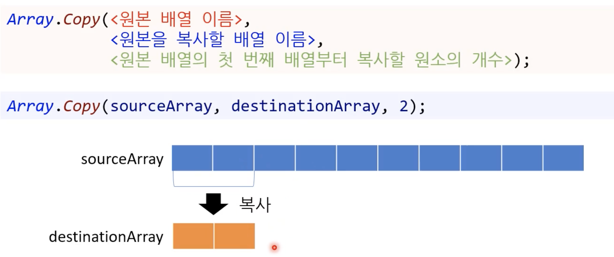

## 배열의 안쪽 배열에 2D 배열 등등 뭐든지 가능!

```
int[][,] ohMyGod;
```

### string.IsNullOrEmpty 함수

[공식 문서](https://learn.microsoft.com/ko-kr/dotnet/api/system.string.isnullorempty?view=net-8.0)

## 문자열 분할

### Key-value

몬스터 데이터 형식을 만들었다.


현재 문제점은 한 몬스터의 데이터를 하나의 파일에 저장한다는 것이다. 여러 몬스터를 저장하면 많은 파일을 사용하게 된다.  

많은 파일을 사용하게 되면 디스크에서 파일을 읽어올 때 마다 성능 손해가 심하다.  

그래서 한 파일에 문자열로 key-value 쌍들을 저장하자.
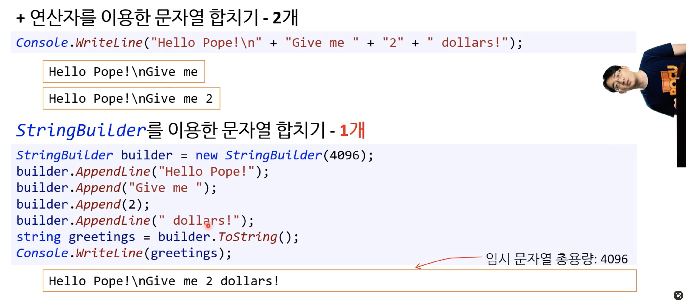

짜잔! 이것이 Json이다. 예전에는 XML도 많이 썼다.

### 표

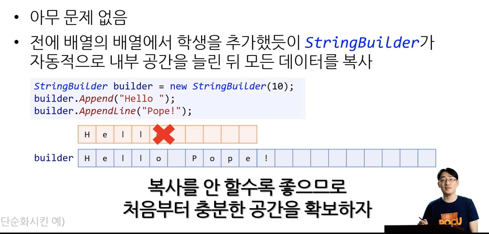

엑셀파일은 텍스트 파일이 아니라서 CSV라는 포멧으로 저장한다!

- 각 값은 쉼표(comma)로 분리
- 쉼표를 구분문자(delimiter)라고 함!

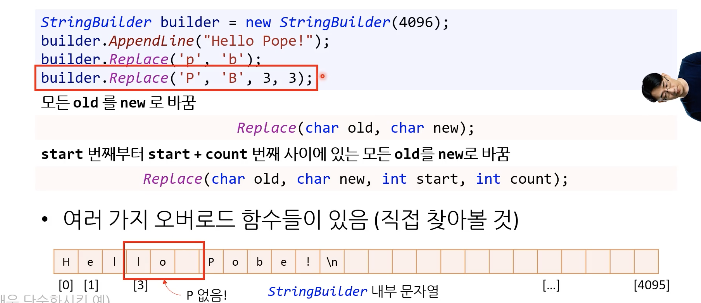

## CSV 읽는 법

1. 한줄을 읽는다.
  a. 다음 쉼표까지 문자열을 읽어 문자열 목록에 추가
  b. 읽어올 위치를 쉼표 다음으로 옮김
  c. 아직 읽어올 문자열이 있다면 a로 돌아감
   - 이번 줄에 문자열이 없으면 d로
  d. 읽어 온 데이터를 몬스터 정보에 저장
   - 데이터 개수를 확인해야한다. name, hp, mp 이렇게 3개가 잘 들어왔는지
2. 아직 읽어올 줄이 있다면 1로 돌아감

## 토큰(token)을 읽어 오는 법

- 토큰 : 연속된 데이터에서 쪼갤 수 있는 가장 작은 단위

문자열의 다양한 함수를 알아보자!

## IndexOf()

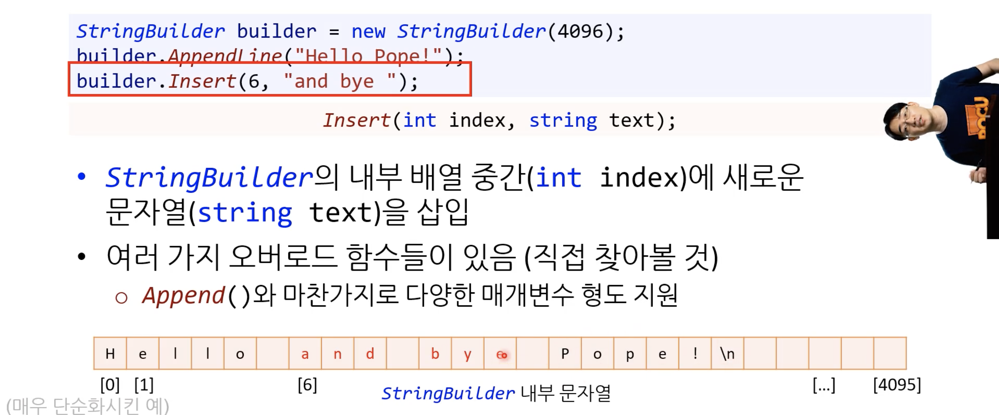

다양한 버전의 IndexOf()는 함수 오버로딩

참고로 LastIndexOf는 가장 마지막에 나타난 곳의 색인 반환

객체 지향에서 함수 호출은 `변수.함수(인자)` 변수(데이터)에서 함수가 나왔다는 것에 주목

절차적 언어에서는 indexOf(message, 'v'); 이렇게 컴퓨터는 함수와 데이터를 따로 본다.

[참고문서](https://learn.microsoft.com/ko-kr/dotnet/api/system.string.indexof?view=net-8.0)

## Substring()

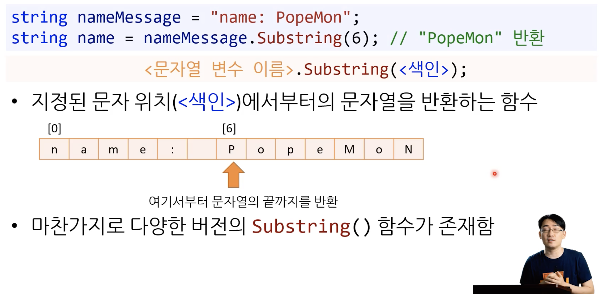

[참고문서](https://learn.microsoft.com/ko-kr/dotnet/api/system.string.substring?view=net-8.0)

## 첨자 연산자 []

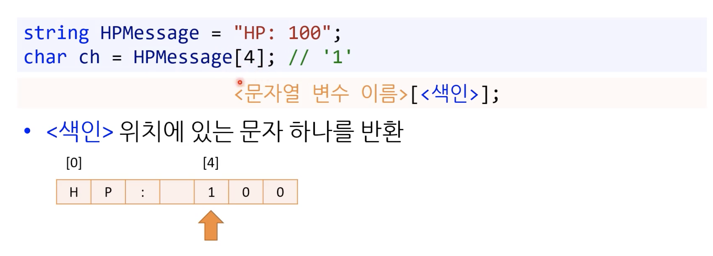

문자열도 배열이라는 것!

### 직접 Tokenizer을 구현해보자! IndexOf(), Substring(), 첨자 연산자[] 활용하기

```C#
public static string[] MyTokenizer(string origin, char[] delimiters)
        {
            List<string> res = new List<string>(origin.Length);

            int startIndex = 0;
            while (startIndex < origin.Length)
            {
                int delimiterIndex = findDelimiterIndex(origin, delimiters, startIndex);

                if (delimiterIndex == -1)
                {
                    res.Add(origin.Substring(startIndex));
                    break;
                }

                string token = origin.Substring(startIndex, delimiterIndex - startIndex);
                res.Add(token);
                startIndex = delimiterIndex + 1;
            }
            if (startIndex == origin.Length)
            {
                res.Add("");
            }
            
            return res.ToArray();
        }

        private static int findDelimiterIndex(string input, char[] delimiters, int start)
        {
            for (int i = start; i < input.Length; i++)
            {
                foreach (char delimiter in delimiters)
                {
                    if (input[i] == delimiter)
                    {
                        return i;
                    }
                }
            }
            return -1;
        }
```

## 문자열 토크나이저 Split()


- 인자는 delimiter
- `원본 문자열은 변경 없이 그대로 유지`
- 쪼갠 문자열을 문자열의 배열(string [])로 반환

## 여러 개의 구분 문자가 문자열에 있는 경우

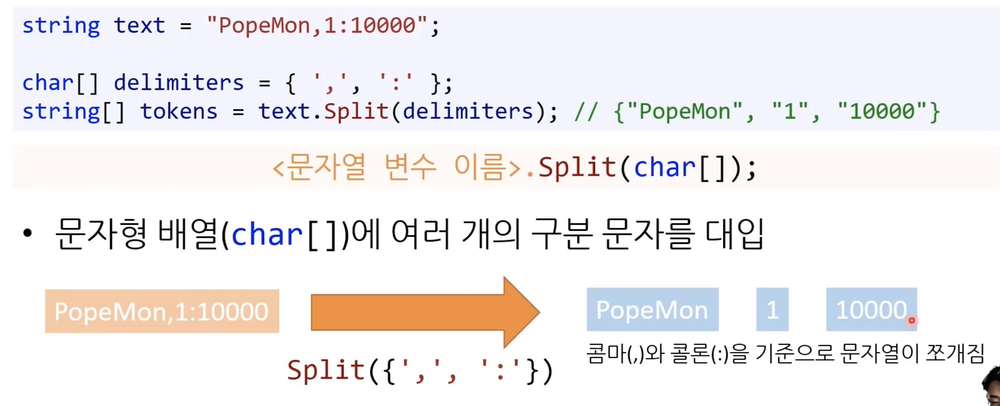

- delimiters는 string []

## 구분 문자 사이가 비어있다면?

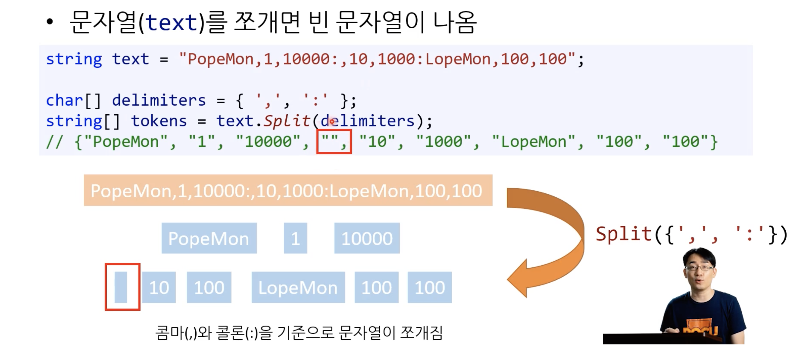

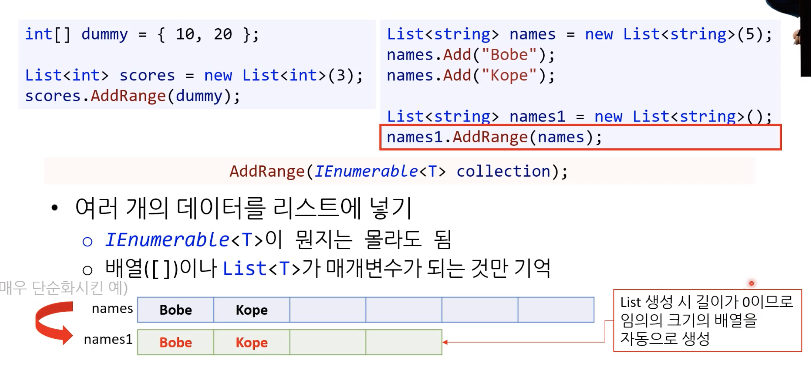

[열거형 : RemoveEmptyEntries](https://learn.microsoft.com/ko-kr/dotnet/api/system.stringsplitoptions?view=net-8.0)

## 불필요한 공백 지우기


[Trim 시리즈](https://learn.microsoft.com/ko-kr/dotnet/api/system.string.trim?view=net-8.0)

- 원본 문자열은 변경 없이 유지
- 가지친 새로운 문자열 반환
- TrimEnd, TrimStart 도 알아두세용

## 문자열 대체하기

```C#
static void Main(string[] args)
        {
            string textMessage = File.ReadAllText(@"TextMessage.txt");

            // [ "[POCU Web Message]", "Monday 2019-04-15 13:21:54.456", "student1234@fakeemail.com     ", "Course                COMP1500", "Term                    201905" ]
            string[] lines = textMessage.Split('\n');

            // [ "Monday", "2019-04-15", "13:21:54.456" ]
            string[] dateTimeString = lines[1].Split(' ');
            string nameOfDay = dateTimeString[0];

            // [ "2019", "04", "15" ]
            string[] date = dateTimeString[1].Split('-');

            int year = int.Parse(date[0]);
            int month = int.Parse(date[1]);
            int day = int.Parse(date[2]);

            // [ "13", "21", "54.456" ]
            string[] time = dateTimeString[2].Split(':');

            int hours = int.Parse(time[0]);
            int mins = int.Parse(time[1]);
            float seconds = float.Parse(time[2]);

            string email = lines[2].Trim();

            string courseCode = lines[3].Replace("Course", "").Trim();
            string term = lines[4].Replace("Term", "").Trim();

            Console.WriteLine($"Name of Day: {nameOfDay}");
            Console.WriteLine($"Year: {year}");
            Console.WriteLine($"Month: {month}");
            Console.WriteLine($"Day: {day}");
            Console.WriteLine($"Hours: {hours}");
            Console.WriteLine($"Minutes: {mins}");
            Console.WriteLine($"Seconds: {seconds}");
            Console.WriteLine($"Email: {email}");
            Console.WriteLine($"Course Code: {courseCode}");
            Console.WriteLine($"Term: {term}");
        }
```

- [Replace 함수](https://learn.microsoft.com/ko-kr/dotnet/api/system.string.replace?view=net-8.0)

- string변수.메서드1.메서드2.... 이렇게 .으로 메서드 연속 호출하는 것을 `메서드 체이닝!`

## 함수 오버로딩

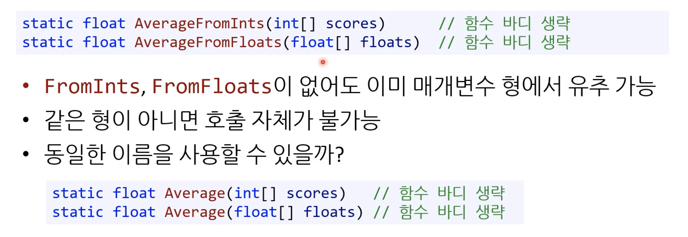

- 굳이 함수 이름에 FromInts, FromFloats를 붙여야할까? 함수의 매개변수 형에서 이미 유추가 가능
- int[] , float[]이라는 매개변수는 배열이니까 같은 형의 입력값의 평균을 구함을 알 수 있음
  - 이걸 보고 각기 다른 형의 평균을 구하면 사용자 잘못임
- 따라서 동일한 이름에 매개 변수만 바꾸어 사용해보자는 의도

### 참고 : float이 double에 비해 CPU에서 처리하는 속도가 빠름

정밀도가 double이 높긴 한데, 보통은 float을 사용합니다!

### 함수 오버로딩 조건

- 동일한 이름
- 매개변수 목록이 다르다.
- 함수의 시그니처가 이름 + 매개변수 목록이라서 이름이 같아도 매개변수 목록이 다르면 컴퓨터가 함수를 식별할 수 있다
- 반환형은 함수의 시그니처에 포함되지 않는다. 따라서 반환형만 다르고 함수의 이름과 함수의 매개변수 목록이 같은 함수가 있으면 `컴파일 에러`가 발생한다.
  - 오버로딩 여부에서 반환형은 무시하고 생각하자!

```C#
static void Print(int score);               // (1)
static void Print(string name);             // (2)
static void Print(float gpa, string name);  // (3)
static int Print(int score);                // (4)
static int Print(float gpa);                // (5)
```

(4)에서 컴파일 에러가 발생한다. 위에서 부터 컴파일러는 읽고, (1)과 (4)를 컴파일러는 구분할 수 없다.

### 코딩 표준 : 함수 오버로딩

- 매개변수의 수가 다른 경우 : 오버로딩 OK
- 승격/묵시적 변환을 해도 상관없는 경우 : 오버로딩 OK
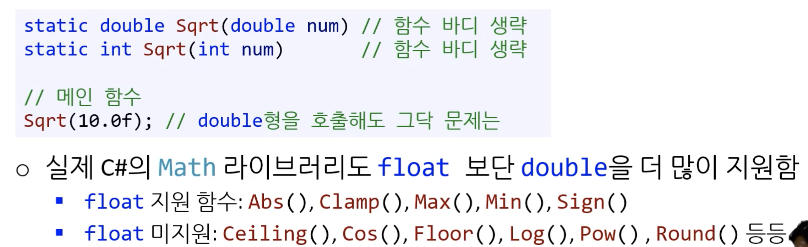
- 매개변수가 아예 승격이 불가능한 경우 : 오버로딩 OK
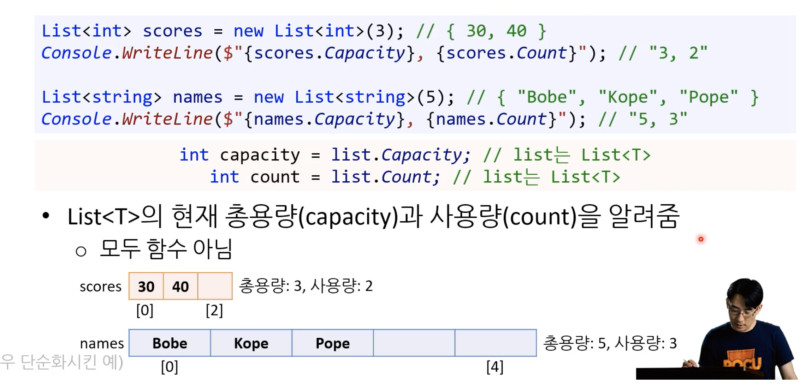

## 기본값 인자

### Optional Paramter

기본값 인자는 매개변수의 값을 생략할 수 있다는 관점에서 optional paramter라고 부른다.

### 약간만 차이나는 함수들

```C#
static string getFullAddress(string street, string city);
static string getFullAddress(string street, string city, string state);
```

함수를 오버로딩 할 때 중복된 매개변수가 많다면, 함수를 구현할 때 중복 코드가 많이 생기기 마련이다.

### 기본값 인자의 효과

```C#
static string getFullAddress(string street, string city, string state = "");
```

- 호출 시 아래와 같이 인자를 생략할 수 있다.

```C#
static string getFullAddress("main street", "city", "state");
static string getFullAddress("main street", "city");
```

- 함수에서 기본값 인자는 하나 이상 선언할 수 있다.

```C#
static string getFullAddress(string street, string city = "", string state = "");
```

- 매개변수 기본값 인자들은 noraml 매개변수 뒤에 써줘야한다.

```C#
static string getFullAddress(string street, string city = "", string state);
// 컴파일 에러, 중간에 기본값 매개변수가 있다.
```

### 기본값 인자의 문제점

- 1) 나중에 누군가 기본값 인자를 중간에 추가할 때 문제가 발생한다.

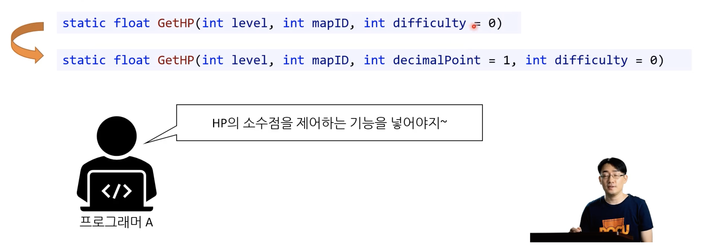

- 수정 된 함수를 호출하는 다른 사람이 의도하지 않게 호출하게 된다.

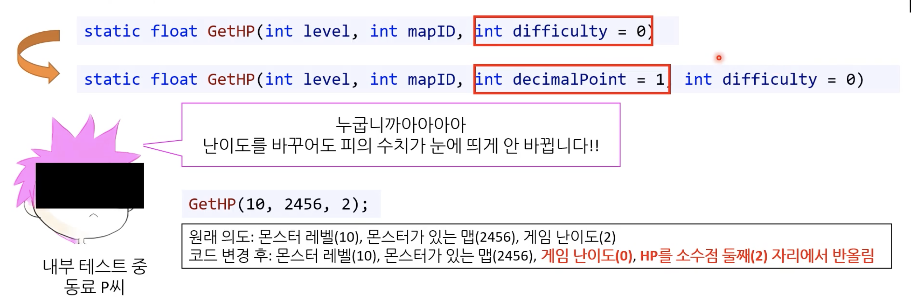

- 2) 기본값 인자가 도중에 변경된 경우 기존의 코드에서 문제가 발생할 수 있다. 

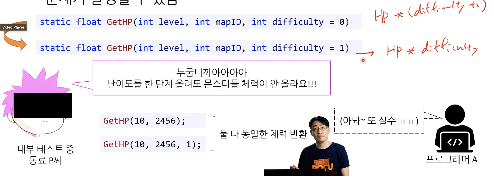

- 함수 내부에서 difficulty를 곱할 때 연산이 0부터 시작에서 1부터 시작으로 변경되었을 때 이런 일이 발생한다.

### 코딩 표준 : 기본 인자값

- 새 기본 매개변수는 언제나 뒤에 둘 것
  - 컴파일러가 에러 발생시켜서 막아주긴 함
- 기본값은 언제나 0으로 할 것
- 매개변수를 직접 넣어주게 강요하는 것이 안전할 수 있다.
  - 실수를 막을 수 있다

## out 매개변수

### 나누기 함수 개선

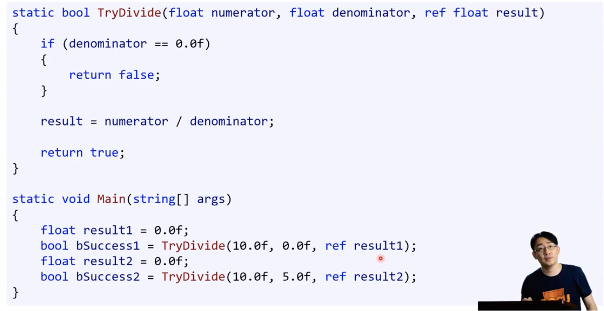

이렇게 하면 TryDivide의 반환값을 통해서 조건문을 만들고 result의 값을 사용할지 말지를 분기할 수 있다.

1. 문제점 : result값을 대입하는 코드(result = numerator / denominator 을 빼먹거나..)에 실수가 있는 경우

2. 문제점 : ref 키워드가 붙은 매개변수에 값을 넘기기 위해서 result를 선언과 동시에 초기화해야 한다. 이 때 대입 값은 굳이 쓸 필요가 없는데 컴파일러의 문법상 어쩔 수 없다.

### ref를 개선한 out

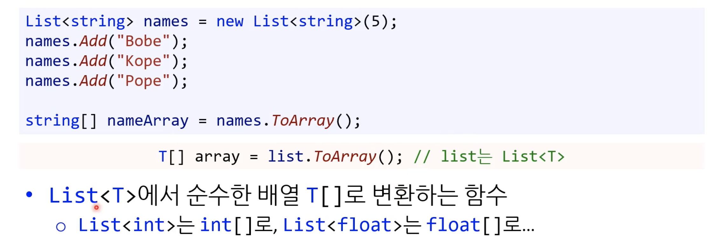

- 1) 주목할 점: denominator가 0일 때도 result에 값을 대입했다.
- 2) 주목할 점: 함수 밖에서 초기화할 필요 없다!
  - 오직 출력값만 의미한다. out!

### out 매개변수의 특징

- 함수 안에서 대입 안 하면 컴파일 오류
  - 이를 통해 문제점 1을 막을 수 있음

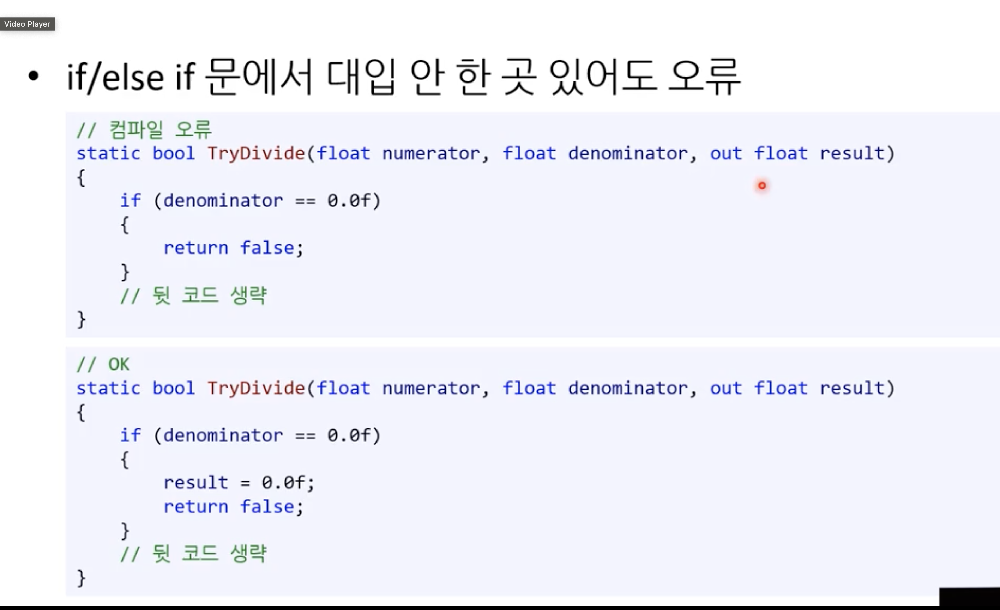

### 키보드 입력

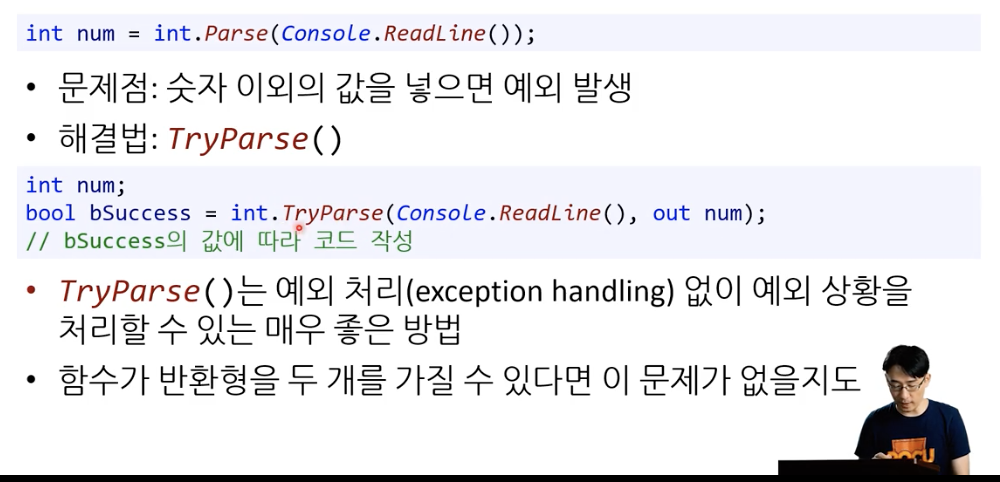

- 어떤 상황에서 Try함수를 사용하는지 생각하자. 운영 환경에서 예상하지 못한 값이 들어올 때! 키보드 입력의 경우에도 숫자가 입력된 것을 막을 수 없다.
  - 만약 들어오는 값을 통제할 수 있다는 확신을 할 수 있다면(개발 환경이겠죠?) assert를 넣고 개발 환경에서 디버깅한다고 생각하면 된다.
- num에 값을 대입해준다.
- 예외 상황을 처리할 수 있다.