# Week1

## 왜 C#인가요?

### C#은 입문자에게 적합한 최고의 주류 언어

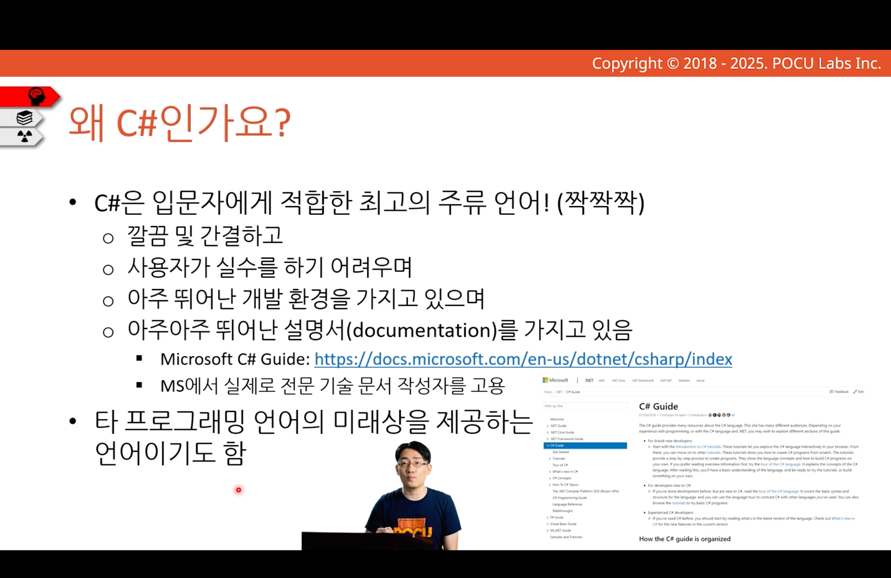

- 간결하다.
- C#을 사용할 때 사용자는 실수를 하기 어렵다.
- 뛰어난 개발 환경을 가지고 있다.
- [뛰어난 설명서(documentation)](https://learn.microsoft.com/ko-kr/dotnet/csharp/programming-guide/)을 가지고 있다.
    - 마이크로소프트는 문서 쓰는 사람을 따로 고용해서 운영
- 다른 프로그래밍 언어의 미래상을 제공한다. 대표적으로 'async await;가 있다.

### C#을 사용할 수 있는 프레임워크가 존재

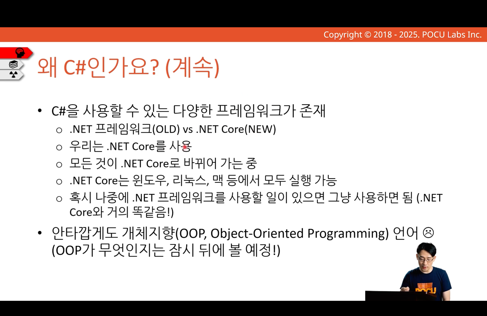

- .NET 프레임워크(OLD) VS .NET Core(NEW)
- .NET Core는 리눅스나 맥에서도 잘 돌아간다.

## C#은 어디에서 쓰이나요?

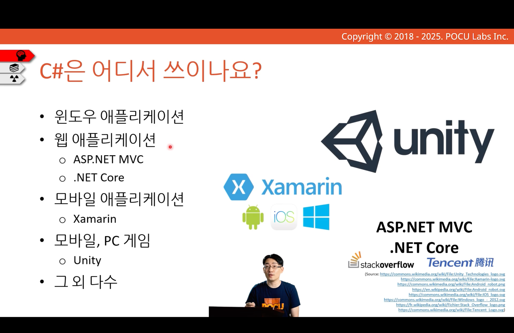

- 윈도우 어플리케이션
- 웹
- 게임 엔진
- 모바일 어플리케이션

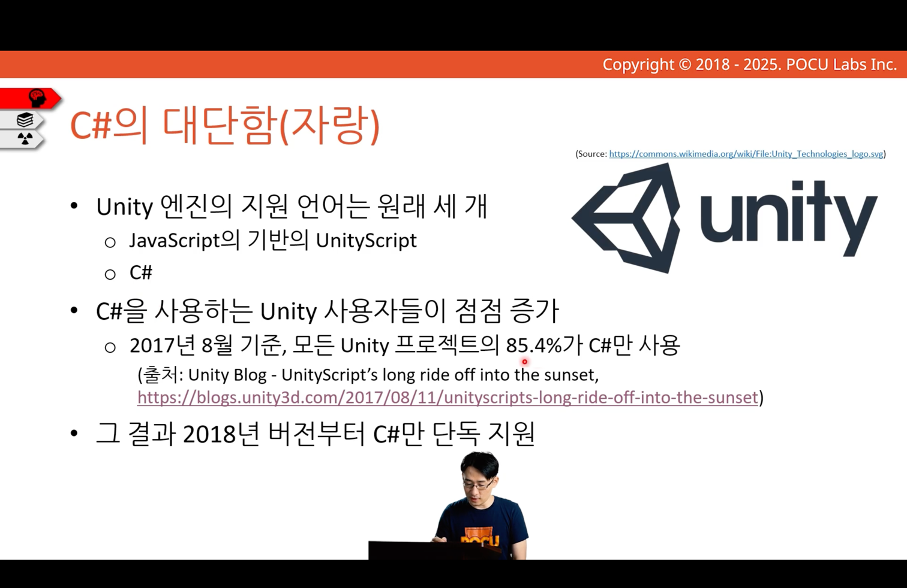

- Unity 엔진에서 C# 점유율이 점점 증가해서 결국 C#만 단독 지원

## OOP를 무시하고 C#을 사용하기

- 모든 곳에서 static을 사용한다.
- `.` 이나 `new` 등 무시한다.

## Hello World

### Hello World 출력하기

```<C#>
using System;

namespace HelloWorld
{
	class Program
	{
		static void Main(string[] args)
		{
			Console.WriteLine("Hello World!");
		}
	}
}

```

## 프로그래밍 언어 분류

- 언어 분류를 하면 어떤 점이 좋을까? 언어를 어떻게 활용할지 가늠할 때 도움이 된다. 이는 실무에서 언어를 선택할 때 유용하다.

## 저수준 언어 vs 고수준 언어

- 어느 정도 주관적인 부분이 있다는 것을 감안해야한다.

### 고수준이 더 좋다는 의미가 아님

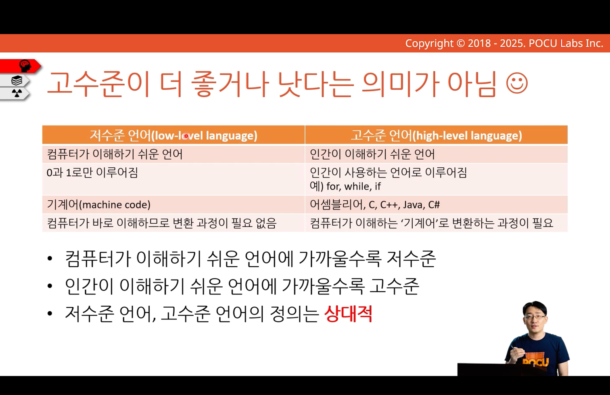

- 컴퓨터의 이해에 가까울수록 저수준
- 인간의 이해에 가까울수록 고수준

### 기계어(네이티브 코드)


- 네이티브 코드
- 이진법 기반

### 어셈블리어(Assembly Language)

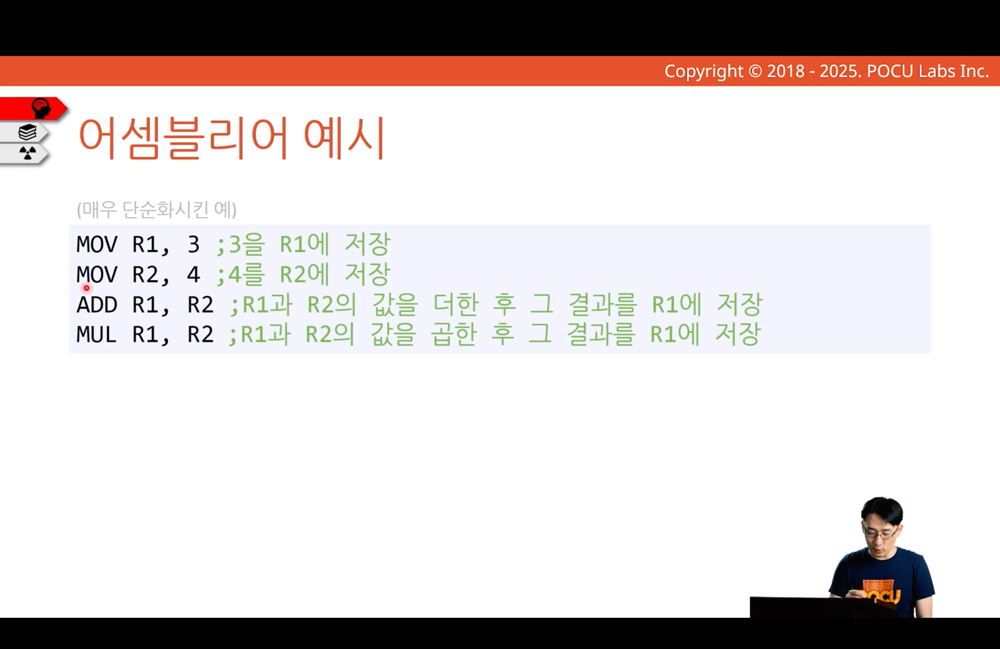

- 사람에게 친근함

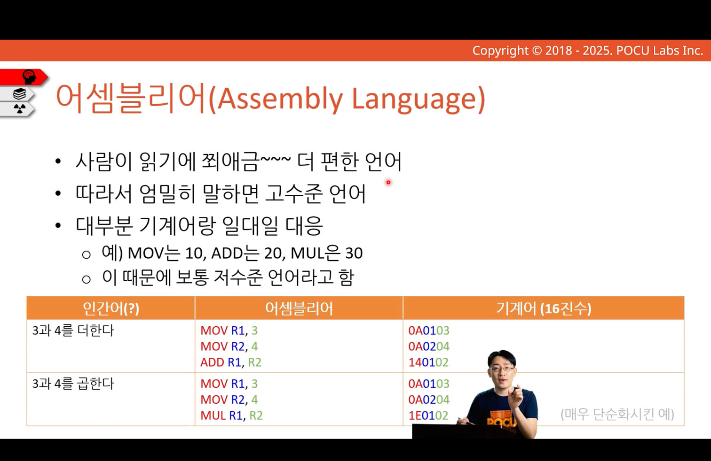

- 기계어에 비해 고수준 언어
- 어셈블리어의 '대부분'은 기계어에 대응된다.

### 고수준 프로그래밍 언어

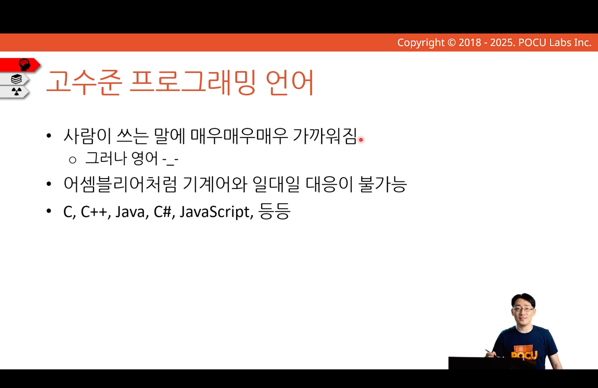

- 어셈블리어보다 더 사람이 읽기 편하다.
- 어셈블리어와 다르게 기계어와 일대일 대응이 불가능

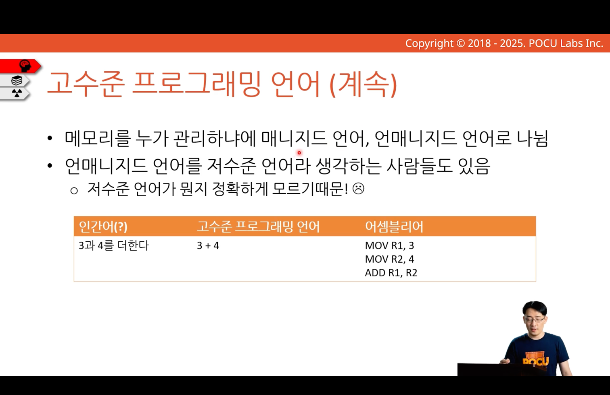

- 메모리를 누가 관리하냐에 따라 매니지드 언어/언매니지드 언어로 나눌 수 있다.

## 컴파일 언어 vs 인터프리터 언어

- 이 둘을 구분짓는 가장 큰 특징 혹은 차이점 때문에 일어나는 현상은 `곧바로 실행하냐 vs 실행 전 어떤 단계를 거치냐`이다.
- 프로그램의 성능, 개발 속도와 관련이 있는 개념

### 컴파일 언어

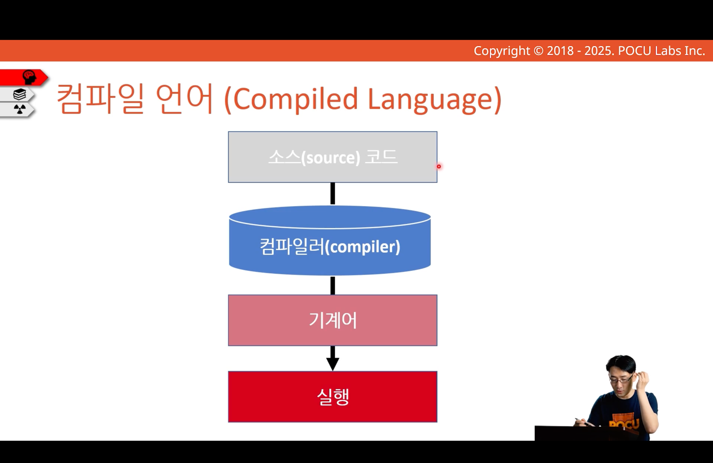

- 컴파일러의 역할:
    - 소스 코드를 기계어로 바꾸기
    - 컴파일러는 프로그램이다.
- 머신(컴퓨터)는 기계어 결과물을 실행함

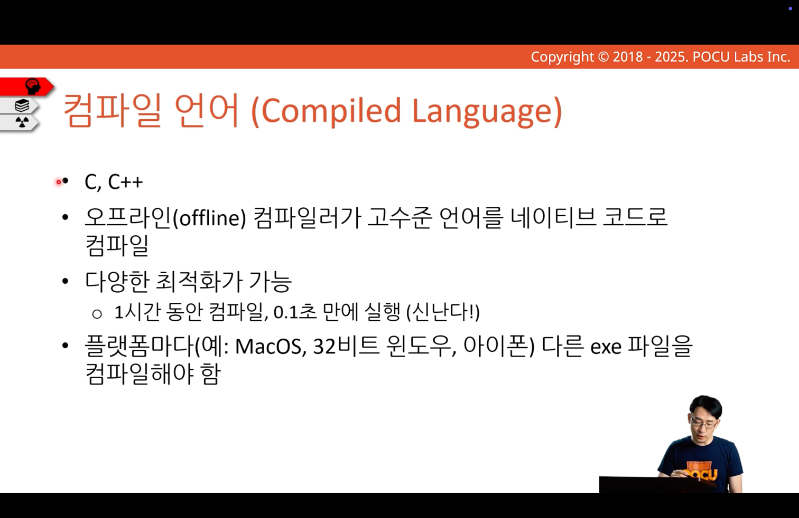

- 컴파일 언어의 장점:
    - 최적화
- 단점:
    - 컴파일에 걸리는 시간
    - CPU, 운영체제마다 이해하는 기계어가 다름
        - 플랫폼 종속적
        - exe 파일을 여러 개 만들어야함

### JIT(Just-In-Time) 컴파일 언어

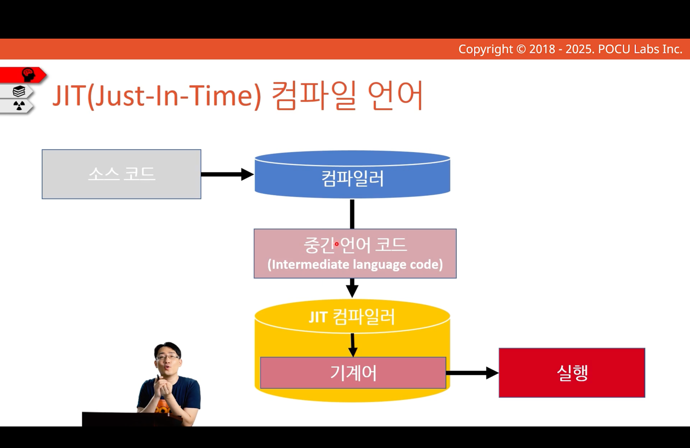

- 컴파일러는 '중간언어'로 컴파일
- 가상머신(VM)의 JIT 컴파일러가 '중간언어'를 기계어로 바꾸어 진짜 머신에서 실행

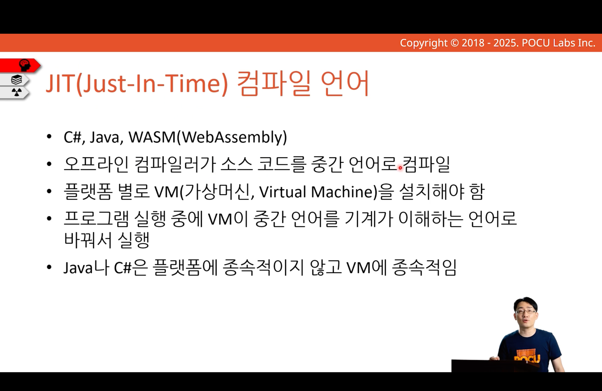

- 플랫폼 별로 가상머신이 설치되어 있어야함
    - ex:
        - JRE
    - 가상머신(VM)에 종속적인 언어

### 인터프리터 언어

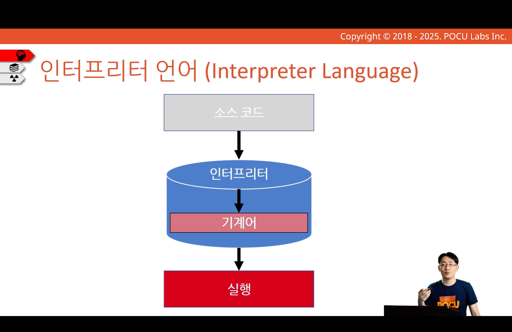

- 인터프리터
    - 통역의 개념
    - 실행 도중에 변환
        - 소스코드를 기계어로 바꿔서 머신에서 실행하거나, 미리 기계어의 명령어 집합을 머신에서 실행하거나


- 컴파일러가 없어서 실행 전 코드의 문제를 알 수 없음
    - 컴파일러가 컴파일 에러를 내주면 에러잡기 편함

## 강한 타입(Strong-typed) vs 약한 타입(Weak-typed)

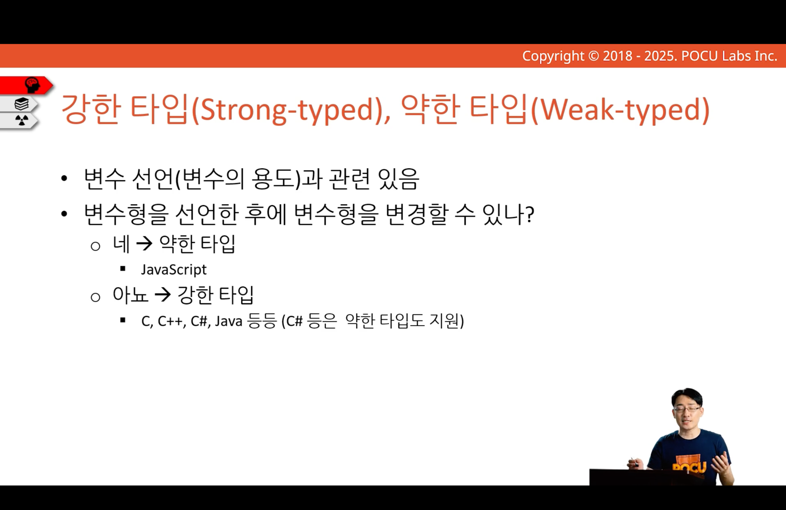

- 변수를 선언한 후에 변수형을 변경할 수 있는지 여부에 따라 분류
    - 약한 타입은 변수를 처음 선언할 때 정수형으로 선언했는데, 나중에 그 변수에 문자열을 대입해도 괜찮은 JavaScript 같은 언어

### 실생활의 예(비유)

- 분리수거를 할 때 빈 병, 음식물 쓰레기 이렇게 용도가 정해진 쓰레기통이 있다. 이 때 음식물 쓰레기에 종이를 버리고, 플리스틱을 넣고 이렇게 할 수 있는 방식이 약한 타입 언어다.
    - 장점 : 쓰레기 버리는 사람이 쓰레기 통을 구분할 필요가 없어서 편하다.
    - 단점 : 다른 사람이 헷갈릴 수 있다. 의도한 건지 실수한 건지 명확하지 않다.


- 여기서 다른 사람이 컴퓨터라고 생각하면 된다. 컴퓨터도 마찬가지로 코드를 실행하기 전 까지 실수를 찾을 수 없는 경우가 많다. 따라서 상용 코드를 작성할 때는 강한 타입 언어들이 일반적으로 더 좋다.

- 참고로 컴파일 언어가 인터프리터 언어보다 프로그래머에게 유리한 이유도 상용 코드를 작성할 때 컴파일러가 실수를 잡아줄 수 있기 때문이다.

## 매니지드 언어 vs 언매니지드 언어

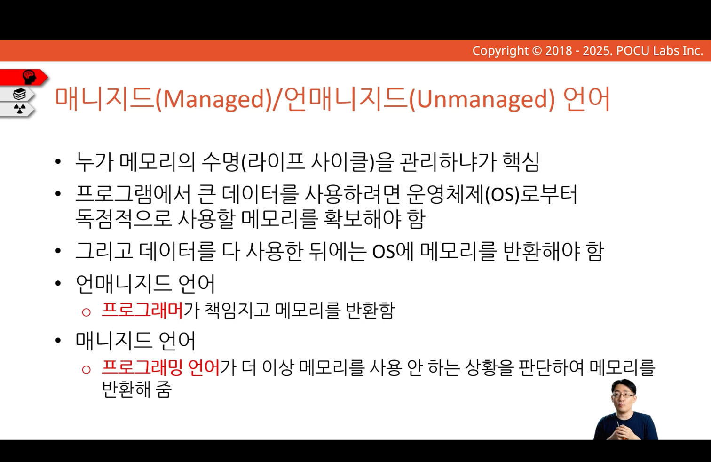

- 누가 메모리의 life cycle(수명)을 관리하냐에 따라 분류
- 메모리의 수명을 관리하는 것이 왜 필요할까? 컴퓨터의 구조 상 프로그램이 실행되려먼 운영체제로 부터 `독점적인` 메모리를 받아서 `확보`
  해야한다. 그리고 프로그램의 실행이 끝나면 받은 메모리를 운영체제에 `반납`해야한다.

- 언매니지드 언어는 프로그래머가 직접 메모리 반납을 수행
- 매니지드 언어는 언어 자체적인 기능으로 더 이상 프로그램이 메모리를 사용하지 않는다고 판단해 메모리를 반환해준다.
    - GC

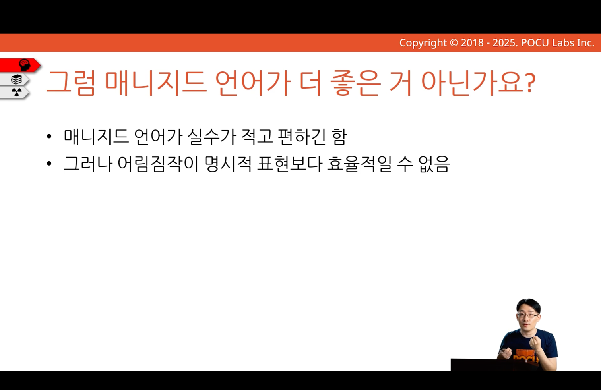

- 따라서 매니지드 언어가 실수가 적고 편하다. 그러나 효율성이 떨어질 수 있다.

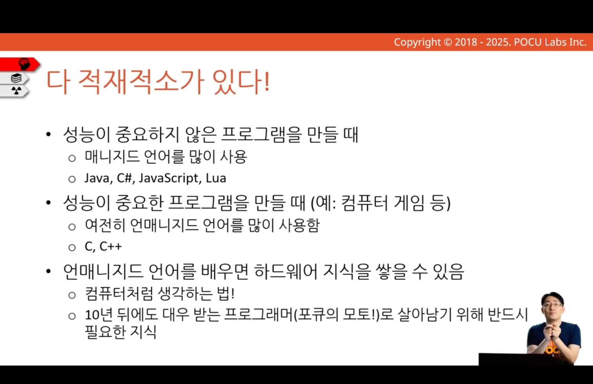

- 성능이 중요하지 않은 프로그램에서는 매니지드 언어가 효율적이다.
- 컴퓨터 게임같은 성능이 중요한 프로그램은 언매니지드 언어가 효율적이다.

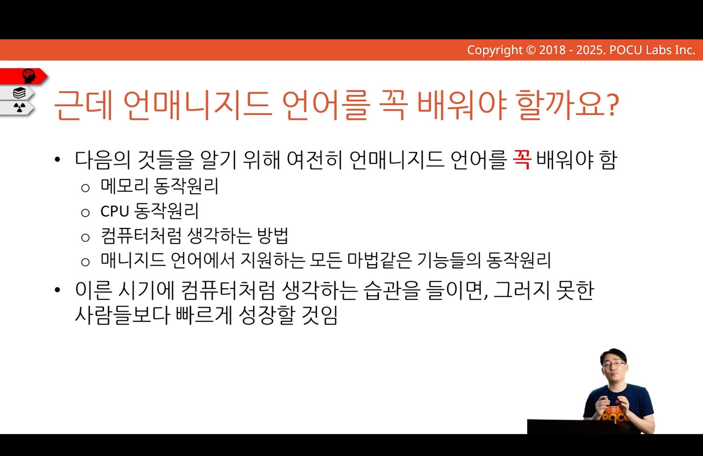

- 학습하는 사람 입장에서는 언매니지드 언어를 배우면 하드웨어 지식을 쌓을 수 있어서 좋다!

## 프로그래밍 패러다임 : 절차적 언어

### 절자적 언어

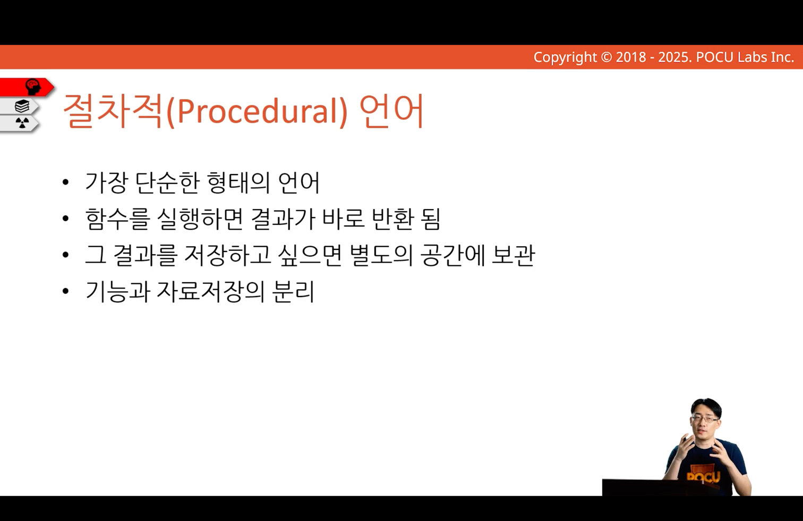

- 컴퓨터 프로그래밍은 어떤 절차에 따라서 실행하면 된다는 개념이 사용되었다.
- 함수를 실행하면 결과가 바로 반환된다.
- 실행 결과를 저장하려면 별도의 공간에 보관한다.
    - 변수(상태)
- 기능과 자료 저장의 분리!


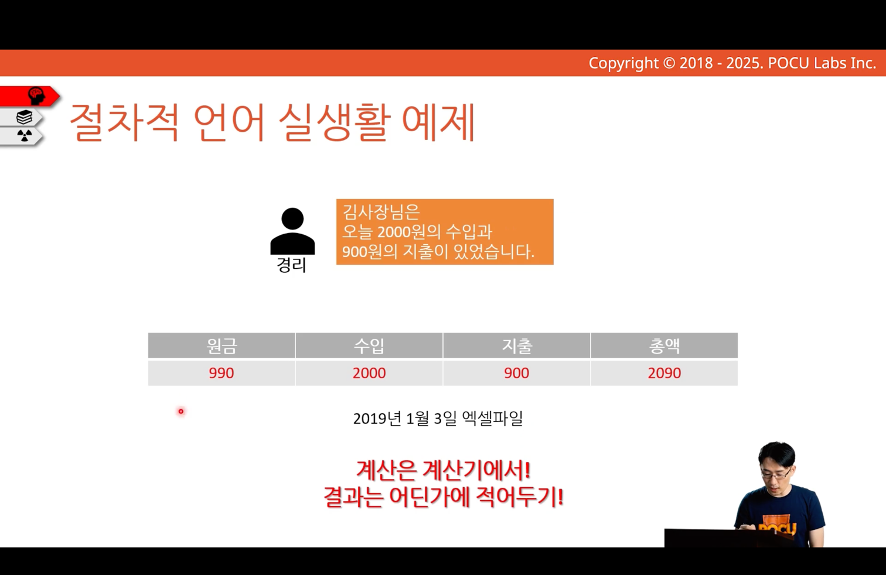


- 설명하기 굉장히 어려운 개념인데 실생활 예제는 장부에 하루 결산 금액을 저장하고 오늘 영업 시간에 수입과 지출을 더하고 빼면서 계산을 한다. 즉 계산을 하는 기능과 장부라는 저장이 분리된 개념이다. 여기서 중요한
  것은 계산 과정에서 수입, 지출 등 항목은 지속적으로 변할 수 있다는 것이다. 상태가 변할 때 마다 덮어쓰기 때문이다. 물론 최종 계산 결과는 모두 누적되서 장부에 저장된다. 즉 절차적 언어에서는 기능과 자료
  저장이 분리되어있으며, 기능은 상태 변화를 동반할 수 있다.

## 프로그래밍 패러다임 : OOP 언어

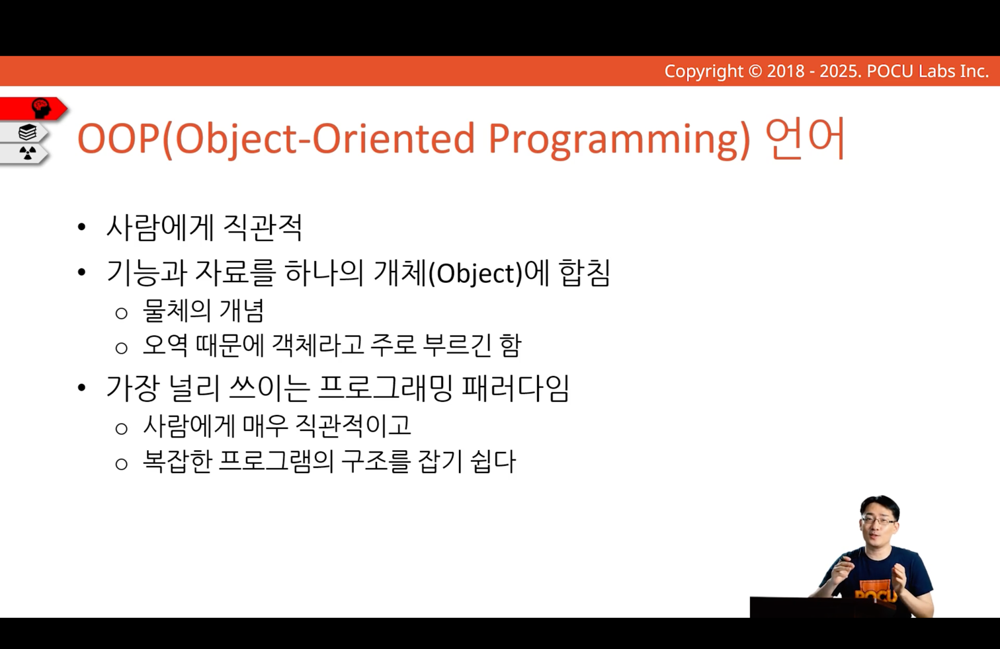

- 사람에게 가장 직관적인 패러다임 따라서 널리 쓰인다.
- 기능과 자료를 하나의 개체(Object)에 저장
    - 동작과 상태

## 프로그래밍 패러다임 : 함수형 언어

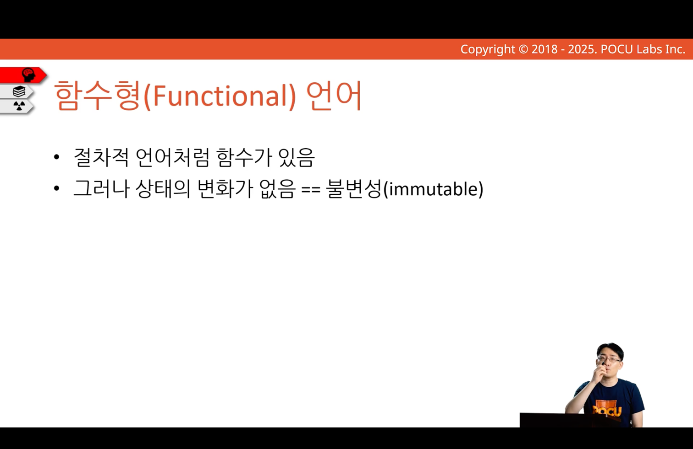

- 함수가 있지만 상태의 변화가 없음
    - 절차적 언어는 함수 + 상태
- 불변성(immutable)

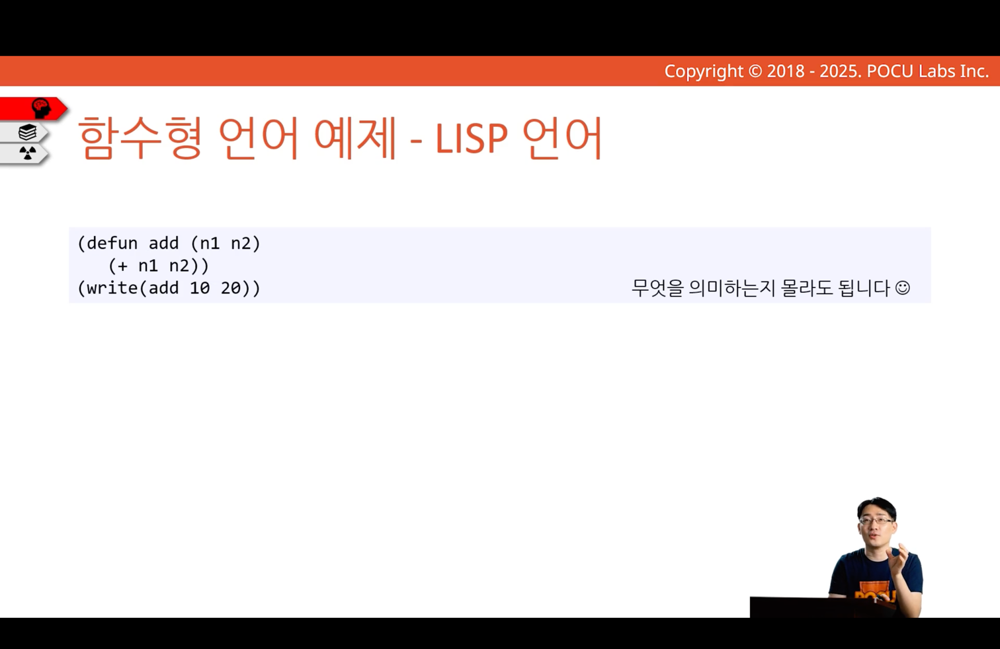

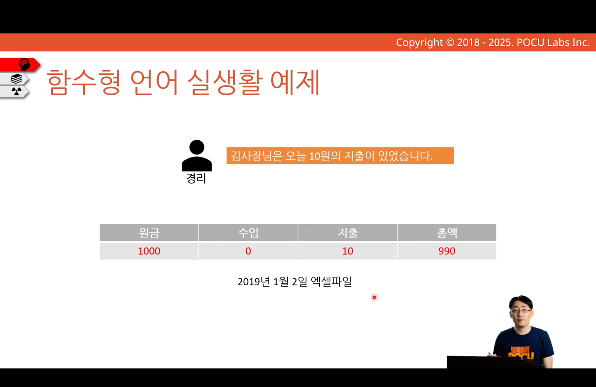

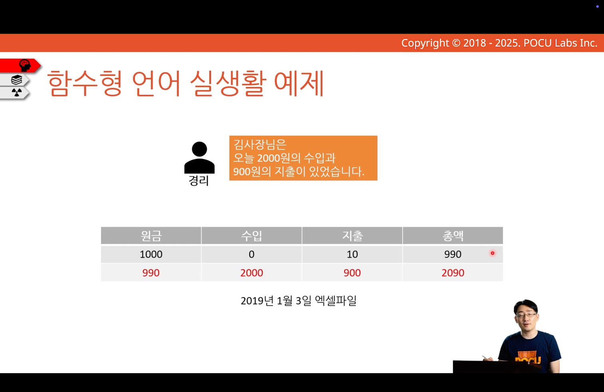

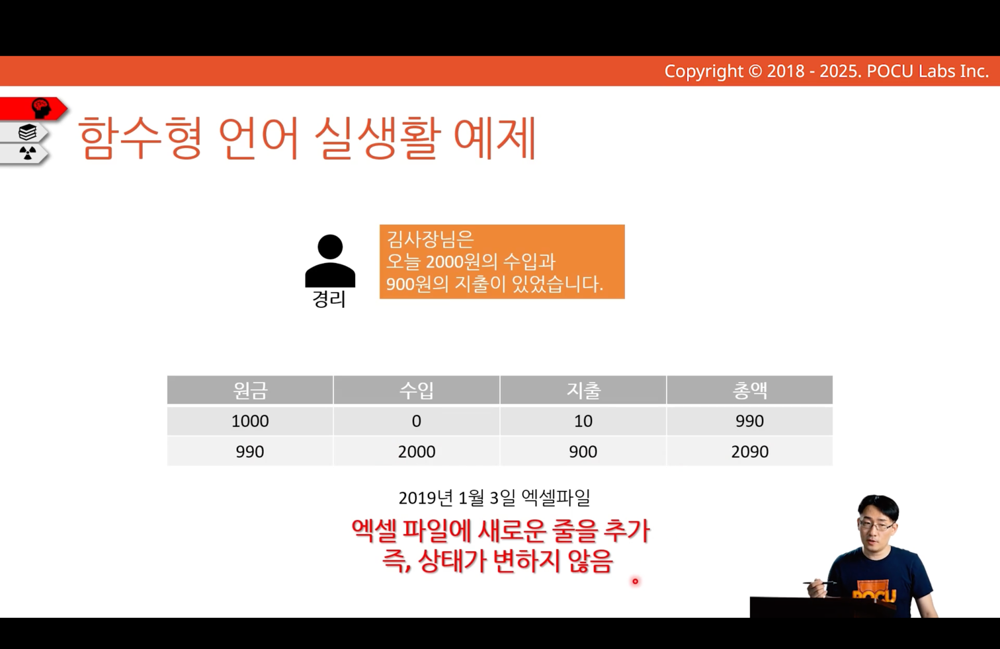

- 쓴 값은 다시 쓰지 못함
    - 불변성

- 멀티 스레딩에서 레이스 컨디션 방지에 유리함

## C#은 어떤 언어인가

- 강한 타입 언어
- 매니지드 언어
- OOP