# Week13

## C99 이전의 부동 소수점 연산 오류 처리

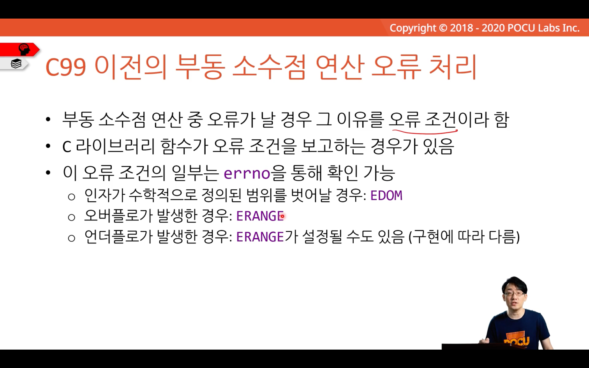

- Error Domain
- Error Range
- 부동 소수점 연산 중 오류가 발생하는 경우, 오류의 이유를 `오류 조건`이라고 정의함
- 오류 조건의 `일부`를 errno를 통해 확인할 수 있음
    - errno를 통해 확인할 수 있는 메크로는 부동 소수점 `전용`이 아니었음
    - 다른 문제가 발생해도 EDOM, ERANGE가 errno의 값으로 설정됨
        - Ex) 로그 함수에 음수를 대입할 때

## C99의 부동 소수점 연산 오류 처리

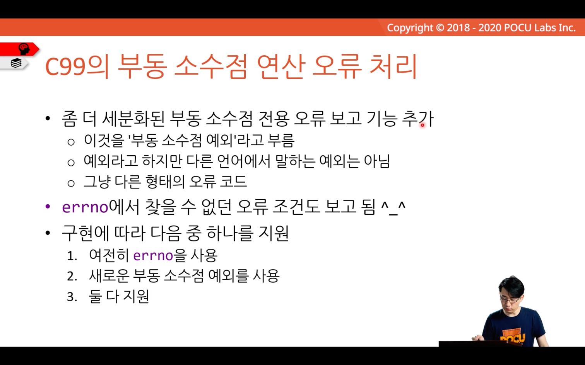

- C99에서 세분화된 부동 소수점 전용 오류 보고 기능이 추가됨
    - 이 전용 기능을 `부동 소수점 예외`라고 부름
    - errno의 일종으로 구현할 수 있음
        - 즉 다른 형태의 에러코드
    - 다른 언어에서 예외랑 다름
- 이전에 errno에서 찾을 수 없었던 `오류 조건`(부동 소수점 연산 중 오류가 발생하는 경우 오류의 이유)도 보고됨
- 구현에 따라 오류 보고 방법 구현이 달라짐
    1. 여전히 errno 사용(옛날 방식)
    2. 새로운 `부동 소수점 예외` 사용 (새로운 방식)
    3. 둘 다 지원

### 부동 소수점 연산 오류 `처리 방법` 구현 확인하기

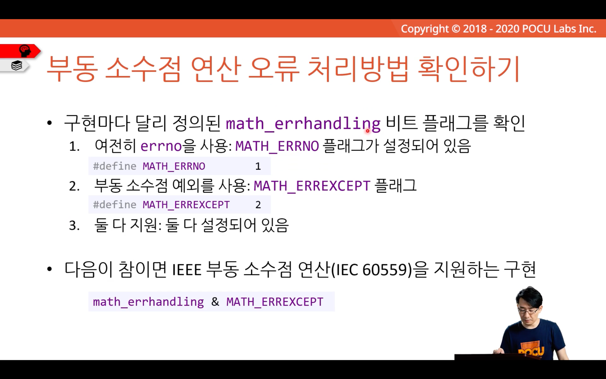

- math_errhandling은 비트 플래그
- 여전히 errno를 사용해 구현한 경우
    - #define MATH_ERRNO (1)
    - math_errhandling의 비트 패턴에서 1을 나타내는 비트는 켜져있음
        - 즉 math_errhandling & MATH_ERRNO != 0
        - 예를 들어 math_errhandling의 값이 0011 이면, 0011 & 0001 == 1 != 0 을 만족함
- 새로운 `부동 소수점 예외`를 사용하는 경우
    - #define MATH_ERREXCEPT (2)
    - math_errhandling의 비트 패턴에서 2를 나타내는 비트는 켜져있음
        - math_errhandling & MATH_ERREXCEPT != 0 를 만족
- 둘다 지원
    - math_errhandling의 비트 패턴에서 1을 나타내는 비트, 2를 나타내는 비트 모두 켜져있음

- IEEE 부동 소수점 연산(IEC 60559)라고 부동 소수점 연산에서 가장 많이 쓰이는 표준이 있음
    - math_errhandling & MATH_ERREXCEPT != 0 이면 IEEE 부동 소수점 연산을 지원하는지 확인할 수 있음

[질문]: math_errhandling 비트 플래그 값이 MATH_ERRNO, MATH_ERREXCEPT 등 매크로 값으로 설정된다는 말인가요?

### 새로운 부동 소수점 예외의 구현

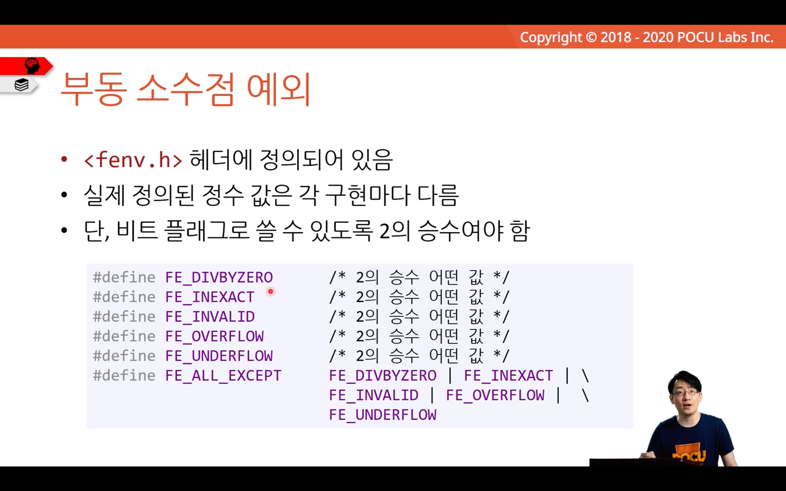

- <fenv.h> 헤더에 정의됨
- 메크로 값은 비트 플래그로 쓸 수 있도록 `2의 승수`
- FE_ALL_EXCEPT는 모든 비트가 켜져있다고 볼 수 있음
    - 다른 모든 매크로가 2의 승수기 때문에 비트에서 오직 한 자리만 1
    - FE_INEXACT & FE_ALL_EXCEPT 의 결과가 0이 아니면 FE_INEXACT의 비트가 켜져있다는 것
        - 즉 오류가 있었다는 것이죠?

### errno와 부동 소수점 예외의 비교

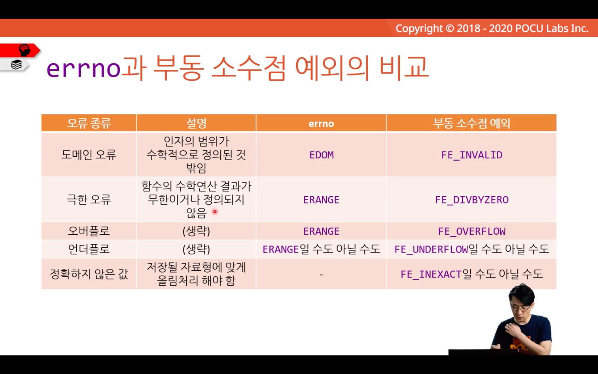

- `부동 소수점 예외`가 세분화 된 것 확인

### 부동 소수점 예외가 났는지 확인하는 법

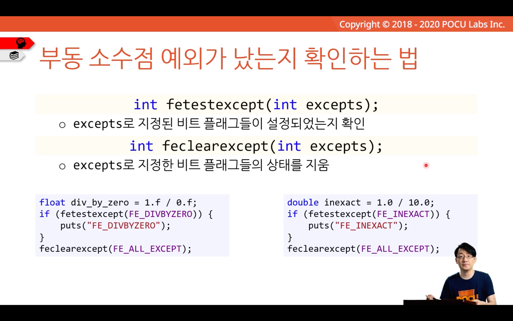

- <fenv.h> 헤더에서 제공하는 함수를 사용하면 됨
- 한 번 비트 플래그가 설정되면 자동으로 지워지는 것은 아니기 때문에 `feclearexcept()`를 호출해서 비트 플래그 초기화
- 참고로 FE_INEXACT의 경우 정확하지 않은 값이 `오류 조건`임
    - 부동 소수점 나누기 연산이 정확하지 않기 때문

### 커스텀 부동 소수점 예외 설정

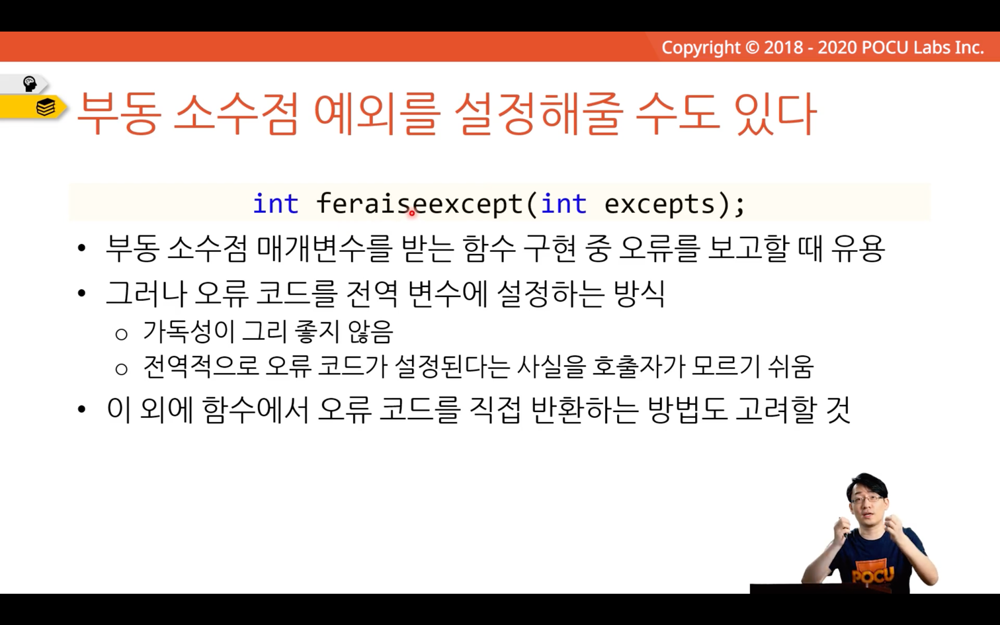

- 함수를 구현하는 사람이 부동 소수점 예외를 설정해도, 함수 호출자는 모르는 경우가 많음
    - 그래서 가독성이 좋지 않음
    - 전역 변수에 설정되는 것도 문제
- 함수에서 오류 코드를 직접 반환하는 방법이 좋음!

### 부동 소수점 연산 환경 설정

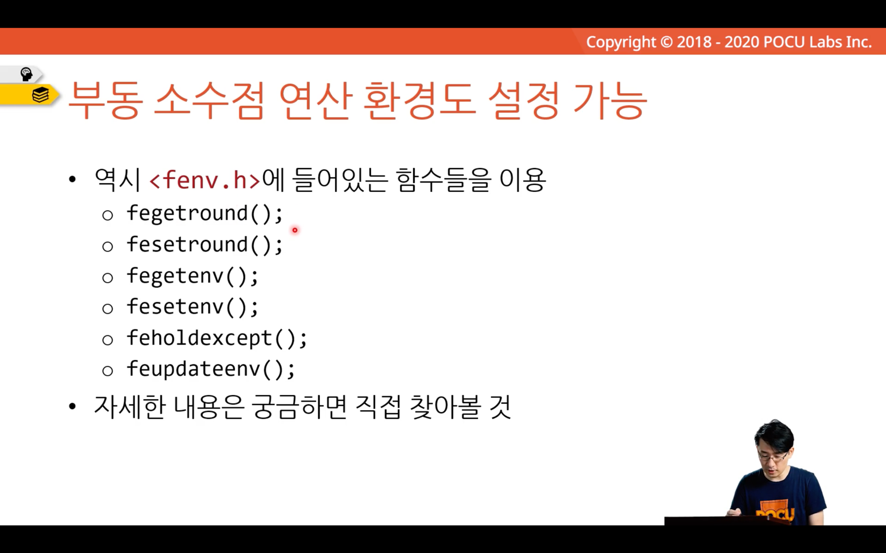

- 반올림 규칙 설정

### <fenv.h> 지원 여부는 불확실

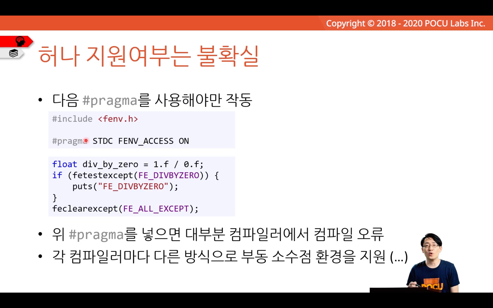

- #pragma는 컴파일러가 별도로 지원하는 기능을 켜고/끄는 방법
- 컴파일러마다 지원하는 부동 소수점 환경이 다름
- 참고로 C89 이후 표준은 이렇게 컴파일러마다 지원 안 하는 경우가 많음

## Type-Generic 수학

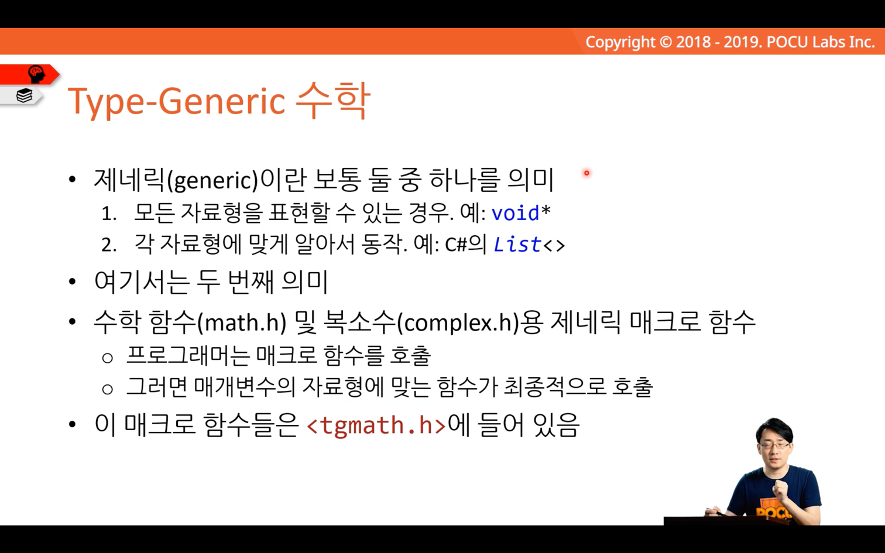

- 컴퓨터 공학에서 generic == 범용적
    - 용도1: 모든 자료형을 표현할 수 있는 경우
        - void*
    - 용도2: 컴파일 시점에 각 자료형에 맞게 알아서 동작
        - List<T>면 컴파일 시점에서 자료형 T에 맞게 바꿔줌
        - List용으로 클래스 크드를 작성했는데, 입력하는 형에 맞게 복붙해준다고 생각해도 됨
- C에는 오버로딩을 지원하지 않음
    - add_int, add_float
    - 이렇게 이름이 겹치면 안 되기 때문에 동일한 기능을 해도 따로 만들어야하는 불상사
        - add(int a, int b), add(float a, float b) 불가능

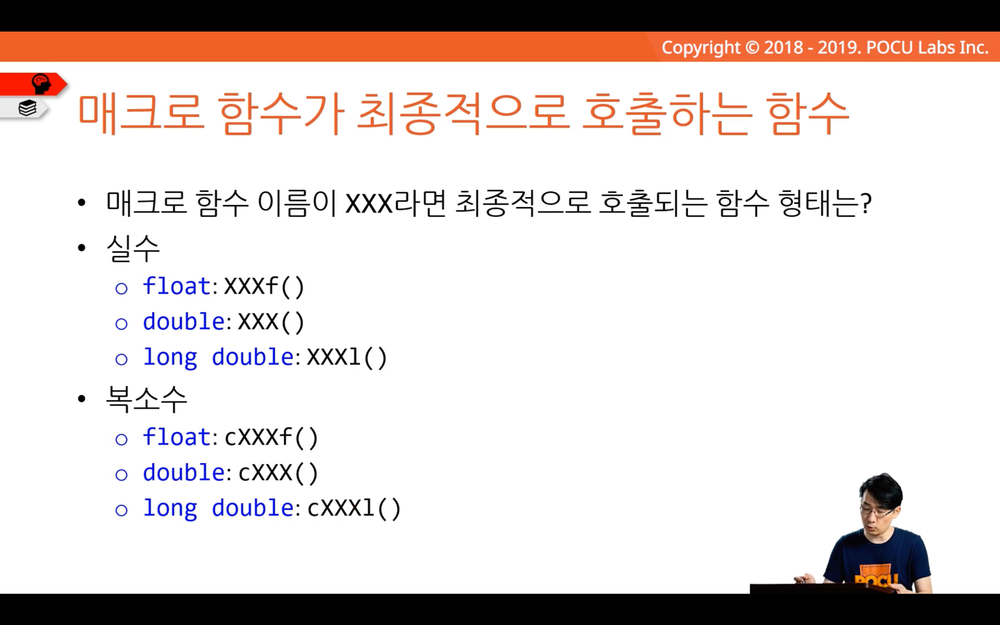

- 수학 함수(math.h) 및 복소수(complex.h)용 제네릭 `매크로 함수`
    - 프로그래머는 매크로 함수를 호출
    - 매개변수의 자료형에 맞는 함수가 최종적으로 호출
    - 예를 들어 XXX라는 함수를 호출할 때 매개변수에 float을 넣으면, 실제 호출은 XXXf()가 호출됨

### 복소수와 실수를 모두 지원하는 매크로 함수

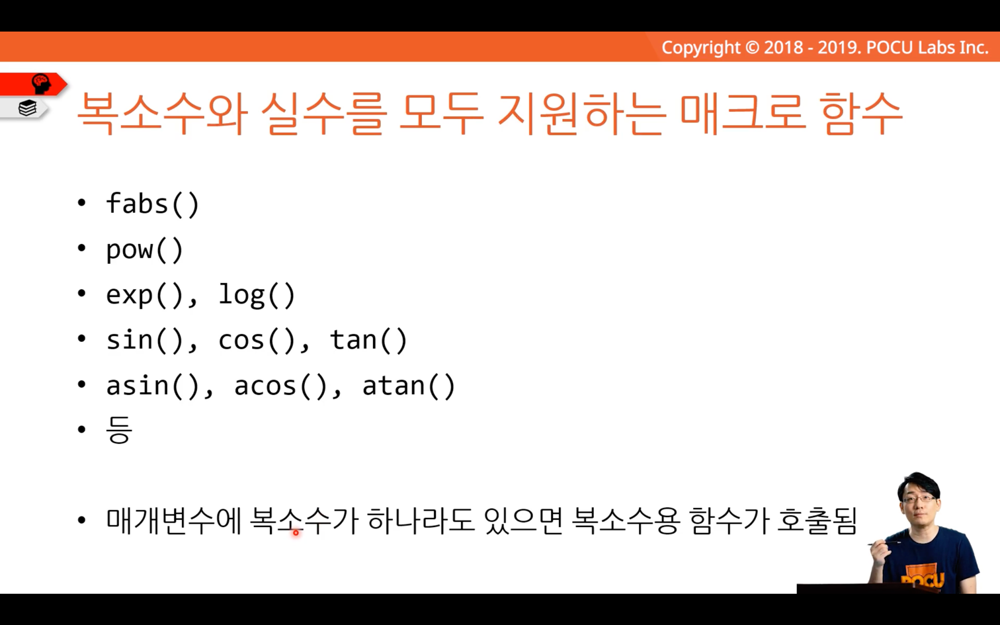

- 복소수가 더 큰 개념이라, 매개변수에 복소수를 넣으면 복소수용 함수가 호출됨

### 실수만 지원하는 매크로 함수

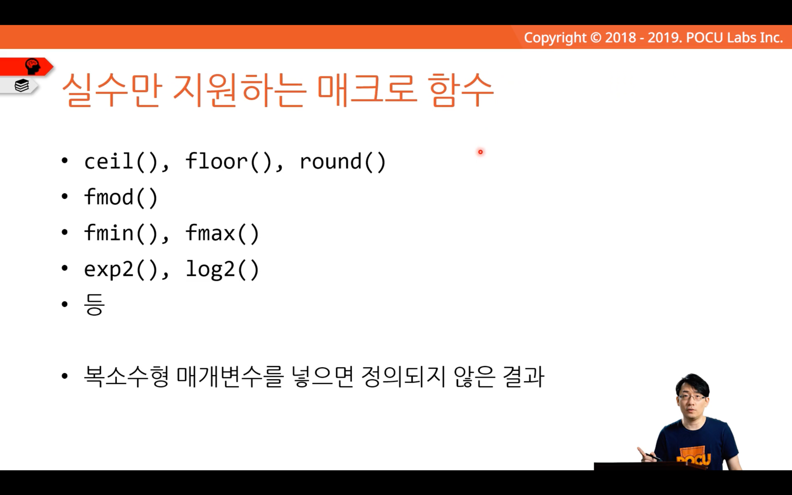

### 복소수만 지원하는 매크로 함수

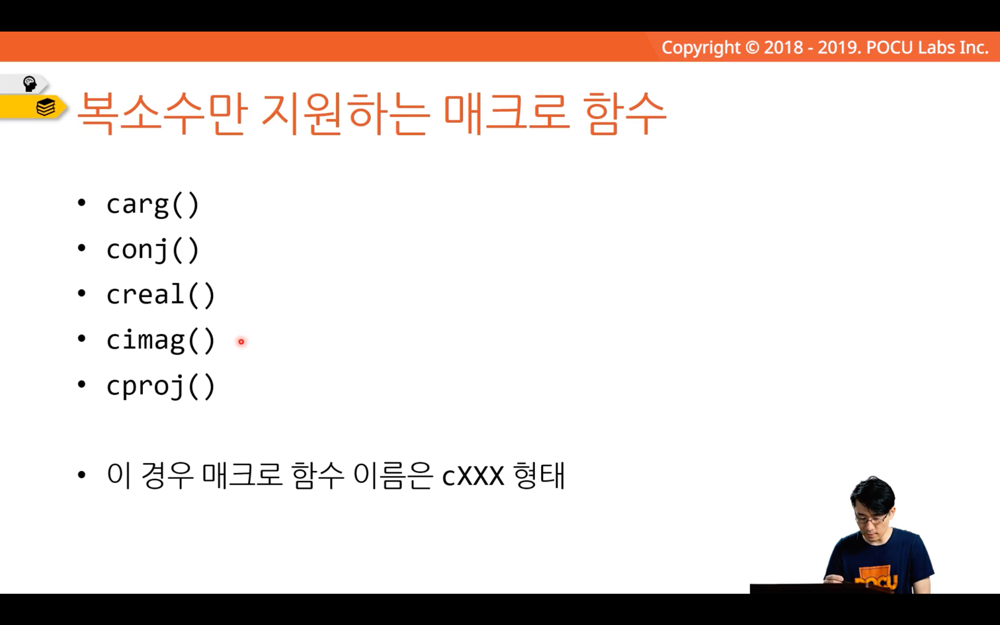

### 매개 변수의 자료형 우선 순위

- 매개변수 중 하나가 long double이면 long double용 함수 호출
- 매개변수 중 하나가 double 또는 int면 double용 함수
    - int 전용은 없음
- 그 밖은 모두 float용 함수

## 가변 길이 배열

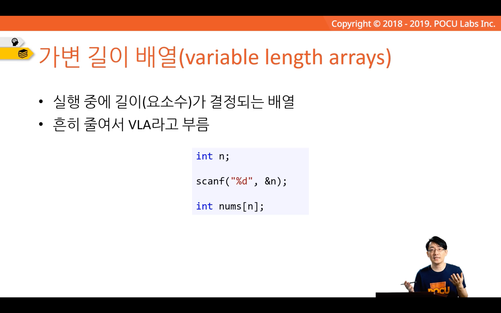

- 실행 중에 길이(요소수)가 결정되는 배열
- A.K.A `VLA`

### 가변 길이 배열에 대한 비판

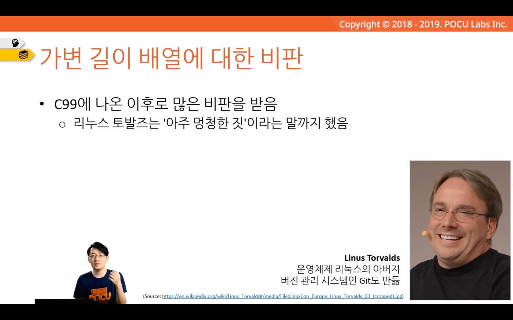

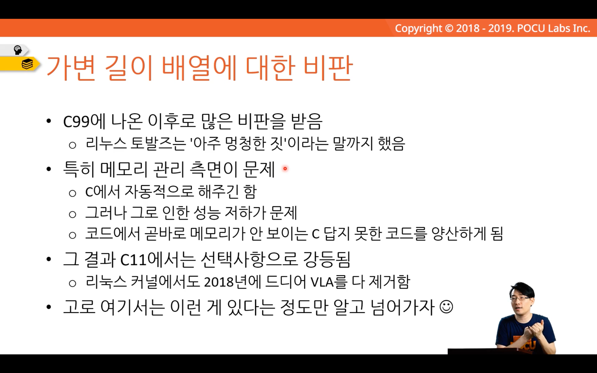

- 스택 메모리의 크기는 컴파일 시점에 결정됨
- 동적 메모리 할당이 필요할 수도...
- 메모리를 한 눈에 보기 어렵게 만듦
- 결국 C11 표준에서 `선택 사항`으로 강등

### 가변 길이 배열와 메모리

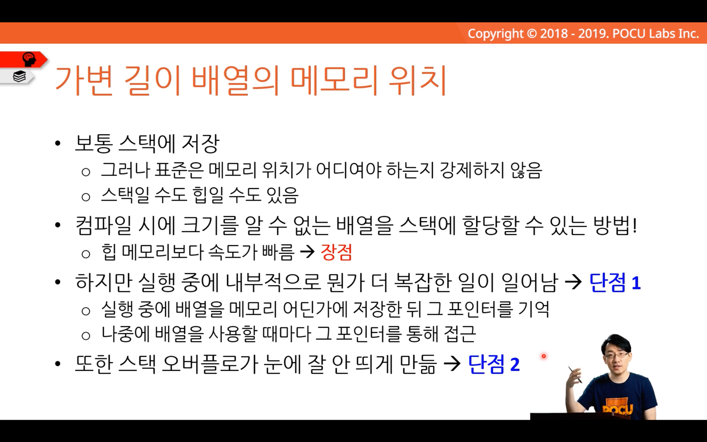

- 보통 가변 길이 배열은 스택에 저장
- 새로운 개념의 등장
    - `컴파일 시 크기를 알 수 없는 배열을 스택에 할당하기`
    - 참고로 이런 개념이 C++에도 나옴
- 장점
    - 힙 메모리보다 속도가 빠름
- 단점
    - 실행 중 복잡한 일이 발생함
    - 스택 오버플로우가 눈에 띄지 않음

### sizeof() 로 가변 길이 배열의 크기를 알 수 있음

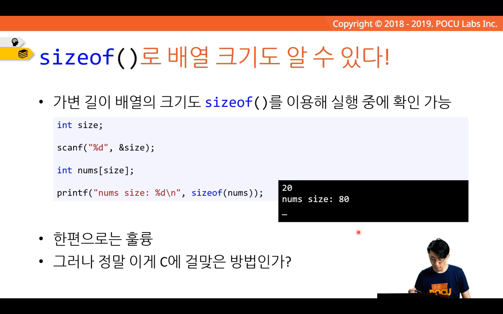

- 실행 중 가변 길이 배열의 크기를 알 수 있음

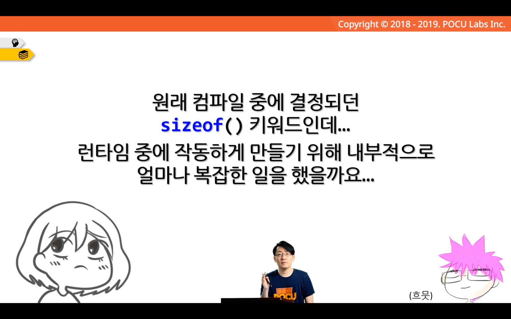

- 원래 sizeof()는 컴파일 도중에 상수값으로 변환되는 키워드
- C의 목적은 단순함인데, 복잡해지는데..?
    - 자잘한 기능이 많아지면 프로그래머가 암기할 사항이 많아짐

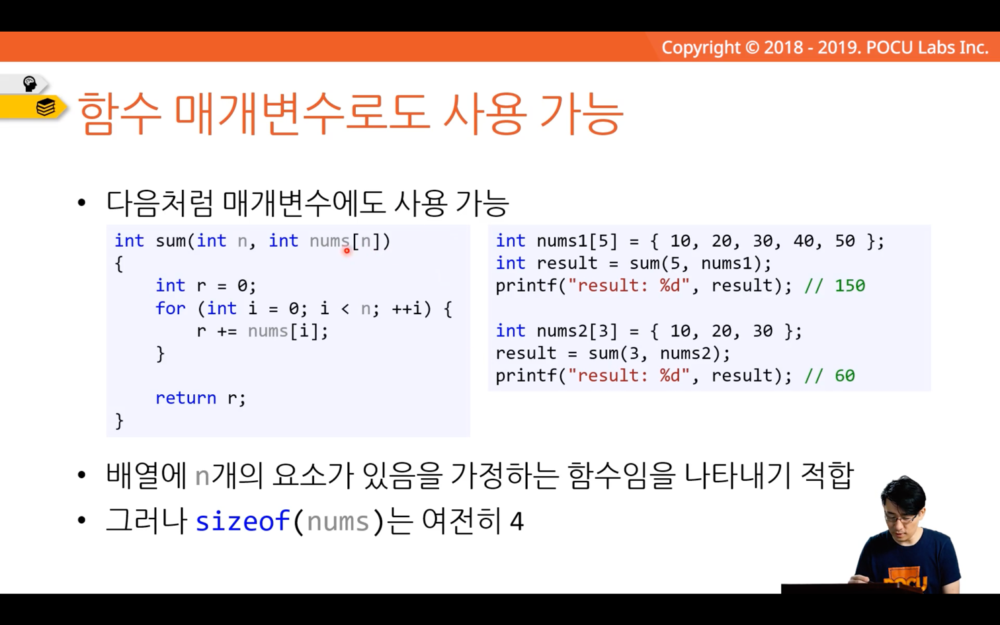

- 함수 매개변수로 사용할 때는 가변 길이 배열이랑 관계없음
- 어차피 함수 매개변수에는 포인터로 전달
- 단지 프로그래머가 읽기 편하도록 표현하는 법임

### VLA 베스트 프렉티스

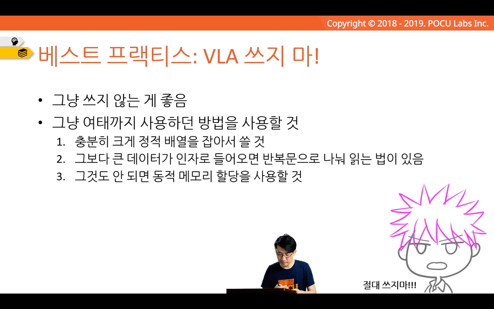

- 사용 안 하는게 베스트 프렉티스 ㅋㅋ

## 배열 색인 안의 static 키워드

- 함수 매개변수로 전달되는 배열에 static 키워드를 사용할 수 있음

### 함수에 배열 매개변수 전달하기 [한계 1]

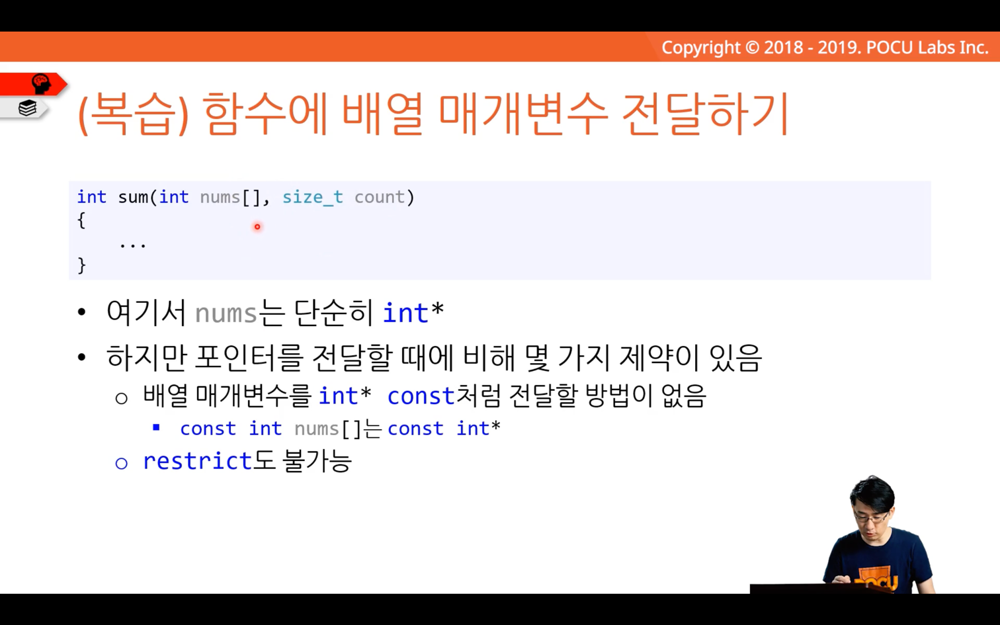

- int* nums vs int nums[]
    - 배열 매개변를 int* const로 전달할 방법이 없음
        - 내부적으로 int* 로 캐스팅 됨
    - restrict 키워드 불가능

#### [함수의 배열 매개변수에 대한 추가 설명]

```c++
void fun(int num[])
{
    printf("%p\n", num);
    int a = 123;
    num = &a;
    printf("%p\n", num);
    num++;
    printf("%p\n", num);
}

int main(void)
{
    int a = 123;
    int arr[5] = { 0, };
    fun(arr);
//    arr = &a; 컴파일 오류
//    ++arr; 컴파일 오류

    return 0;
}
```

- 함수의 매개변수로 배열을 전달하면 타입 캐스팅됨
    - from `int(*)[5]` to `int*`
    - from 배열의 첫번째 요소의 주소를 값으로 가진 상수 포인터 to 배열의 첫번째 요소의 주소를 값으로 가진 포인터

### 함수에 배열 매개변수 전달하기 [한계 2]

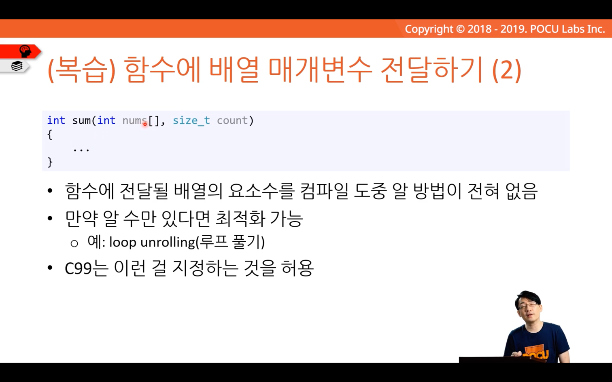

- 포인터 변수로 캐스팅되기 때문에 함수에 전달될 배열의 요소 수를 컴파일 도중 알 수 없음
- 컴파일 도중에 알 수 있다면, 최적화 가능!
    - loop unrolling
        - 8번 반복하는 반복문이 있으면, 그냥 코드를 8줄 적어주는게 빠름
        - 반복문 중 4회씩 묶어서 벡터연산 [SMID](https://ko.wikipedia.org/wiki/SIMD)

### 한계 1, 한계 2를 극복하여 나온 것이 배열 색인 안의 static 키워드

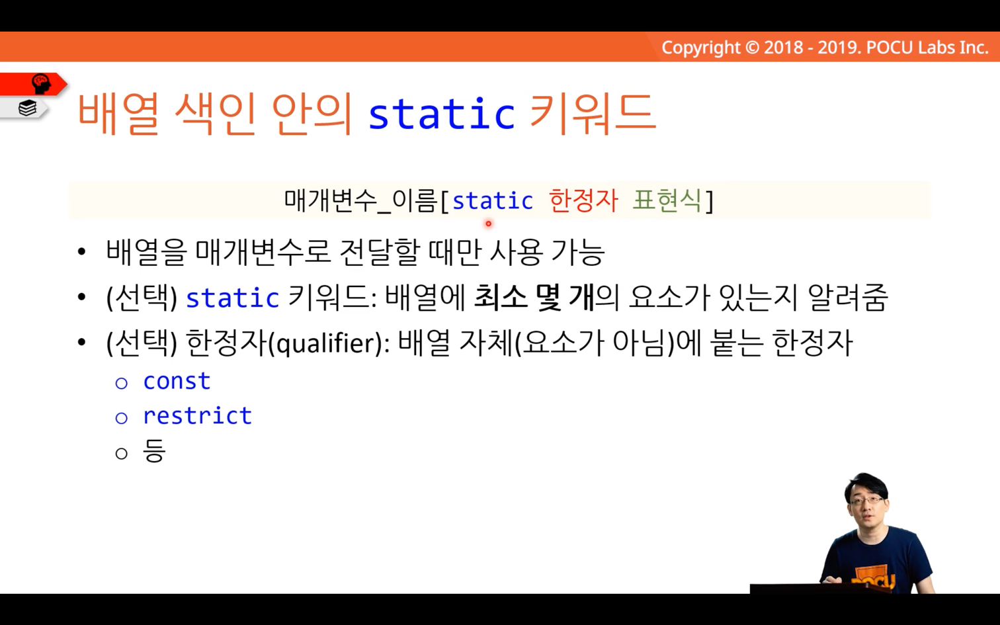

- 함수 매개변수로 전달되는 배열에 static 키워드를 사용할 수 있음
- static: 배열에 최소 몇 개의 요소가 있는지 컴파일러에게 알려줌
- 한정자: 배열 전체에 적용되는 개념
    - const
    - restrict

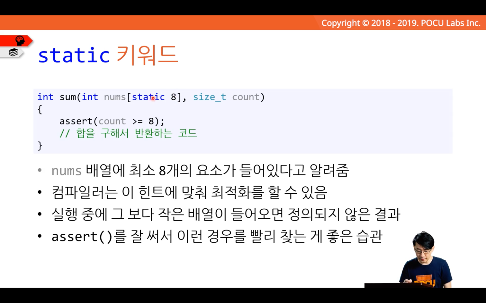

- 실행 중에 그 보다 작은 배열이 들어오면 정의되지 않은 결과
    - 컴파일러는 최소 8개가 들어온다고 가정하고 최적화하기 때
- 그래서 assert로 디버깅 중에 문제 찾는게 좋은 습관!!
- sizeof(nums) 호출하면 여전히 8 나옴! 포인터로 캐스팅 되는 것은 변하지 않음
    - sizeof(void*)의 값

### const 한정자 사용 예

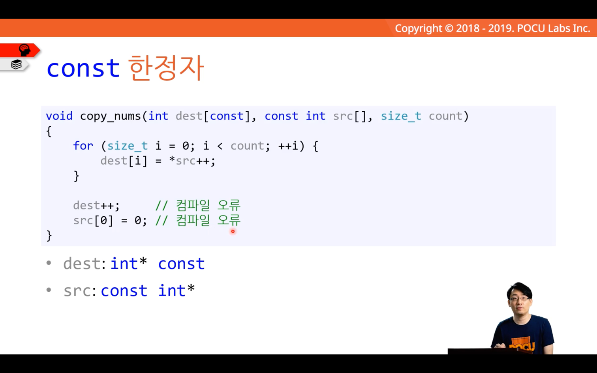

- dest는 `int* const`로 캐스팅한다고 생각하면 됨
- src는 `const int*`로 캐스팅한다고 생각하면 됨

### restrict 한정자 사용 예

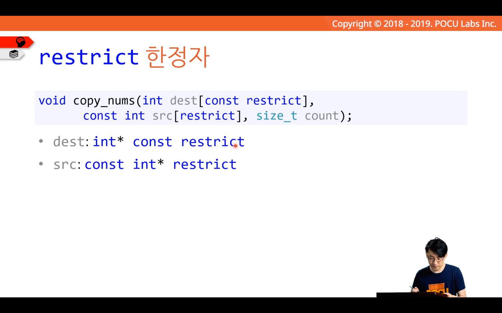

- 포인터에 restrict 키워드 붙이는 것과 효과 동일함
- 다른 포인터 변수와 메모리 영역이 겹치지 않음

## 복합 리터럴

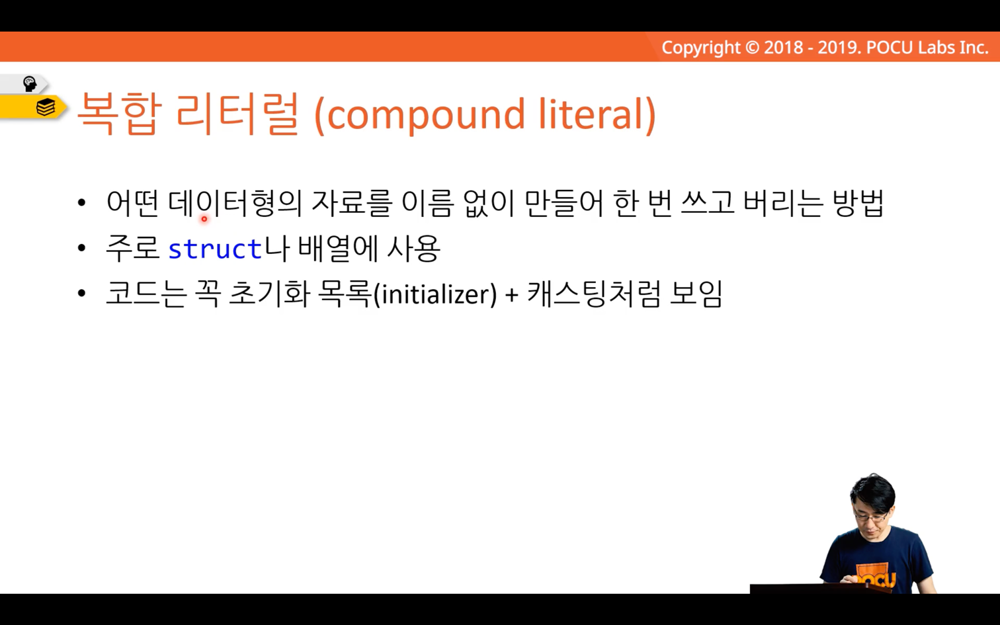

- 쉽게 생각하면 1회용 구조체, 배열을 쓰고 버리는 방법

### 사용 방법

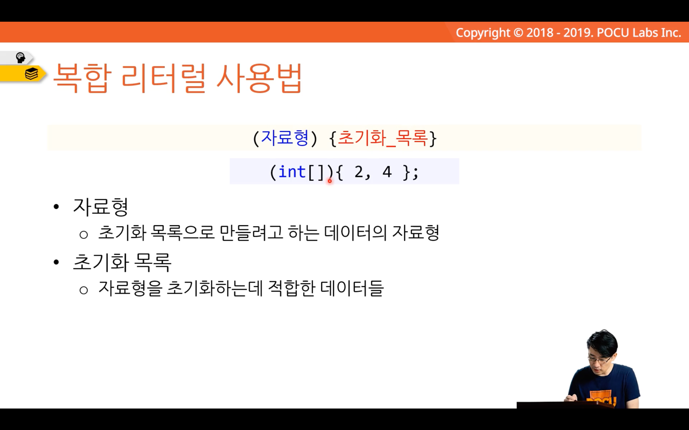

- 초기화 목록 + 타입 캐스팅

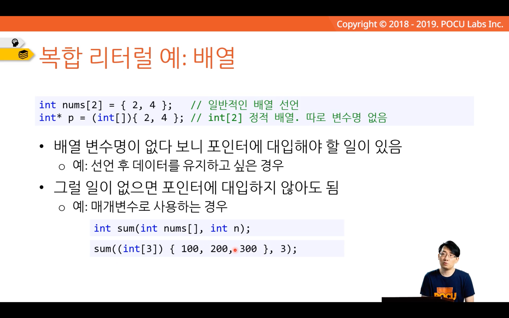

- 복합 리터럴로 선언하면 배열 변수명이 없기 때문에 포인로 접근해서 사용하면 됨
    - 즉 재사용 용도
    - 예를 들어 p[1]
- 그럴 일이 없으면 포인터에 대입하지 않아도 됨
    - 예를 들어 함수의 매개변수로 사용하는 경우

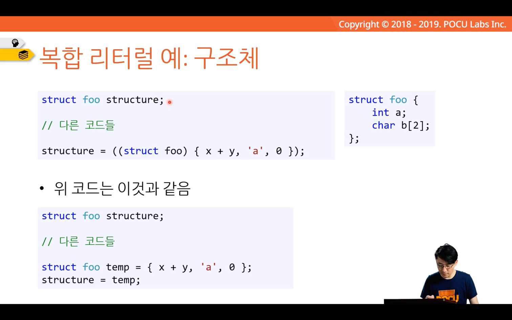

### 베스트 프렉티스

- 쓰지 말자 ㅋㅋ

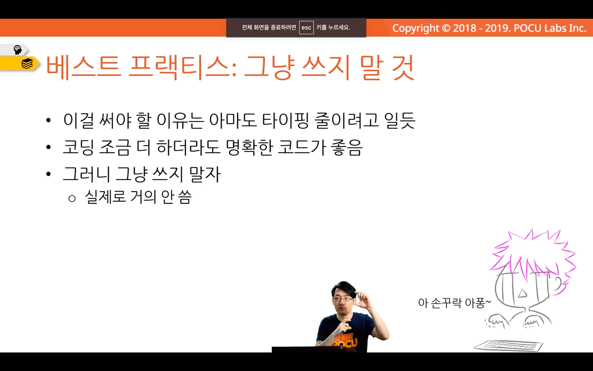

## 가변 인자 메크로

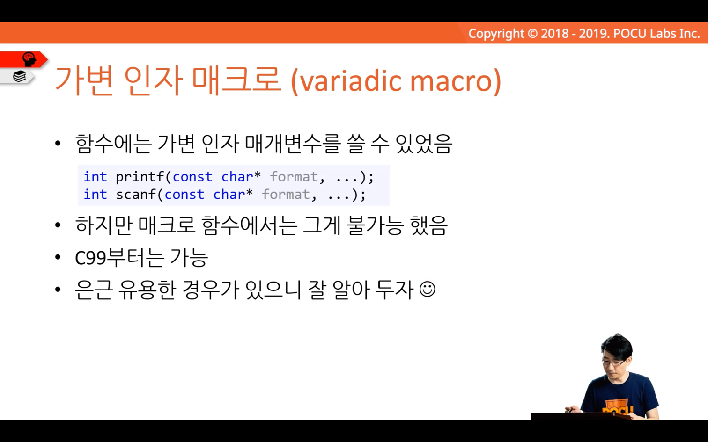

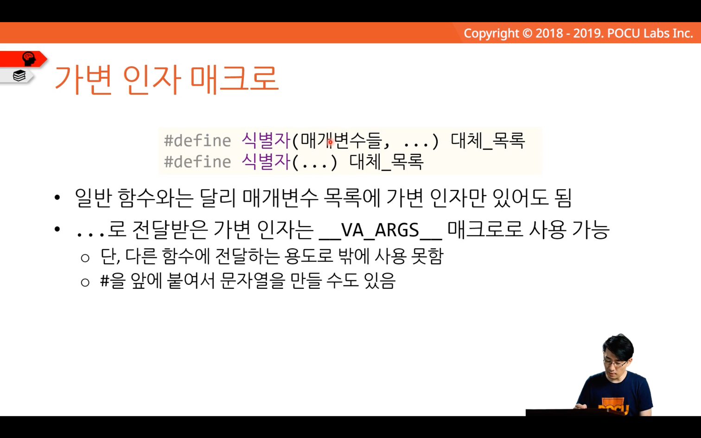

- 일반 함수와 달리 매개변수 목록에 가변 인자만 있어도 됨
- __VA_ARGS__ 매크로로 사용 가능
    - 단 다른 함수에 전달하는 용도로 밖에
- #을 붙여서 문자열(대체_목록)을 만들 수 있음

### 다른 함수에 가변 인자를 전달하는 용도

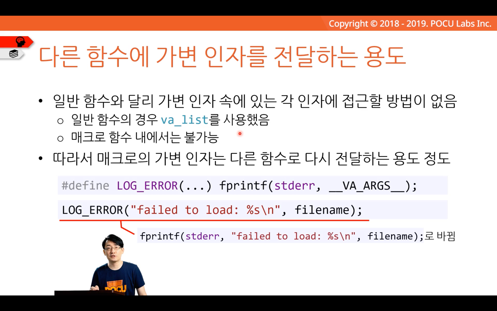

- 일반 함수(메크로 함수가 아닌)와 달리 가변 인자 속에 있는 각 인자에 접근할 방법이 없음
    - 일반 함수의 경우 `va_list` 메크로로 접근함
- 메크로 함수의 가변 인자는 다른 함수의 매개변수로 다시 전달하는 용도
    - `...`의 모든 매개변수를 다른 함수의 매개변수로 복붙!

### # 명령어와 같이 쓰이는 경우

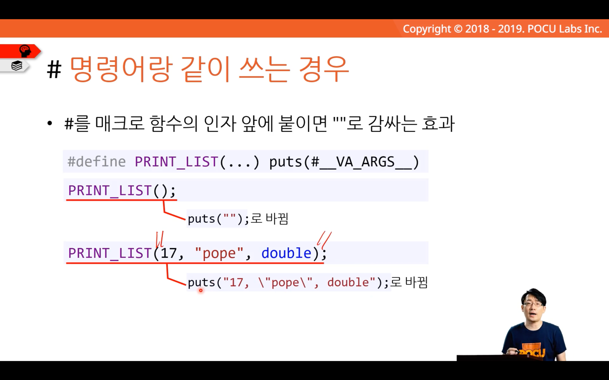

- 마찬가지로 `...`의 모든 매개변수를 복붙하되 ""사이에 복붙함

## 유니버셜 문자

### 유니코드 지원

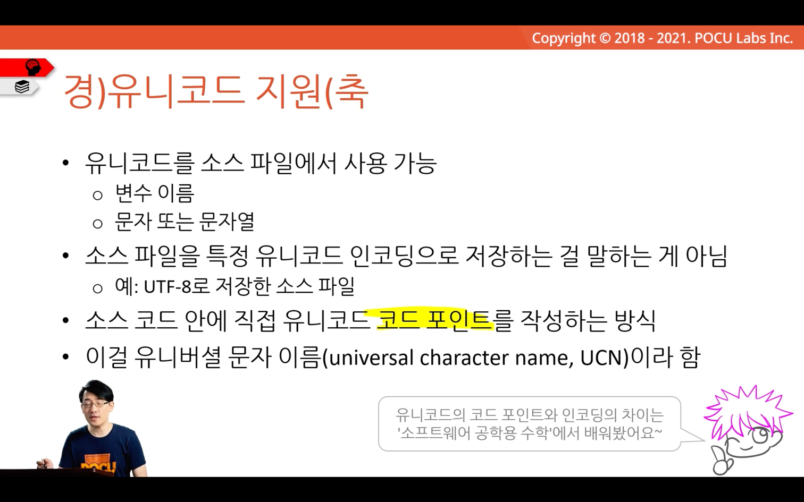

- UCN(Universal Character Name)
    - 유니코드 코드 포인트를 소스 파일에 작성
    - 변수명, 문자 또는 문자열에 사용
        - 특히 `변수명`
- 소스 파일을 인코딩으로 저장하는 방식
    - `인코딩으로 저장`의 의미: 소스 파일에서 모든 char형으로 표현되는 문자는 UTF-8로 인코딩

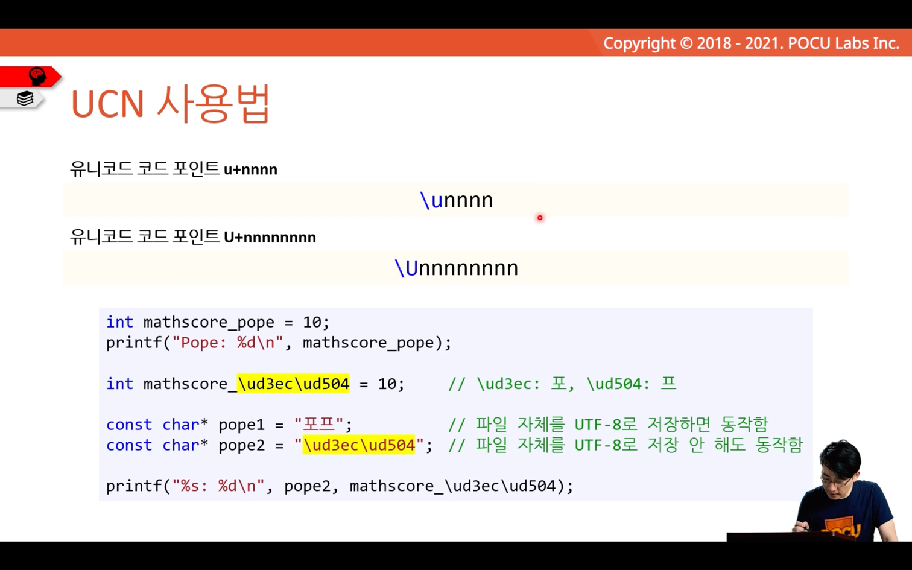

- 소문자 `\u`를 사용하면 유니코드 코드 포인트를 최대 2바이트 크기로 표현 가능
- 대문자 `\U`를 사용하면 유니코드 코드 포인트를 최대 4바이트 크기로 표현 가능

- `int mathscore_포프`와 동일함
- const char* pope1 = "포프"
    - UTF-8로 인코딩해 저장하는 방식
- UCN을 사용하면 인코딩 안 해도 동작함
    - C99에서 UCN을 지원하기 때문

### UCN 지원의 의의

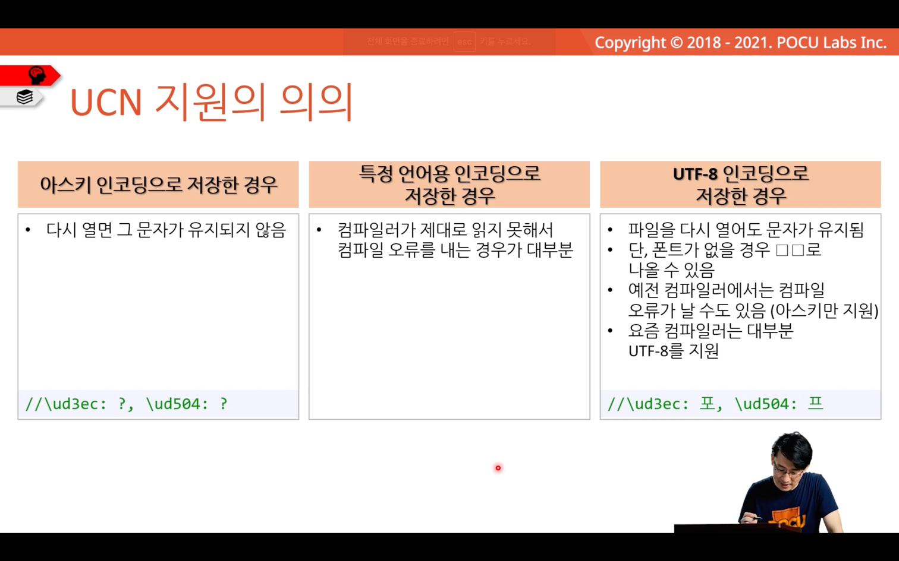

- 아스키 인코딩으로 저장한 경우
    - 소스 코드에 아스키가 아닌 문자를 넣고 저장했을 때 로딩을 하면 깨져서 나옴
        - 저장할 때 인코딩할 때 올바르게 저장되지 않기 때문(손상됨)
    - 저장(인코딩) 후 로드(디코딩)해서 파일을 봤을 때 사진에서 주석의 한글 '포', '프'가 모두 깨져서 나옴

- 특정 언어용 인코딩으로 저장한 경우
    - 소스 코드에 한글 문자를 넣고 저장했을 때 로딩을 하면 정상적으로 잘 보임
        - 저장할 때 한글에 맞게 인코딩해 올바르게 저장
    - 컴파일러가 한글에 맞게 인코딩된 소스 코드를 컴파일 할 수 없는 경우가 대부분임

- UTF-8 인코딩으로 저장한 경우
    - 소스 코드에 모든 문자를 넣고 저장했을 때 로딩을 하면 정상적으로 잘 보임
        - 유니 코드 인코딩은 모든 문자를 정상적으로 처리함
        - 다만 `폰트`가 없을 경우 로드 했을 때 유니 코드를 읽었는데(정상적으로 디코딩) 어떻게 화면에 보여줄지 몰라서 □ (U+25A1)로 화면에 보임
            - 폰트는 인코딩/디코딩과 무관하고, 화면에 출력할 때 적용됨
    - 예전 컴파일러에서는 컴파일 오류가 날 수 있음
        - 옛날 컴파일러는 아스키만 지원하기 때문

- UCN을 지원해서 `인코딩/디코딩과 무관하게` 유니코드 코드 포인트를 소스 코드에 입력해 다국어를 사용하는 환경에서 공통된 문자(유니코드)로 읽을 수 있음
    - 다만 코드에 유니코드가 있으면, 유니코드를 읽을 수 있는 사람이 많지 않아서 검색해야함
    - 가독성은 의미가 없음
        - 그저 누구나 `읽을 수 있다` 정도

### C 언어에서 인코딩을 판단할 수 없음

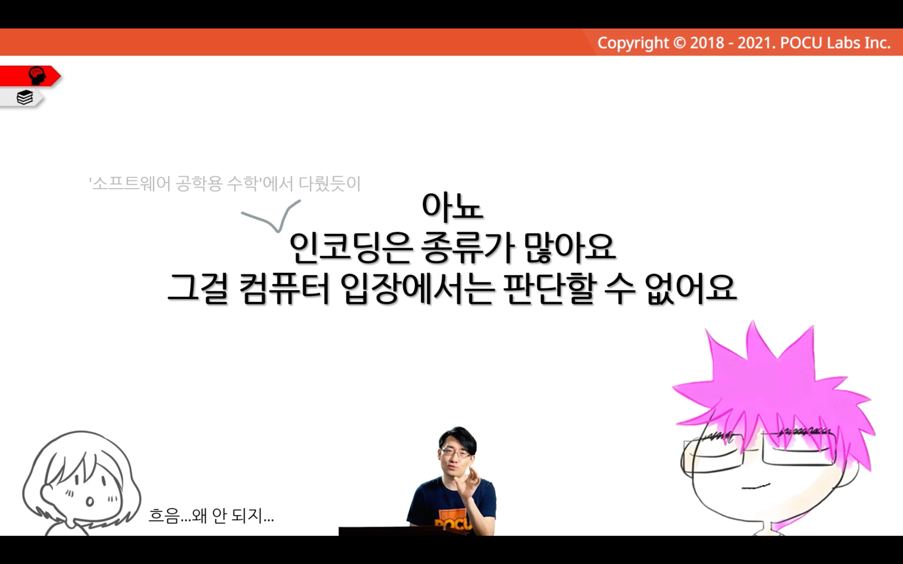

- 컴퓨터는 바이트 패턴으로만 알 고 있음

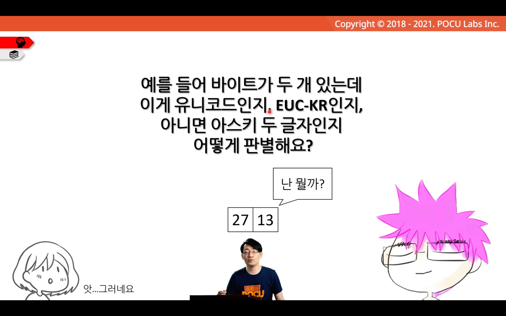

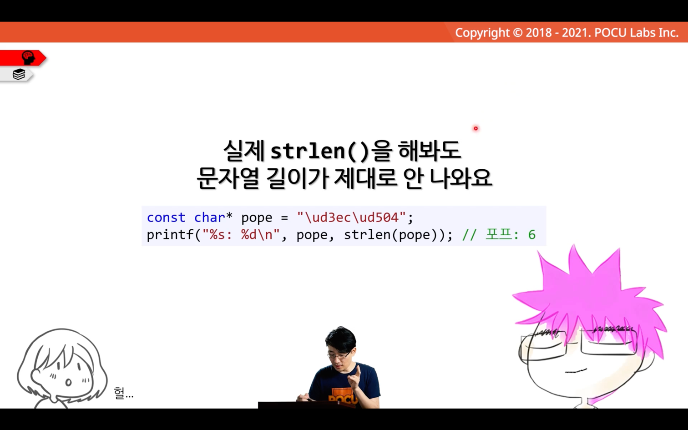

- 한글로 인코딩이 됬으면, 2글자로 저장하고 strlen()의 값은 2여야 함
- 하지만 바이트로 계산하기 때문에 6바이트
    - \ud3ec, \ud504면 16진수 4개니까 4바이트 아닌가요?
    - 아마 한글 인코딩(UTF-8)에서 1글자당 3바이트로 인코딩해서 저장하기 때문에 한 글자당 3바이트라고 추정할 수 있음
        - `멀티바이트 문자`

## 멀티바이트 문자

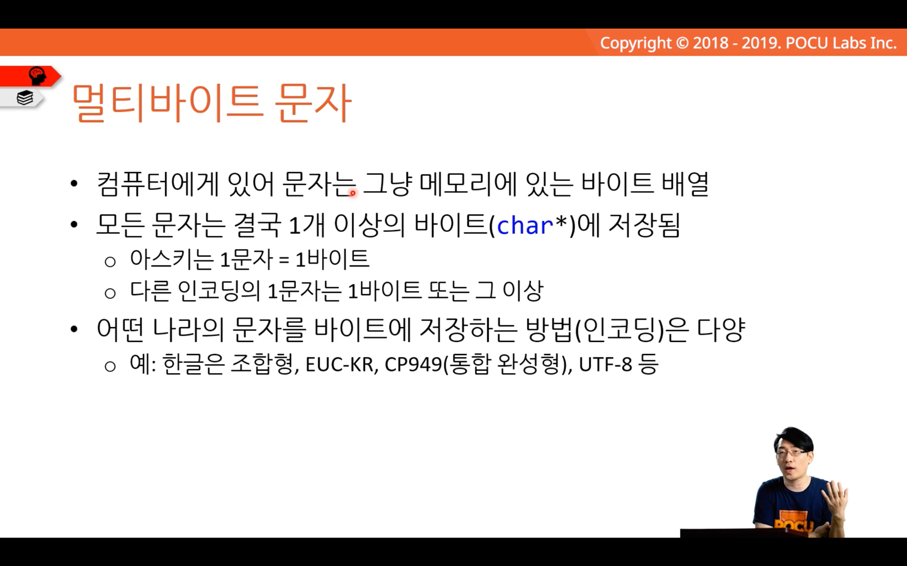

- 모든 문자는 1개 이상의 바이트에 저장됨
    - 아스키: 1문자는 1바이트
        - strlen()은 아스키를 전제로 만들었음
    - 다른 인코딩: 1문자는 1바이트 이상
- 같은 한글 글자라도 인코딩 방법은 다양함
    - 인코딩은 문자를 바이트(비트패턴)로 저장하는 것

### C에서 멀티바이트 문자

- 1개 이상의 바이트로 표현된 문자
    - 내부적으로 1개 이상의 바이트 덩어리
    - 바이트 덩어리로 문자를 표현
        - 따라서 각 문자마다 바이트 수가 다를 수 있음
            - 예를 들어 동일한 인코딩 방식에서 `김`은 3바이트 `뷃`은 4바이트
        - 아스키 인코딩의 경우 모든 문자가 1바이트로 고정

- C에서는 멀티 바이트 문자가 기본임
    - 사용자의 입력과 출력은 모두 멀티바이트 문자
    - C의 라이브러리도 기본적으로 멀티바이트 문자
    - 인코딩과 독립적으로 동작
    - 시스템의 인코딩 방식에 따름

### 멀티바이트 문자가 제대로 동작하는 조건

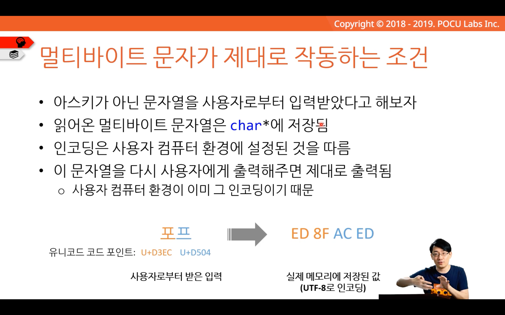

- 한 사용자 환경에서의 입력과 출력을 가정
    - 아스키가 아닌 문자을 사용자로 부터 입력 받음
        - 한글 문자 `포프`를 입력받았음
    - 입력 받은 문자를 바이트 덩어리로 기억함
        - 이 바이트 덩어리를 `멀티 바이트 문자`라고 정의함
        - 이 때 바이트 덩어리로 변환하는 것을 `인코딩`이라고 정의함
    - 실행 중 사용자 컴퓨터에 설정된 인코딩에 따라 입력한 값을 바이트로 변환해서 `멀티 바이트 문자`로 저장
        - 저장하는 자료형은 char*
        - 인코딩은 실행 중 사용자의 환경에 따라 결정됨
    - 출력할 때 인코딩된 `멀티 바이트 문자`를 디코딩해서 보여줌
        - 디코딩은 실행 중 사용자의 환경에 따라 결정
        - 동일한 사용자 환경이라서 인코딩/디코딩 방식이 동일함
    - [중요] C에서 인코딩/디코딩의 책임을 지지 않음
- 핵심은 `멀티바이트 문자`는 시스템 환경을 따른다는 것!

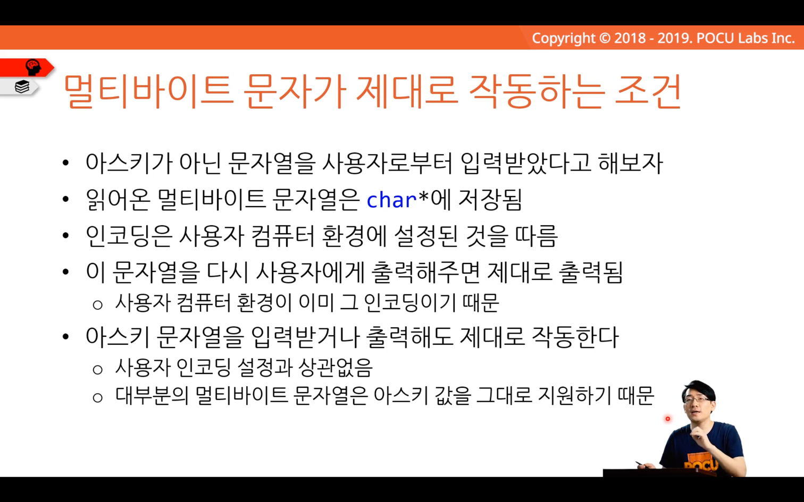

- 대부분 인코딩에서 멀타바이트 문자열은 아스키 값을 그대로 지원
    - 즉 인코딩할 때 아스키 코드 값을 그대로 유지함

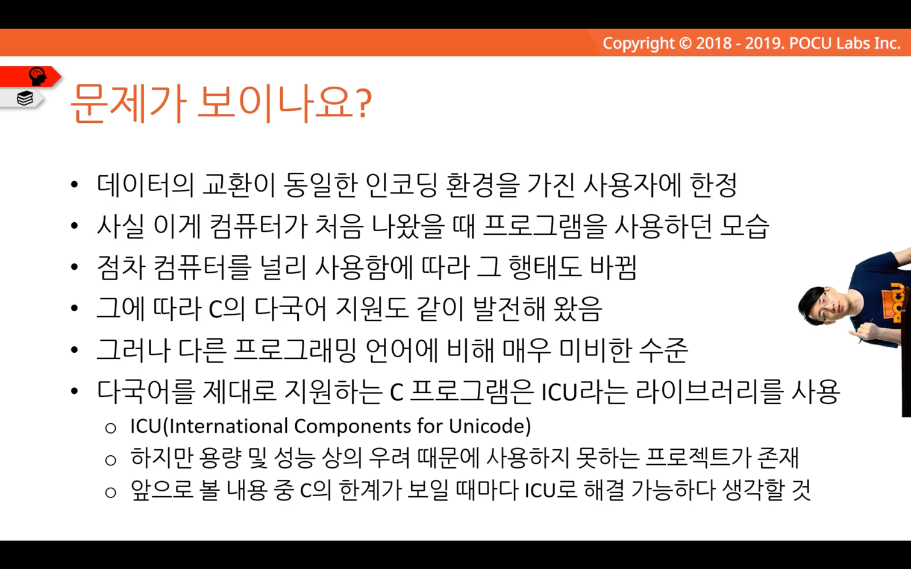

- 사용자 환경이 달라지는 경우
    - 데이터를 교환할 때 사용자의 환경이 달라지면 문제가 발생함
    - 인코딩 방식이 달라지기 때문
- ICU(International Components for Unicode)
    - 다국어 지원 라이브러리
    - 용량 및 성능 때문에 ICU를 사용할 수 없는 프로젝트도 있음
        - Ex) 임베디드, 옛날 게임

## 다국어 지원

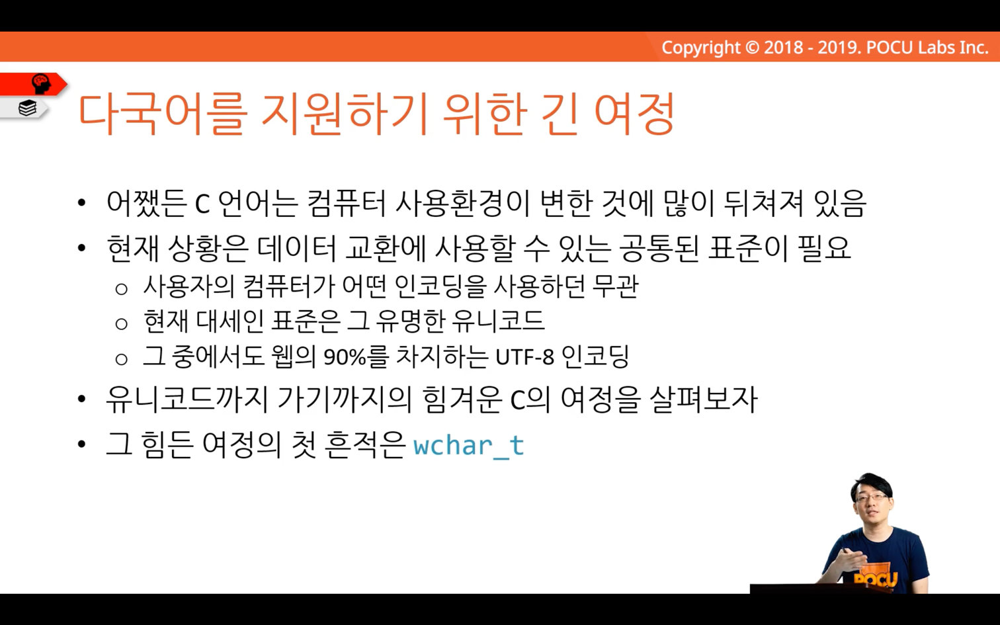

- C언어는 오래된 언어라 컴퓨터 사용환경이 변한 것에 많이 뒤처짐
- C언어에서 데이터 교환에 사용할 수 있는 `공통된 표준`이 필요
    - 사용자가 어떤 인코딩을 사용하던, 공통된 표준으로 언어 레이어에서 저장하면 됨
    - 참고로 현재 가장 많이 사용되는 인코딩은 유니코드(UTF-8)

### 다국어 지원의 배경

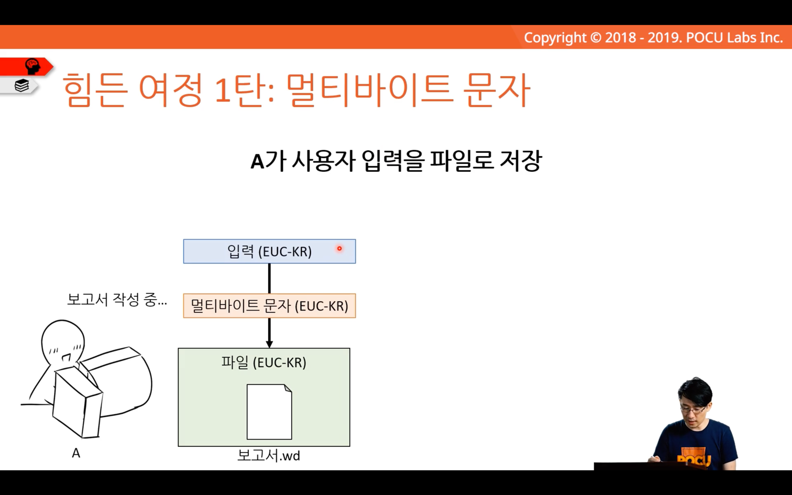

- 사용자가 보고서를 작성함(키보드로 입력)
- 입력된 한글은 EUC-KR 인코딩을 통해 멀티바이트 문자로 저장

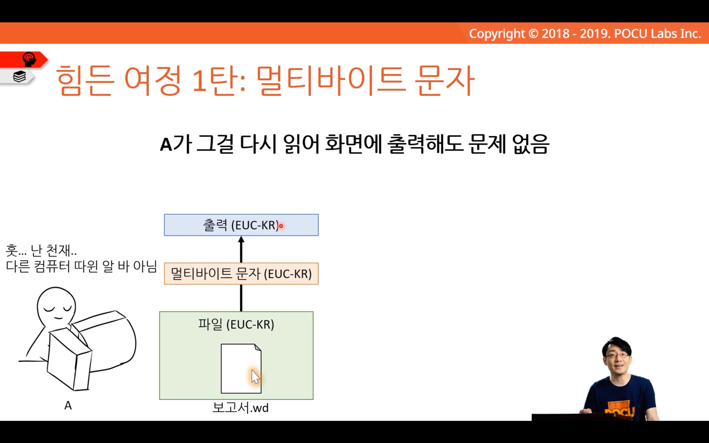

- 저장된 멀티바이트 문자를 디코딩해서 출력하면 한글로 읽을 수 있음
- 동일한 컴퓨터에서 입출력하기 때문에 인코딩/디코딩 방식도 동일함


- 동료에게 파일을 전달함
- 동료 컴퓨터는 ISIO-2022-KR 인코딩 방식 사용


- EUC-KR로 인코딩된 파일을 ISIO-2022-KR로 디코딩하면 글자가 깨짐


- 가장 쉬운 해결법은 동료 컴퓨터의 인코딩을 바꾸는 방법


- 인코딩을 변경하면 동료 컴퓨터에 ISIO-2022-KR로 인코딩한 파일을 정상적으로 읽을 수 없음


- 문제를 정의하면 둘 사이에 공통 인코딩이 없다는 것


- 근본적인 해결책은 서로 다른 인코딩된 파일을 공통된 인코딩으로 변환하면 됨


- 공통 인코딩된 파일을 읽을 때 자신의 컴퓨터의 인코딩에 맞게 변환 과정을 거쳐서 읽으면 됨

## wchar_t


- wide 문자를 나타내는 자료형
- 각 문자가 `고정된 바이트 크기`를 가짐
    - 기존 멀티바이트는 한국어, 중국어, 일본어 등 다국어 문자마다 바이트 크기가 달랐음
- 타겟 플랫폼(운영체제)에서 지원하는 모든 인코딩 중 가장 큰 문자를 담을 수 있어야 함
    - 현재 UTF-32(4바이트)


- 자료형이니 `컴파일 시`에 이미 `인코딩`과 `바이트 크기`가 정해짐
- 컴파일러와 플랫폼마다 크기가 다를 수 있음
    - C언어 표준에서 몇 바이트에 무슨 인코딩인지 정하지 않았기 때문
    - 리눅스: UTF-32
    - 윈도우: UCS-2
- 아스키 문자들은 기존 아스키 코드값을 그대로 유지

### wchar_t 사용법


- 와이드 문자열의 경우 따옴표 앞에 'L'을 붙임
    - 안 붙이면 `컴파일 오류`

```c++
const wchar_t* w_pope = L"포프";
```

- 컴파일 중 플랫폼에 따라 변환됨
- 코드에서 위 처럼 선언하면, 메모리에 플랫폼에서 사용하는 wchar_t인코딩에 맞는 비트패턴으로 저장됨
- 즉 코드에서 리눅스/윈도우 플랫폼에 관계없이 wchar_t를 사용할 수 있음


- 서식 문자 "%ls"는 와이드 문자열을 `멀티바이트 문자열`로 변환한 뒤에 화면에 출력
    - 멀티바이트 문자열은 사용자 환경에 맞는 인코딩에 맞게 변환한 결과

### wchar_T 전용 함수들(c89)


- C89에서는 변환하는 함수만 제공
    - 멀티바이트 문자(열) -> 와이드 문자(열)
    - 와이드 문자(열) -> 멀티바이트 문자(열)


```c++
const char* pope = "\ud3ec\ud504";
wchar_t w_buffer[64];
mbstowcs(w_buffer, pope, 64);

const wchar_t* w_pope = L"포프";
char buffer[64];
wcstombs(buffer, w_pope, 64);
printf("%s\n", buffer);
```

### 문자열 길이를 구한는 함수?(c89)


- 별도의 문자열 길이를 구하는 함수는 없음
- wchar_t에서 모든 문자는 고정 크기인 점을 이용하면 구현할 수 있음
    - 멀티 바이트문자열을 와이드 문자열로 변환
    - 널 문자가 나올 때까지 wchar_t가 몇 개인지 세기만 하면 됨

### wchar_t 저용 함수들 (C95)


- 시험에 안 나올 듯

## 새로운 문제점(플랫폼이 다른 경우)


- 와이드 문자는 플랫폼에 종속적임
    - 이런 상황을 portable 하지 못하다라고 표현합니다


- 만약 모든 플랫폼에서 동일한 인코딩을 사용한다면 괜찮은데, 점유율이 50%가 넘는 윈도우즈만 다른 인코딩 사용 중


- C99에서 언어 레벨에서 해결 방법은 없음
    - ICU 라이브러리를 사용하기
    - 두 플랫폼 사이에 변환하는 라이브러리를 직접 만들기

## C11 다국어 지원

### 이전 방법


- 서로 다른 멀티바이트 문자 간 변환이 불가능
    - 멀티바이트 <-> 와이드 문자 변환만 가능


- 플랫폼에 종속적임

### 공통의 인코딩 방법을 사용하면 어떨까? (UTF-32, UTF-16)


- C11에서 허용


- 언어에서 UTF-16, UTF-32 인코딩을 지원
- 문자열에 소문자 u를 붙이면 UTF-16으로 인코딩
- 문자열에 대문자 U를 붙이면 UTF-32로 인코딩
- char16_t 변수에에 char32_t 문자 저장 불가
    - `컴파일 에러`
- 이 자료형을 사용하면 어떤 플랫폼이던 UTF-16/UTF-32에 인코딩
    - 기본적으로 char은 시스템(플랫폼)의 인코딩 방식을 따름
    - char이 멀티바이트 문자라고 생각하면 됨


- 리터럴 소문자 u를 붙여서 char_16t* 문자열을 만들고, 이를 char*에 대입하면 컴파일 에러
- 문자열 사용과 똑같고, 리터럴만 다르다고 생각하자!


- 당연히 바로 %s 형식지정자로 출력하면 안 됨
- %s는 시스템의 멀티바이트 문자와 호환됨


- 멀티바이트 문자로 변환하는 함수 제공함


- [mb_state_t](https://en.cppreference.com/w/c/string/multibyte/mbstate_t)
    - 멀티바이트 문자의 인코딩 규칙에서 발생할 수 있는 모든 변환 상태를 나타내는 타입

- 매크로는 다음과 같이 구현
    - `#define ARRAY_LENGTH(x) (sizeof(x) / sizeof((x)[0]))`
- [c16rtomb](https://en.cppreference.com/w/c/string/multibyte/c16rtomb)
    - 성공하면 버퍼(char* p가 가리키는 주소)에 몇 바이트를 저장했는지를 반환
        - UTF-16 문자가 컴퓨터 환경에 맞는 인코딩에 따라 char로 변환되고, 변환된 char이 몇 바이트인지를 리턴
        - `멀티바이트 문자`이기 때문에 몇 바이트인지 결과에 따라 버퍼에서 포인터를 이동해줘야함
        - 이건 `실행 중`에 결정되는 값!
    - 변환에 실패하면 -1을 반환함
        - 따라서 -1을 반복문의 종료조건으로 사용

- 아쉽지만 UTF-16/UTF-32 문자열을 통채로 멀티바이트 문자열로 변환하는 함수는 없음
    - 위의 예시처럼 한 글자 한 글자 변환

### wchar_t의 문제(플랫폼 의존)을 극복


- 포팅이 가능해짐

### 여전히 wchar_t를 사용할 일이 있음


- wchar_t 와 멀티바이트 문자가 서로 변환이 되고, 멀티바이트 문자와 UTF-16/UTF-32 문자가 서로 변환이 되기 때문에 멀티 바이트 문자를 거쳐서 2번 변환하면 됨

### UTF-8로 대동단결 하면 안 되나요?


- C22에 넣자고 제안된 상태임

### C에서 UTF-8로 인코딩을 하는 기능을 제공하긴 함


- char형에 저장은 할 수 있음
- 하지만 UTF-8로 인코딩된 비트패턴을 시스템에 맞는 멀티바이트로 변환하는 함수가 없음
    - 즉 시스템(플랫폼)의 인코딩 방식과 호환이 안 될 수 있음

## 다국어 지원 접근 방법 (정리/요약)

### 기본 원칙


- 사용자에게 보여주지 않을 문자열은 전부 아스키로 저장
    - 시스템 내부에서 아스키로 강제합시다!
- 사용자에게 보여줄 문자열은 다국어 지원을 할 수 밖에 없음
- 파일로 저장할 때는 공통 인코딩
- 가장 편한건 `ICU 라이브러리`
    - 라이센스, 비용, 용량 문제 때문에 사용 할 수 없는 경우도 있음


- UTF-8로 파일을 저장한다는 가정에 여러 시나리오를 소개

### [최상의 시나리오(C89 이상)]


- 사용자 환경을 모두 UTF-8로
    - 여기서 사용자는 컴퓨터 외부라고 생각하면 됨
    - 회사에서 모든 컴퓨터 인코딩을 UTF-8로 통일하는 이상적인 시나리오
- 인코딩을 제외한 추가적인 변환이 필요없음

### [차선책: wchar_t가 UTF-32를 보장하는 경우(C89 이상)]


- 윈도우 플랫폼에서는 UTF-32 아니라서 불가능
- 멀티바이트 문자를 와이드 문자로 변환(C에서 제공하는 함수)
    - UTF-32 인코딩
- UTF-8로 추가적인 변환 과정을 거쳐서 파일로 저장
    - UTF-32에서 코드 포인트가 그대로 4바이트에 저장됨
    - 유니코드 코드 포인트 4바이트를 UTF-8로 변환하는 것은 간단한 일(자체 제작 함수)


- 수학 과목 내용 참고

### [char32_t가 UTF-32인 경우(C11 이상)]


- 멀티바이트 문자를 char32_t로 변환
    - `c32rtomb()`(C에서 제공하는 함수)를 사용하면 됨
- 변환 결과는 UTF-32로 인코딩
- from UTF-32 to UTF-8은 간단함(자체 제작 함수)

### [아마도 char8_t가 UTF-8인 경우(C23 이상)]


- 이건 미래의 좋은 방법
- 멀티바이트 문자를 char8_t로 변환(C에서 제공하는 함수로)
- 변환 결과는 UTF-8로 인코딩

### [만약 윈도우에서 char32_t/char16_t를 사용할 수 없다면? 즉 C11을 사용 못하는 경우]

- wchar_t 밖에 사용할 수 없음
    - 근데 윈도우 플랫폼에서만 작동
- 자체 변환함수 만들기
    - 하지만 UCS-2는 유니코드와 호환 X
    - 유니코드로 표현할 수 있는 모든 것을 UCS-2로 표현할 수는 없음!

## C11 경계 점검(bound-check) 함수


- 검사하다보니 성능에 문제가 생김
- 주로 문자열 관련 함수
- 문제가 생기면 문제에 대한 보고를 해줌(에러 헨들러)


- 반드시 구현해야하는 함수가 아님
- 표준에서 강제 X

### [경계 점검 함수 사용하기]


- #define __STDC_LIB_EXT1__ 를 지원하는지 컴파일러 문서를 확인
    - [질문] 직접 확인하는 방법?
        - GPT는 stdio.h, string.h 보면 된다고 함
    - 지원하면 다음 스탭으로
- #define __STDC_LIB_EXT1__ 1 을 선언
    - 컴파일 옵션 `-D`로 넣어주기
    - 관련 헤더 파일을 인클루드 하기 전(코드에서 전방)에 선언

```c++
// 1. 매크로 정의
#define __STDC_WANT_LIB_EXT1__ 1

// 2. 관련 헤더 파일 인클루드
#include <string.h>
#include <stdio.h>

int main() {
    // 경계 점검 함수 사용 코드
    char src[] = "Hello, World!";
    char dst[50];
    strcpy_s(dst, sizeof(dst), src);
    printf("%s\n", dst);
    return 0;
}
```

- 참고로 마이크로소프트 Visual Studio 환경이라면 위에서 설명한 매크로를 정의하지 않아도 경계 점검 함수를 사용할 수 있음
    - 오히려 사용 안 하면 컴파일 경고를 줌

### [경계 점검 함수 예시]


- errno_t
    - 타입을 만들어서 함수의 반환값으로 사용
    - 0이면 성공, 아니면 실패
    - Ex) errno_t strcpy_s( char *restrict dest, rsize_t destsz, const char *restrict src );
- rsize_t
    - size_t와 동일한 형을 typedef한 것
    - 다만 size_t의 역할에 이 자료형을 사용하는 함수가 `경계 점검 함수`임을 표시하는 역할이 추가됨
    - 그래서 함수 시그니처만 보고 이 함수가 경계 검사를 하는지 알 수 있음
- RSIZE_MAX
    - `경계 점검 함수`에서 허용하는 버퍼의 최대 크기
        - 버퍼의 크기가 메모리의 크기보다 클 수는 없음
        - 사용 환경의 메모리에 맞게 정의됨
    - 컴파일 타임에 결정되는 상수일 수도 있고, 실행 중 남아있는 메모리의 크기에 따라 변하는 변수일 수도 있음
        - 표준에서 선택을 허용해서 혼란이 있음
        - 매크로가 대문자인데 상수가 아니다?!

### gets_s()

#### [gets()의 완전한 제거]


- `gets()`가 완전히 표준에서 제거됨
- 이유는 버퍼 오버플로우
- C89에서 부터 권고사항으로 `fgets()`사용하기

#### [gets_s()는 안전함]


- rsize_t 형의 버퍼의 사이즈를 매개변수로 받음
- 동작
    - str에 n-1개의 문자까지 저장
    - 마지막에 널문자 붙여줌
- 오류 감지
    - n이 0이거나 RSIZE_MAX보다 클 경우
    - str이 널 포인터인 경우
    - n-1개의 문자를 저장한 후에 줄바꿈이나 EOF가 발생하지 않을 때
        - 사용자의 입력을 받았는데 한 줄로 그 입력을 담을 수 없는 경우 사용자의 의도대로 한 줄을 못 받았기 때문에 오류로 처리
        - 참고로 에러 핸들러가 오류를 보고했을 때 오류를 무시하고 잘려진 한 줄(모두 입력 안 됨)을 사용해도 상관은 없음
            - 이것이 에러 핸들러의 효과
            - 커스텀으로 에러 핸들러를 정의하지 않으면, 컴파일러의 에러 핸들러 구현에 따라 효과가 다름
                - 크래쉬 날 수도 있음
- 오류 감지 후 아래 단계를 따름
    1. stdin에서 내용을 읽고 줄바꿈이나 EOF를 만날 때 까지 문자를 버림

    - 즉 읽지 못한 나머지를 버림

    2. 등록된 에러 핸들러 호출
        - 기본적으로 컴파일러가 구현한 기본 에러 핸들러가 호출
        - 커스텀 에러 핸들러를 등록했다면, 커스텀 에러 핸들러 호출

### sprintf_s(), snprintf_s()


- sprintf_s(), snprintf_s()의 매개변수 목록은 동일함
    - bufsz 파라매터의 자료형이 rsize_t임을 통해 C11 경계 점검 함수임을 알 수 있음
- 오류 감지
    - format, buffer가 널 포인터인 경우
    - bufsz의 크기가 0이거나 RSIZE_MAX보다 클 경우
    - format의 %s에 대응하는 인자가 널 포인터인 경우
    - (sprintf_s에만 해당) buffer에 저장될 문자열의 길이가 bufsz보다 큰 경우

- [참고] sprintf()와 snprintf()의 개념 차이
    - snprintf()에는 기본적으로 format의 길이가 버퍼의 사이즈보다 길어도 n개 만큼(버퍼사이즈)만큼 잘라서 넣는다는 개념이 포함됨
        - 이미 함수에 잘라서 넣는다는 개념이 포함되어 있기에 버퍼사이즈 만큼 잘라서 넣는 상황을 오류 상황이라고 보지 않음
    - sprintf()에는 잘라서 넣는다는 개념이 없음
        - 따라서 buffer에 저장될 문자열의 길이가(format의 길이) bufsz보다 큰 경우 오류가 발생

### fopen_s()


- "w" 또는 "a"모드로 파일을 열었을 때 배타적으로 파일 사용
    - 즉 다른 프로그램이 동시에 이 파일에 접근 불가
- 새로 추가된 모드
    - x: 파일이 이미 있으면 덮어쓰기 대신 errno_t 0이 아닌값 반환
    - u
- [질문] 파일 스트림의 포인터의 포인터를 전달하는 이유?
    - 시험에 안 나올 듯
    - 내부적으로 호출자의 포인터를 직접 조작해서 변경할 수도 있음 (pass by reference)


- 오류 감지
    - 슬라이드 참고

### strnlen_s()


- strlen()의 문제점은 널 문자를 만나지 않으면 끝까지 읽음
- 이를 개선해서 널 문자를 만나지 못하더라도, 버퍼 크기까지 읽어줘
- 반환값
    - str의 길이
        - 정상적으로 버퍼 크기 안에서 널 문자 만남
    - 0
        - str이 널 포인터
        - str에 널 문자만 있는 경우
    - strsz
        - 버퍼 끝까지 읽었는데 널 문자를 못 찾은 경우
- 결과가 정의되지 않음
    - 예를 들어 str의 크기가 3(char str[3])이고 널문자가 없음, strsz는 5라고 가정
    - 이 경우 인덱스 3을 읽을 때 판단할 수 없음
        - 이를 판단하려면? 실행 중에 할당했던 모든 포인터의 메모리 길이를 어딘가에 저정하고 확인해야함
        - 굉장히 성능적으로 문제가 생김
    - 소유하지 않은 메모리는 읽지 맙시다!

### strcpy_s()


- strcpy()와 차이점 위주로 기억
    - return 타입이 errno_t
    - 매개 변수에 rsize_t destsz 포함
    - 복사 후 남은 dest 공간에 쓰레기 값이 들어있을 수 있음
        - 성능 향상을 위해 한 번에 여러 바이트씩 복사할 수도 있기 때문임

- [참고] 쓰레기 값이 생기는 경우

> In traditional strcpy, each character from the source string is copied one by one to the destination string until the
> null terminator is encountered. However, to improve performance, some implementations, including strcpy_s, may copy
> multiple bytes at a time, using techniques like SIMD (Single Instruction, Multiple Data) instructions.

> When strcpy_s copies multiple bytes at once, it may copy more than the actual length of the source string, especially
> if the source string is shorter than the width of the copy operation. This can lead to copying “garbage values” beyond
> the end of the source string into the destination buffer.

- 전통적인 strcpy()는 각 문자를 하나씩 복사했음
- strcpy_s()는 SIMD 같은 기술을 이용해 여러 바이트를 복사할 수 있음
- 예를 들어 아래와 같음

```c++
char src[] = "Hello";
char dest[10];

strcpy_s(dest, sizeof(dest), src);

// 4바이트 씩 복사
// step1: Hell 복사 후 dest: Hell?????
// step2: o\0?? 복사 후 dest: Hello\0????
```


- 오류 감지
  - destsz == strlen_s(src, destsz)
    - 즉 dest에 널문자가 들어갈 공간이 없는 경우
    - src의 길이가 dest보다 긴 경우 strlen_s()는 destsz를 반환함
  - src, dest 메모리가 겹칠 때 restrict 가 붙어있어서 감지

- [참고: destsz == strlen_s(src, destsz) 시나리오]

```c++
#include <string.h>
#include <stdio.h>

int main() {
    char src[] = "Hello";    // Source string length is 5 characters
    char dest[5];            // Destination buffer size is 5 characters, same as src length

    errno_t result = strcpy_s(dest, sizeof(dest), src);

    if (result != 0) {
        printf("Error: %d\n", result);
    } else {
        printf("Copied string: %s\n", dest);
    }

    return 0;
}
```

- [참고: 결과가 정의되지 않은 경우 시나리오]

```c++
#include <string.h>
#include <stdio.h>

int main() {
    char src[] = "HelloWorld";   // Source string length is 10 characters
    char dest[6];                // Destination buffer size is 6 characters
    rsize_t destsz = 8;          // Specified size for the destination buffer is 8

    errno_t result = strcpy_s(dest, destsz, src);

    if (result != 0) {
        printf("Error: %d\n", result);
    } else {
        printf("Copied string: %s\n", dest);
    }

    return 0;
}
```

- strnlen_s(src, destsz): 8
- destsz: 8
- 실제 dest의 크기: 6
- 슬라이드에 `strnlen_s(src, destsz) < destsz 라고 나와있는데, 별로 중요하지 않다고 하심

### strncpy_s()


- 동작 최대 count개의 문자를 src에서 복사 후, 널 문자 붙여줌
- strncpy()와 차이점
  - strncpy()는 복사 후 남은 공간을 0으로 채워줌
    - 비효율적임
  - strncpy_s()는 널 문자 뒤 쓰레기값이 들어올 수 있음


- 오류 감지
  - count가 0이거나 RSIZE_MAX보다 클 때 조건이 추가됨
  - destsz <= strnlen_s(src, count)
    - src가 dest보다 클 때
- 결과가 정의되지 않은 경우
  - src의 실제 공간이 매개변수로 입력한 count보다 작은 경우
  - dest의 실제 공간이 매개변수로 입력한 destsz보다 작은 경우
  - 개념적으로 문제가 있음!

### _s 함수를 과연 써야 할까?


- 과연 이걸 쓴다고 실수를 막을 수 있을까?
- 함수 스펙이 너무 복잡한데요..?
- [후기 강조] 복잡한 규칙의 문제점
  - ㄹㅇ 인생 교훈이죠?
- 언매니지드 언어에서는 성능을 포기하지 않고, 다른 방법으로 오류를 통제하는 것이 더 나은 방법!
- 에러 핸들러를 또 따로 구현하는 것도 문제임
  - 일이 많아짐
  - 함수의 역할이 늘어나죠? 함수는 한 가지 일을 하는 것이 좋음


- 좋은 습관을 들이자!


- 오히려 C99의 방향성과 상반됨
  - restrict는 성능 최적화 방향인데?
- C11은 왜 안전임?


- 뭐 이런 컴파일러도 있음
- optional 기능을 추천하다니... 문제가 있음


- 컴파일 옵션으로 끄는 경우가 많음
- 교훈: 컴파일러가 항상 옳은건 아니다!
